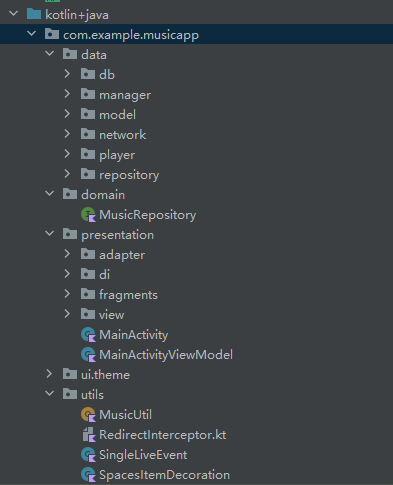

## MusicApp的移动应用开发总结

总结一下移动互联网写的App都用了什么

#### MVVM架构

文件架构：



- data model层 处理数据
  - db 数据库操作：使用**room**数据库
  - manager和player：分别有CookieManager 和 MusicPlayer，按照结构应该都划分为service层操作，由于命名问题使用不同package
  - model ：数据entity类
  - network： 使用**retrofit2** 实现api网络服务
  - repository： 实现domain中在model层实现的数据操作
- domain： 定义viewmodel层的接口
- presentation view层
  - adapter 列表相关操作
  - di 用于module dagger依赖注入 我也不知道为什么依赖注入放在view层
  - fragments 把所有fragment都放在这里了 堆太多了 感觉可以把组件类的fragment和页面类的fragment分开
  - view 实现重绘的动画操作 用于滚动歌词
- MainActivityViewModel viewmodel层用于view层调用viewmodel

##### 核心MVVM架构接口：

- domain - MusicRepository

  ```kotlin
  interface MusicRepository {
      suspend fun searchSongs(query: String): List<Song>
      suspend fun getDailySongs(): List<Song>
      suspend fun addSongToList(song:Song):Boolean
      suspend fun playSong(context:Context)
      ...
  }
  ```

- data - repository - MusicRepositoryImpl 在model层实现的repository的接口，其中使用@inject依赖注入实现service服务，相当于springboot中的@service单例

  ```kotlin
  class MusicRepositoryImpl  @Inject constructor(
      private val musicService: MusicService,     // 网络服务
      private val musicPlayer: MusicPlayer,       // 播放类
      private val musicDao: MusicDao,             // 数据库
      private val cookieManager: CookieManager
  ) : MusicRepository {
  
      override suspend fun addSongToList(song: Song) : Boolean{
          ...
          return true
      }
  
      override suspend fun playSong(context:Context) {
          val url = musicPlayer.currentSong.value?.song?.songUrl
          ...
          musicPlayer.playSong()
      }
  
      override suspend fun pauseSong() {
          musicPlayer.pauseSong()
      }
  
      override suspend fun nextSong() {
          musicPlayer.playNextSongInListLoop()
      }
  
      override suspend fun prevSong() {
          musicPlayer.playPreSongInListLoop()
      }
  
      override suspend fun changePlayMode(){
          musicPlayer.changePlayMode()
      }
      ...
  ```

- presentation - MainActivityViewModel view层调用的viewmodel

  @HiltViewModel依赖注入ViewModel 使用MusicRepository接口

  ```kotlin
  @HiltViewModel
  class MainActivityViewModel @Inject constructor (private val repository: MusicRepository) : ViewModel(){
      val songs = MutableLiveData<List<Song>>()
      val currentSong = MutableLiveData<PlayingSong>()
      val isPlaying = MutableLiveData<Boolean>()
  
  
      private val observerPlayingSong = Observer<PlayingSong> { song ->
          currentSong.postValue(song)
      }
      private val observerIsPlaying = Observer<Boolean>{ playing->
          isPlaying.postValue(playing)
      }
  
      fun selectSong(song:Song){
          viewModelScope.launch {
              val result = withContext(Dispatchers.IO) {
                  repository.addSongToList(song)
              }
          }
      }
  
      fun playSong(context:Context){
          viewModelScope.launch {
              val result = withContext(Dispatchers.IO) {
                  repository.playSong(context)
              }
          }
      }
      ...
  ```

  使用 `withContext(Dispatchers.IO)`来考虑执行时IO阻塞情况

- 在fragment中，如何调用该viewmodel的接口：

  ```kotlin
  private lateinit var viewModel: MainActivityViewModel
  override fun onCreate(savedInstanceState: Bundle?) {
      super.onCreate(savedInstanceState)
      viewModel = (activity as MainActivity).viewModel
  }
  ```

#### dagger依赖注入

我猜和springboot的@service注入差不多

对于使用构造依赖注入的 `MusicRepositoryImpl`：

```kotlin
class MusicRepositoryImpl  @Inject constructor(
    private val musicService: MusicService,     // 网络服务
    private val musicPlayer: MusicPlayer,       // 播放类
    private val musicDao: MusicDao,             // 数据库
    private val cookieManager: CookieManager
) : MusicRepository {
```

在 presentation - di 中提供依赖注入相关模块 （为什么在view层 不知道 抄的）

```kotlin
@Module
@InstallIn(SingletonComponent::class)
object RepositoryModule {

    @Provides
    @Singleton
    fun provideMusicService(): MusicService {
        return MusicService.create()
    }

    @Provides
    @Singleton
    fun provideMusicPlayer(): MusicPlayer {
        return MusicPlayer()
    }

    @Provides
    @Singleton
    fun provideMusicRepository(musicService: MusicService, musicPlayer:MusicPlayer, musicDao: MusicDao, cookieManager: CookieManager): MusicRepository {
        return MusicRepositoryImpl(musicService, musicPlayer, musicDao, cookieManager)
    }
}
```

```kotlin
@Module
@InstallIn(SingletonComponent::class)
object DatabaseModule {
    @Provides
    @Singleton
    fun provideMusicDatabase(app: Application) : MusicDatabase {
        return Room.databaseBuilder(app, MusicDatabase::class.java, "music_db")
            .fallbackToDestructiveMigration()
            .build()
    }

    @Provides
    @Singleton
    fun provideMusicDao(musicDatabase: MusicDatabase): MusicDao {
        return musicDatabase.getMusicDao()
    }
}
```

```kotlin
@Module
@InstallIn(SingletonComponent::class)
object SharedPrefModule {
    @Provides
    @Singleton
    fun provideCookieManager(@ApplicationContext context: Context): CookieManager {
        return CookieManager(context)
    }

    @Provides
    @Singleton
    fun provideSetting(app: Application): SharedPreferences {
        return app.getSharedPreferences("settings", MODE_PRIVATE)
    }
}
```

#### ROOM数据库

因为使用dagger来注入room数据库 所以需要这两个依赖版本**关联正确**

**非常重要 de了两天的bug后来发现room和dagger的版本不对**

```kotlin
val room_version = "2.6.0-alpha01"
implementation("androidx.room:room-runtime:$room_version")
kapt("androidx.room:room-compiler:$room_version")
implementation("androidx.room:room-ktx:$room_version")

implementation("com.google.dagger:hilt-android:2.46")
kapt("com.google.dagger:hilt-compiler:2.46")
```

dagger的`2.46`要room的非稳定版本`2.6.0-alpha01`才能用 太幽默了 不然会报元数据错误的问题

room数据库用法

```kotlin
@Database(entities = [Song::class], version = 2)
@TypeConverters(LyricTypeConverter::class)
abstract class MusicDatabase : RoomDatabase() {
    abstract fun getMusicDao() : MusicDao
}
```

在注解中声明`Database`和相关数据类作为实体，抽象方法`MusicDao`为数据库操作

```kotlin
@Dao
interface MusicDao {
    @Insert(onConflict = OnConflictStrategy.REPLACE)
    fun insertSong(song: Song):Long

    @Update
    fun updateSong(song: Song):Int

    @Delete
    fun deleteSong(song: Song):Int

    @Query("SELECT * FROM Song WHERE id = :id")
    fun getSongById(id: String): Song
}
```

