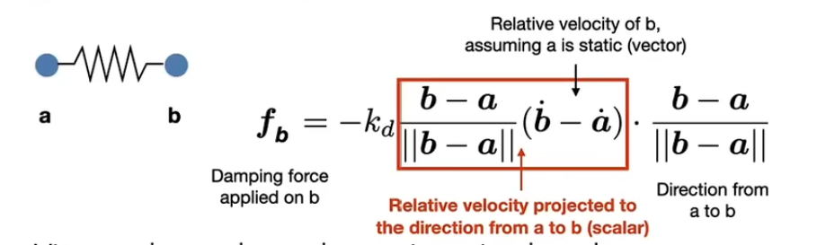
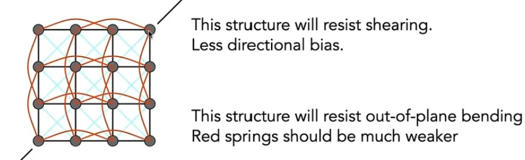
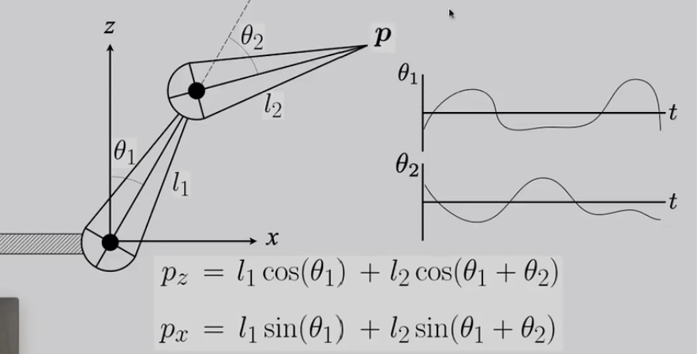
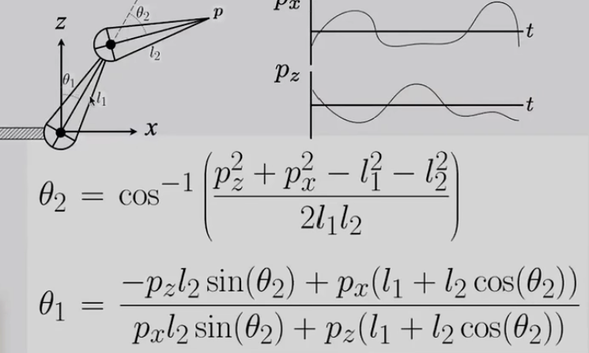

## 02122 Animation

Mass Spring System 质点弹簧系统

弹簧振子系统摩擦力*

质点弹簧系统布料描述

Particle Systems 粒子系统

- create new particles
- calculate forces
- update position and velocity
- remove and update
- render

Forward Kinematics 正向运动学

Articulated skeleton

Joint types

- pin (1D) 平面旋转
- Ball (2D) 立体旋转
- Prismatic joint (translation) 拉长

Inverse Kinematics 逆运动学

#### Animation (cont.)

$$v(x,t)=\frac{dx}{dt}$$

Euler's Method
$$
x^{t+\Delta t}=x^t+\Delta t \dot x^t \\
\dot x^{t+\Delta t}=\dot x^t+\Delta t \ddot x^t
$$
problem: 圆周运动无法表示

Midpoint method

- compute euler step
- compute derivative at midpoint of euler step 计算中点速度
- update position using midpoint derivative 用中点速度计算位置

$$
x_{mid}=x(t)+\Delta t/2*v(x(t),t)\\
x(t+\Delta t)=x(t)+\Delta t *v(x_{mid},t)
$$

Better results
$$
x^{t+\Delta t}=x^t+\Delta t/2 *( \dot x^t + \dot x^{t+\Delta t})\\
\dot x^{t+\Delta t}=\dot x^t+\Delta t \ddot x^t\\
x^{t+\Delta t}=x^t+\Delta t \dot x^t + \frac{(\Delta t)^2}{2}\ddot x^t
$$
Adaptive Step Size

- compute $$x_t$$ an euler step, size T
- compute $$x_{t/2}$$ an euler step, size T/2
- compute error $$||x_t=x_{t/2}||$$
- if(error> threshold) do it again

Implicit Euler Method

用下一帧的速度来算

Stability:

O(h):if we halve h, we can expect the error to halve as well

for implicit euler

Local truncation error(every step): O(h^2)

Global truncation error(overall): O(h)

Runge-Kutta Families - RK4:O(h^4)
$$
y_{n+1}=y_n+\frac{1}{6}h(k_1+2k_2+2k_3+k_4)\\
t_{n+1}=t_n+h\\
k_1=f(t_n,y_n),k_2=f(t_n+\frac{h}{2},y_n+h\frac{k_1}{2}),\\
k_3=f(t_n+\frac{h}{2},y_n+h\frac{k_2}{2}),k_2=f(t_n+h,y_n+hk_3)
$$
Position-Baesd / Verlet Integration

##### RigidBody Simulation

$$
\frac{d}{dt}\begin{bmatrix}X\\\theta\\\dot X\\w\end{bmatrix}=
\begin{bmatrix}\dot X\\\omega\\\ddot X\\\alpha\end{bmatrix}
$$

##### Fluid Simulation

思路：若小球运动导致密度发生变化 则需要重新运动到密度一致的情况（流体密度不变假设）

Update: gradient descent

模拟大规模物质:

Eulerrian vs. Lagrangian

质点法 Lagrangian 模拟每个个体

网格法 Eulerrian 考虑每个网格随着时间如何变化

Material Point Method MPM: combining Eulerian and Lagranigian

