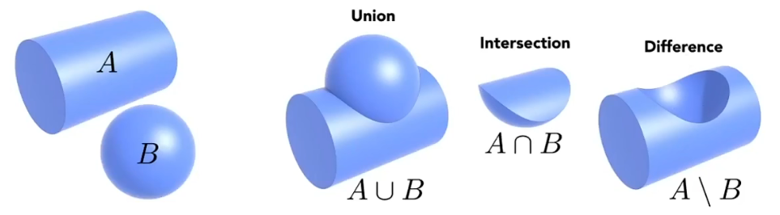
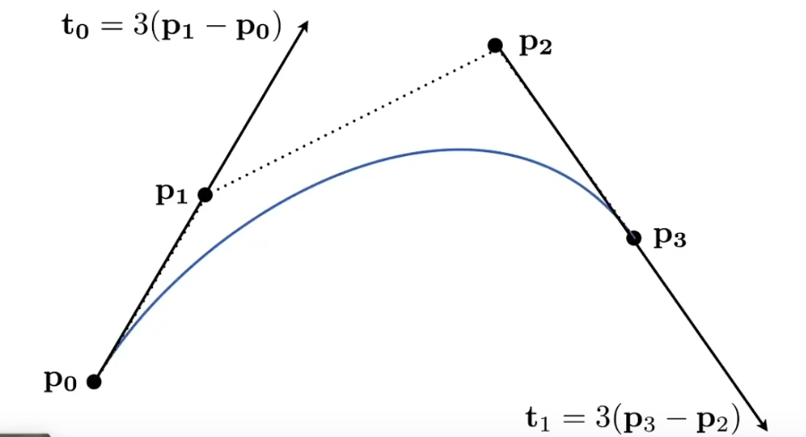
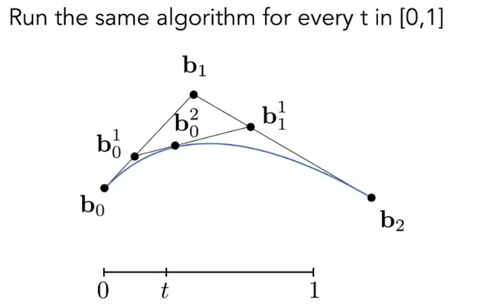
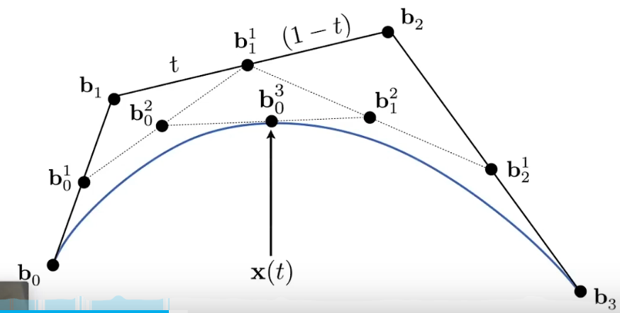
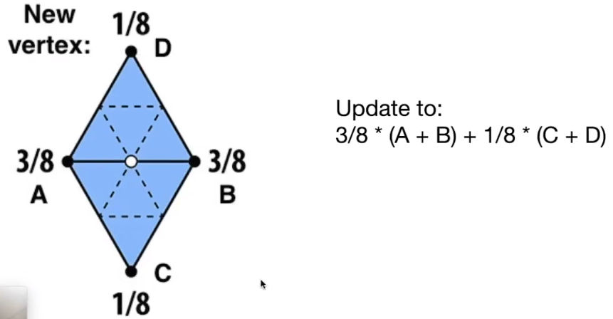
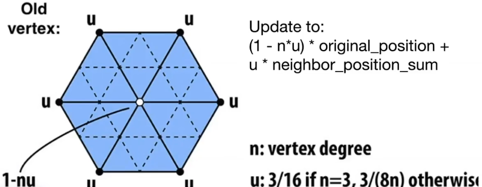
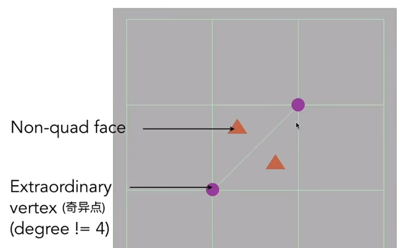
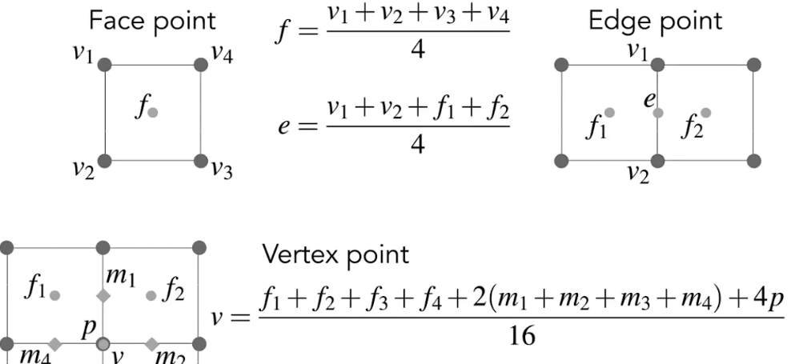

## 0101112 Geometry 123

#### Introduction

##### Implicit 隐式几何

points satisfy some specified relationship $$x^2+y^2+z^2=1$$

More generally, $$f(x,y,z)=0$$ ->judge inside/outside easy but sampling hard

##### Explicit 显式几何

all points are given directly or via parameter mapping(参数映射)

parameter mapping: $$f:(u,v)->(x,y,z)$$

example: $$f(u,v)=((2+cosu)cosv,(2+cosu)sinv,sinu)$$

##### Implicit:

###### Constructive  Solid Geometry CSG

combine implicit geometry via Boolean operations



###### Distance Functions

giving minimum distance (could be signed distance) from anywhere to object

case: for the circle [SDF解析(CSDN)][]

[SDF解析(CSDN)]: https://blog.csdn.net/qq_41368247/article/details/106194092

```
float sdCircle( vec2 p, float r )
{
  // 与圆心距离位r的点，在该圆上，SDF取值0
  return length(p) - r;
}
```

###### Level set

深入有点难 暂时别管

###### Fractal

exhibit self-similarity, detail at all scales

##### Explicit

###### Point Cloud

list of points(x,y,z)

###### Polygon Mesh (Generally)

Store vertices and polygons (often triangles or quads)

The Wavefront Object File(.obj) Format

a text file that specifies vertices, normals, texture coordinates and their connectivities

v - vertices, vt - texture coordinates, vn - normals, connectivities - explain the connectivities of a triangle

#### Curves 曲线

##### Bezier Curves 贝塞尔曲线 懒得打

Defining cubic bazier curve with tangents



consider 3 points (quadratic bazier)二阶贝塞尔



Four input points



algebraic formula

Bernstein form of a bezier curve of order n
$$
b^n(t)=b^n_0(t)=\sum_{j = 0}^{n}b_jB^n_j(t)
$$
Bernstein polynomials:
$$
B^n_i(t)=\left(\begin{matrix} n\\i \end{matrix}\right)t^i(1-t)^{n-i}
$$
example:  n=3
$$
b^3(t)=\bold {b_0}(1-t)^3+\bold{b_1}3t(1-t)^2+\bold{b_2}3t^2(1-t)+\bold {b_3}t^3
$$
properties:

- $$b(0)=b_0, b(1)=b_3$$
- $$b'(0)=3(b_1-b_0),b'(1)=3(b_3-b_2)$$
- affine transformation property
- convex hull(凸包) property: curve is within convex hull of control points

##### Piecewise Bezier Curve

Generally use Piecewise cubic Bezier（每四个控制点定义一条）

$$C^0$$ continuity: $$\bold {a_n}=\bold {b_0}$$

$$C^1$$ continuity: $$\bold {a_n}=\bold {b_0}=\frac{1}{2}(\bold {a_{n-1}}+\bold {b_1})$$

#### Surfaces

##### Mesh Subdivision

###### Loop(这是个姓) Subdivision

- split a triangle into 4
- assign new vertex positions






###### Catmull-Clark Subdivision(General Mesh)





##### Mesh Simplification

reduce number of mesh elements while maintaining the overall shape

###### Quadric Error Metrics

- approximate distance to surface as sum of distances to planes containing triangles
- iteratively collapse edge with smallest score 

Mesh Regularization

##### Shadows

draw shadows using rasterization: Shadow mapping

###### Shadow Mapping - use for point light source

key idea: the points not in the shadow must be seen both by the light and by the camera

- The depth buffer from the light's point-of-view
- Comparing Dist(light, shading point) with shadow map