## 017 Materials and Appearance

##### Material == BRDF

如果材质不吸收光 则由能量守恒
$$
L_o(w_o)=\int_{H^2}f_rL_i(w_i)cos\theta_i dw_i\\
= f_rL_i\int_{H^2}cos\theta_i dw_i\\
=\pi f_r  L_i\\
f_r = \frac{1}{\pi}
$$
反射率 $$f_r = \frac{\rho}{\pi}, \rho \in[0,1]$$

反射Perfect Specular Reflection

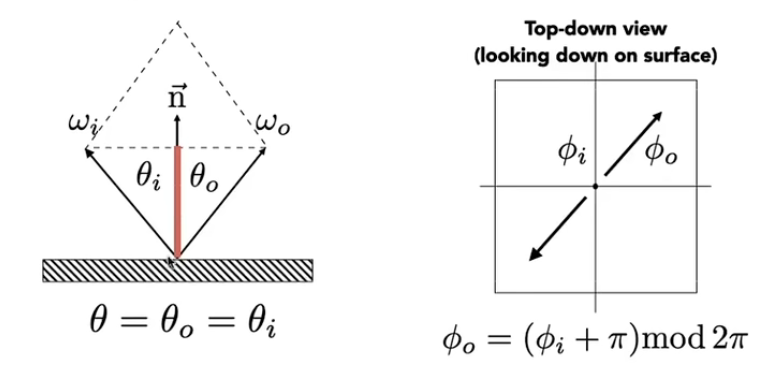

$$w_o+w_i = 2 cos \theta \bold n = 2(w_i \cdot \bold n)\bold n$$

折射 Snell's Law

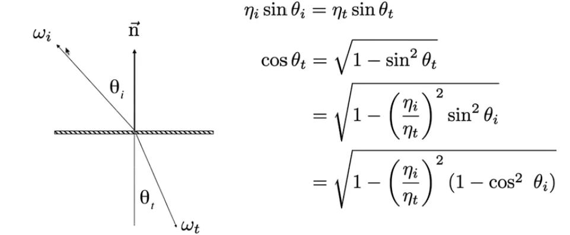

$$1<(\frac{\eta_i}{\eta_t})^2(1-cos^2\theta_i)$$  全反射 即$$\frac{\eta_i}{\eta_t}>1$$

Fresnel Reflection/Term 菲涅尔项

Reflectance depends on incident angle

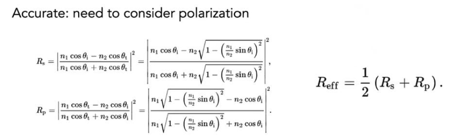

Approximate:
$$
R(\theta)=R_0+(1-R_0)(1-cos\theta)^5,R_0=(\frac{n_1-n_2}{n_1+n_2})^2
$$
Microfacet BRDF

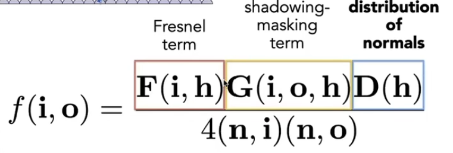

Fresnel term表示能量反射 shadowing-masking 自遮挡-grazing angle 

Isotropic/Anisotropic Materials 各向同性/各向异性材质  

各向异性$$f_r(\theta_i,\phi_i,\theta_r,\phi_r)\neq f_r(\theta_i,\phi_i,\theta_r-\phi_r) $$

Properties of BRDFs

- Non-negativity $$f_r(w_i->w_r)\geq0$$
- Linearity $$L_r(p,w_r)=\int_{H^2}f_r(p,w_i->w_r)L_i(p,w_i)cos\theta_i dw_i$$
- Reciprocity principle 可逆性 $$f_r(w_r->w_i)=f_r(w_i->w_r)$$
- Energy conservation $$\forall w_r \int_{H^2}f_r(w_i->w_r)cos\theta_i dw_i \leq1$$
- Isotropic and anisotropic $$f_r(\theta_i,\phi_i,\theta_r,\phi_r)= f_r(\theta_i,\theta_r,|\phi_i -\phi_r|) $$

Measuring BRDFs

好像没什么用 我又不测

## L18 Advanced Topic in Rendering

Biased vs Unbiased Monte Carlo Estimators 无偏/有偏

期望是否和值一样——无偏/有偏（consistent一致）

无偏估计

Bidirectional Path Tracing BDPT 双向路径追踪 适用光源复杂

Metropolis Light Transport MLT 给定一条路径 采样相似的路径 

适合复杂光路传播 但收敛速度未知

Photon Mapping 光子映射 适合caustics

stage1 photon tracing 光源发出光子到达表面

stage2 photon collection 相机发出光子到达表面

stage3 local density estimation 局部密度估计 （密度估计实际上不正确导致有偏，但光子足够多极限情况下该结果正确）

Vertex Connection and Merging combination of BDPT and Photon Mapping

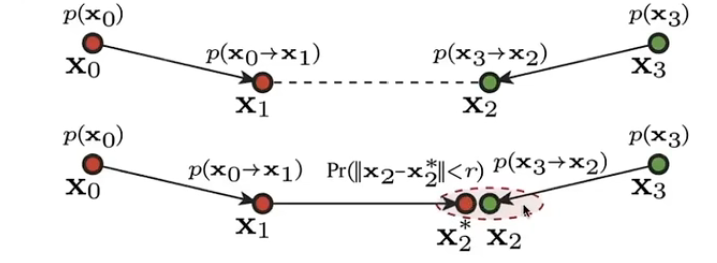

Instant Radiosity (IR) 生成Virtual Point Light(VPL)生成虚拟光源

fast and usually gives good results on diffuse scenes . but cannot use glossy material

###  Advanced Appearance Medeling

participating media参与介质

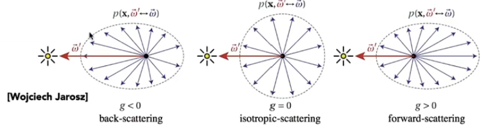

hair appearance

Kajiya-Kay Model

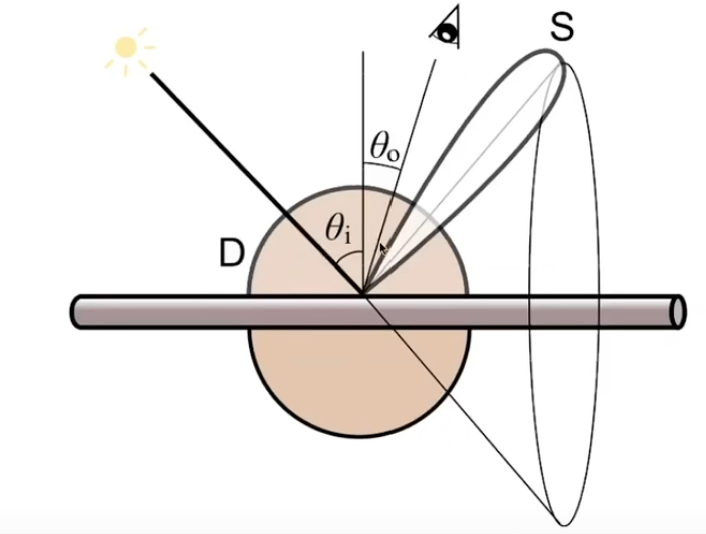

Marschner Model

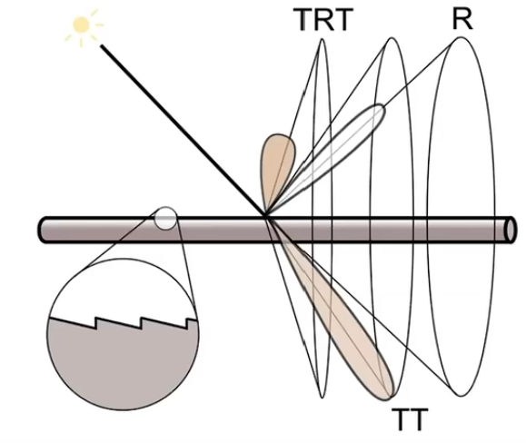

Fur Appearance

头发模型髓质问题

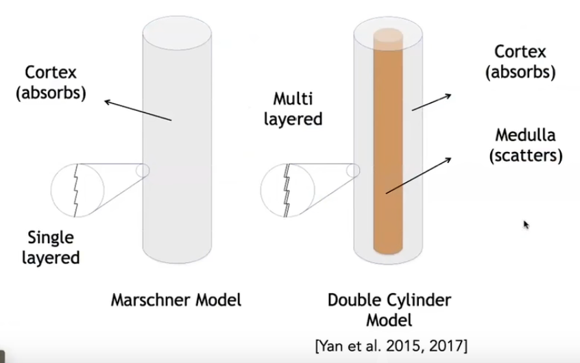

Granular Material 颗粒材质

Translucent Material 类玉石材质 Subsurface Scattering 次表面散射

BSSRDF: $$S(x_i,w_i,x_o,w_o)$$

Dipole Approxiamation

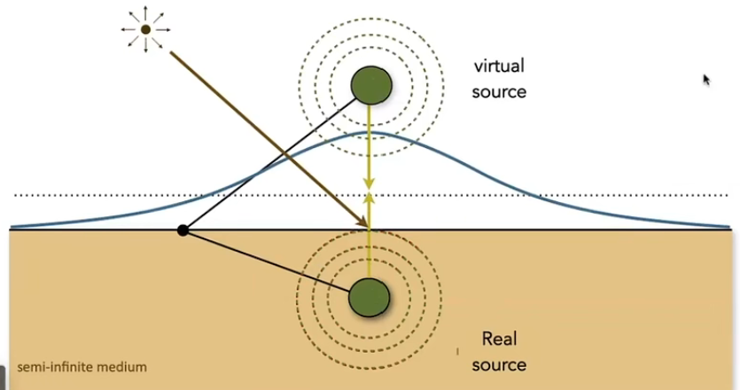

Cloth: a collection of twisted fibers

Render as surface : Render using BRDF （不适用天鹅绒等立体）

Render as Participating Media 

Render as Actual Fibers 暴力渲染每根

Detailed Appearance

细节法线分布

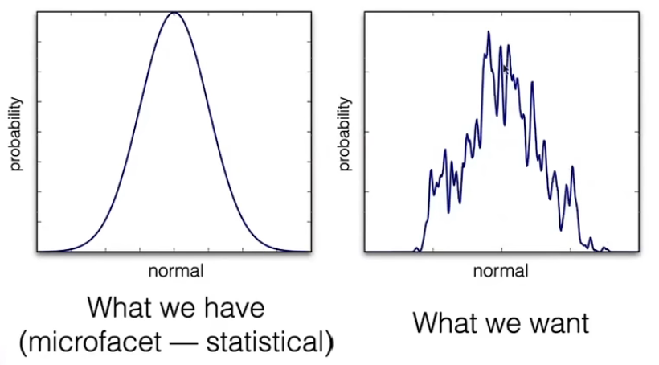

Difficult path sampling problem

Procedural Appearance 程序化生成外观->噪声函数

## 019 Cameras, Lenses and Light Fields

Imaging = Synthesis + Capture

Pinhole Camera 小孔成像原理 针孔摄像机不存在虚化景深效果

Field of View FOV 视场

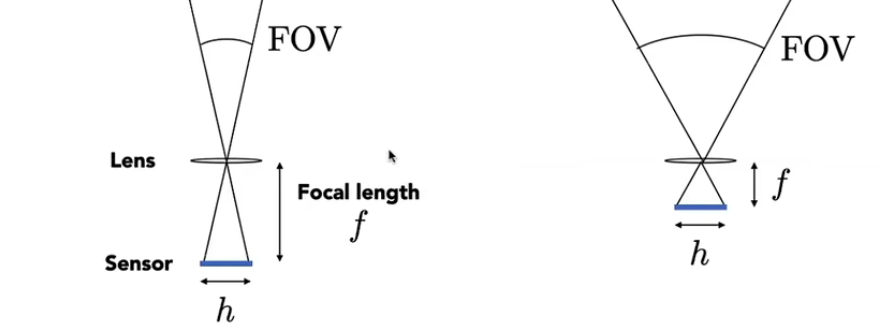
$$
FOV=2arctan(\frac{h}{2f})
$$
Exposure

- $$H=T\cross E$$
- Exposure = exposure time(T-快门) * irradiance(E)-(aperture size光圈)

f-stop control the size of the aperture: Exposure Levels

Shutter speed 快门速度: Motion blur 运动模糊：快门打开的时间内物体已经产生移动-Rolling shutter问题

ISO gain 感光度 - Linear Multiply

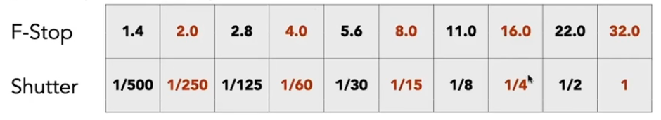

曝光度权衡

Thin Lens Approximation
$$
\frac{1}{f}=\frac{1}{u}+\frac{1}{v}
$$
Defocus Blur

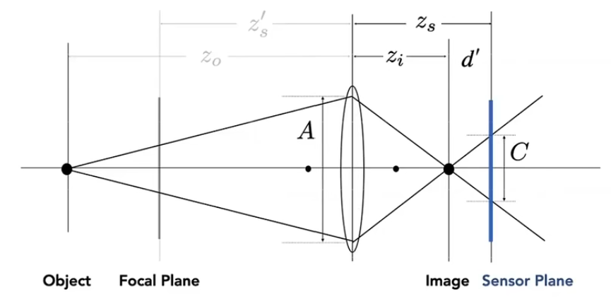

Circle of confusion:$$\frac{C}{A}=\frac{d'}{z_i}=\frac{|z_s-z_i|}{z_i}$$

F-number: the focal length divided by the diameter of the aperture

##### Ray Tracing Ideal Thin Lenses

- choose sensor size, lens focal length and aperture size
- choose depth of subject of interest z

Rendering:

- For each pixel x' on the sensor(actually, film(胶片))
- Sample random points x'' on lens plane

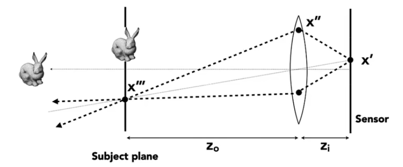

Depth of Field

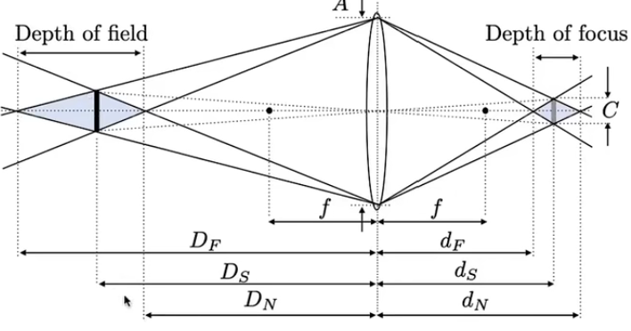

#### Light Field/Lumigraph

The Plenoptic Function 全光函数: $$P(\theta,\phi,\lambda,t,V_v,V_y,V_z)$$ 观察角度，波长，时间，观察位置

抽象 不知道怎么概括 参数化

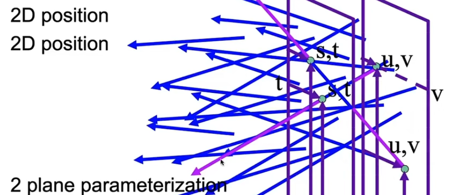

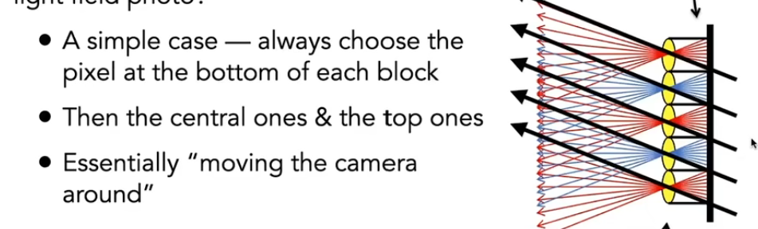

理解一下得了 写不了一点

#### Physical Basis of Color

Spectral Power Distribution 谱功率密度 SPD

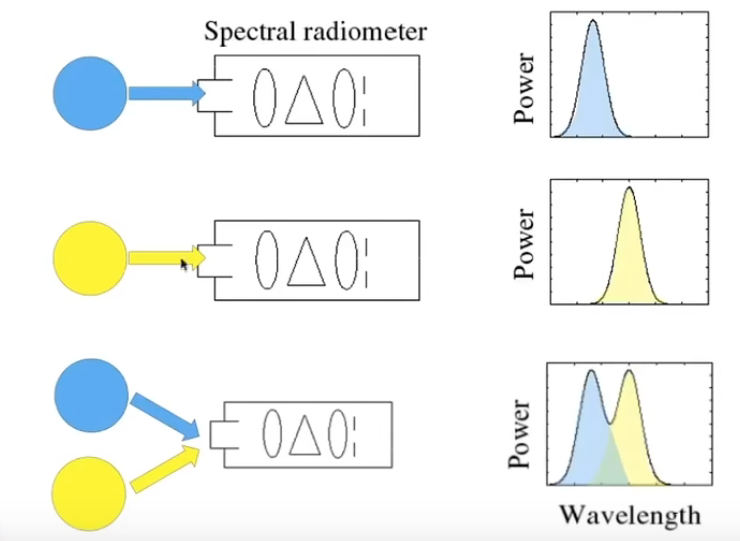

线性性质

光的感知

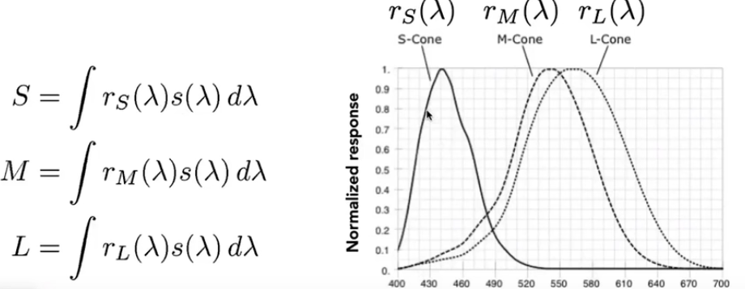

同色异谱 - 不同的光谱 经过积分后值相同

Color Reproduction

加色系统

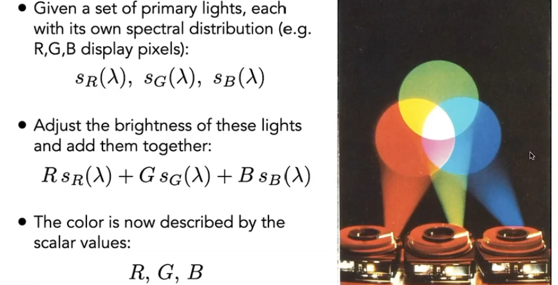

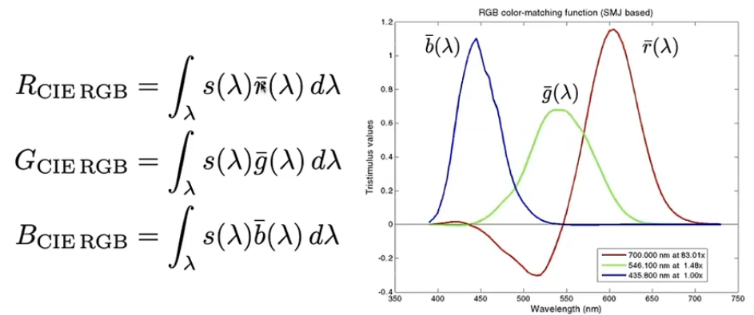

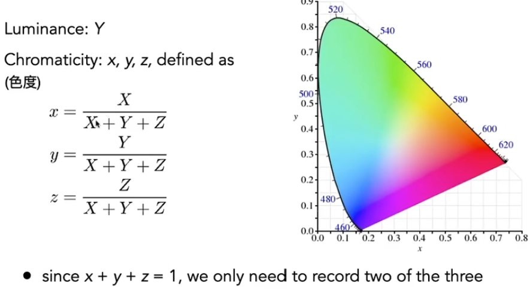