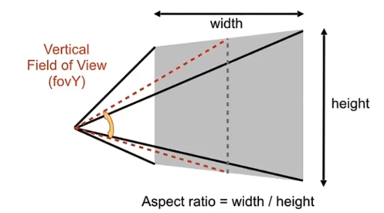
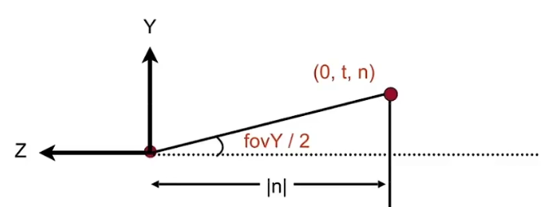
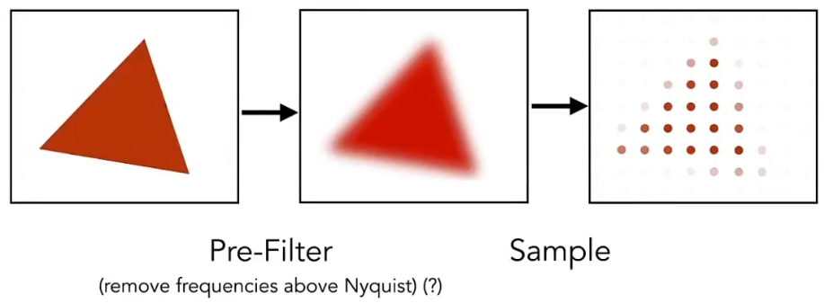
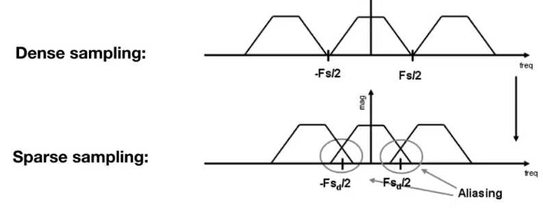
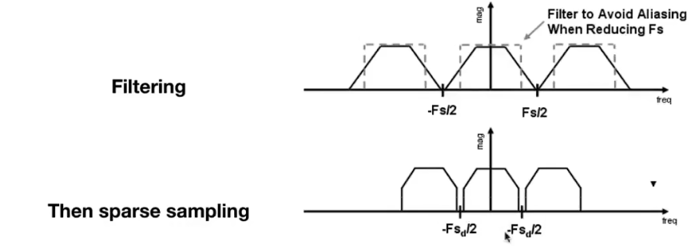

## Lec 5. Rasterization 1(Triangles)

好 发现把这些搬上来要把图片重新搬一遍 非常好博客 爱来自懒狗

#### how to define the frustum

- vertical field-of-view(fovY)
- aspect radio = width / height 



convert:


$$
tan(fovY/2)=t/|n|\\
aspect = r/t
$$
Raster == screen in German

Rasterize == drawing onto the screen

Pixel(FYI, short for "picture element")

#### Canonical Cube to Screen

- Irrelevant to z

- Transform in x and y plane: $$[-1, 1]^2$$ to $$[0, width]$$ x$$[0, height]$$

- $$
  M_{viewport}=\begin{bmatrix}
  width/2 & 0 & 0 & width/2 \\
  0 & height/2 & 0 & height/2 \\
  0 & 0 & 1 & 0\\
  0 & 0 & 0 & 1
  \end{bmatrix}
  $$

  

#### Sample

$$
inside(t,x,y)=
\begin{cases}
1, & point(x,y)&in&triangle&t\\
0,&otherwise
\end{cases}
$$

```
for(int x=0;x<xmax;++x)
	for(int y=0;y<ymax;++y)
		image[x][y]=inside(tri,x+0.5,y+0.5);
```

how to judge whether the point is inside of the triangle: cross product.

edge cases: define by yourself. (no treatment simply)

no check all pixels on the screen, just use a Bounding Box(包围盒) (min x/max x/min y/max y)

Aliasing 走样(Jaggies 锯齿)->抗锯齿

## Lec 6. Rasterization 2(Antialiasing and Z-Buffering)



Twp frequencies that are indistinguishable at a given sampling are called "aliases"

Filtering = Getting rid of certain frequency contents

Filtering = Convolution(卷积) = Averaging



antialiasing

##### Visibility/occlusion

###### Z-buffering

##### Painter's Algorithm

Paint from back to front, overwrite in the framebuffer.

Requires sorting in depth(O(nlogn)) for n triangles)

##### Z-Buffer

- Store current min z-value for each pixel
- Needs an additional buffer for depth values
  - frame buffer stores color values
  - depth buffer stores depth

```
for(each triangle T)
	for(each sample(x,y,z) in T)
		if(z<zbuffer[x,y]) //if there is a closer color then replace
			framebuffer[x,y]=rgb;
			zbuffer[x,y]=z;
```

O(n) for n triangles.