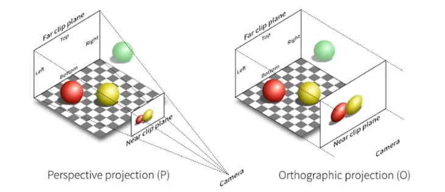
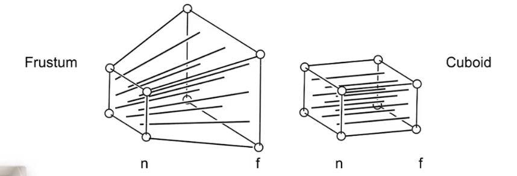

## 03 Transformation

### Scale Matrix

$$
\begin{bmatrix}
x' \\
y'
\end{bmatrix}=
\begin{bmatrix}
s_{x} & 0 \\
0 & s_{y}
\end{bmatrix}
\begin{bmatrix}
x \\
y
\end{bmatrix}
$$

### Reflection Matrix

$$
\begin{bmatrix}
x' \\
y'
\end{bmatrix}=
\begin{bmatrix}
-1 & 0 \\
0 & 1
\end{bmatrix}
\begin{bmatrix}
x \\
y
\end{bmatrix}
$$

### Shear Matrix 切变

$$
\begin{bmatrix}
x' \\
y'
\end{bmatrix}=
\begin{bmatrix}
1 & a \\
0 & 1
\end{bmatrix}
\begin{bmatrix}
x \\
y
\end{bmatrix}
$$

### Rotate (about the origin(0,0)) 

$$
逆时针旋转α
\begin{bmatrix}
x' \\
y'
\end{bmatrix}=
\begin{bmatrix}
cosα & -sinα \\
sinα & cosα
\end{bmatrix}
\begin{bmatrix}
x \\
y
\end{bmatrix}
$$

### Linear Transforms

$$
线性变换
\begin{bmatrix}
x' \\
y'
\end{bmatrix}=
\begin{bmatrix}
a & b \\
c & d
\end{bmatrix}
\begin{bmatrix}
x \\
y
\end{bmatrix}
$$

### Homogeneous coordinates 齐次坐标

平移不是线性变换——增加维度
$$
\begin{bmatrix}
x' \\
y' \\
w'
\end{bmatrix}=
\begin{bmatrix}
1 & 0 & t_{x}\\
0 & 1 & t_{y}\\
0 & 0 & 1
\end{bmatrix}
\begin{bmatrix}
x \\
y \\
1
\end{bmatrix}
$$
2D point = $$ (x, y, 1)^T $$

2D vector = $$ (x, y, 0)^T $$

vector + vector = vector

point - point = vector

point + vector = point 
$$
\begin{bmatrix}
x \\
y \\
w
\end{bmatrix} -> 
\begin{bmatrix}
x/w \\
y/w \\
1
\end{bmatrix} ,w≠0
$$
$$ M^{-1} $$ is the inverse of transform $$ M $$ in both a matrix and geometric sense

### 3D Transformations

3D point = $$ (x, y, z, 1)^T$$

3D vector = $$ (x, y, z, 0)^T $$
$$
\begin{bmatrix}
x' \\
y' \\
z' \\
1
\end{bmatrix}=
\begin{bmatrix}
a & b & c & t_{x}\\
d & e & f & t_{y}\\
g & h & i & t_{z}\\
0 & 0 & 0 & 1
\end{bmatrix}
\begin{bmatrix}
x \\
y \\
z \\
1
\end{bmatrix}
$$

## Transformation Cont.

In rotation, there is
$$
R_{\theta}=
\begin{bmatrix}
cos\Theta & -sin\Theta\\
sin\Theta & cos\Theta
\end{bmatrix}
$$

$$
R_{-\theta}=
\begin{bmatrix}
cos\Theta & sin\Theta\\
-sin\Theta & cos\Theta
\end{bmatrix}
=R_{\Theta}^T
$$

and by definition there is $$R_{-\Theta}=R_{\Theta}^{-1}$$

So in rotation there is $$R_{-\Theta}=R_{\Theta}^{-1}=R_{\Theta}^T$$  (正交矩阵)

### Viewing transformation

#### - View/Camera transformation

#### - Projection transformation

- Orthographic projection 正交投影

- Perspective projection 透视投影

  

### Rotation around x-, y-, or z-axis

$$
R_{x}(\alpha)=
\begin{bmatrix}
1 & 0 & 0 & 0\\
0 & cos\alpha & -sin\alpha & 0\\
0 & sin\alpha & cos\alpha & 0\\
0 & 0 & 0 & 1
\end{bmatrix}
$$

$$
R_{y}(\alpha)=
\begin{bmatrix}
cos\alpha & 0 & sin\alpha & 0\\
0 & 1 & 0 & 0\\
-sin\alpha & 0 & cos\alpha & 0\\
0 & 0 & 0 & 1
\end{bmatrix}
$$

$$
R_{y}(\alpha)=
\begin{bmatrix}
cos\alpha & -sin\alpha & 0 & 0\\
sin\alpha & cos\alpha & 0 & 0\\
0 & 0 & 1 & 0\\
0 & 0 & 0 & 1
\end{bmatrix}
$$

Euler angles $$R_{x, y, z}(\alpha, \beta, \gamma)=R_{x}(\alpha)R_{y}(\beta)R_{z}(\gamma)$$

### Rodrigues' Rotation Formula

rotation by angle α around axis n (go through the origin)
$$
R(n, \alpha)=cos(\alpha)I +(1-cos(\alpha))nn^T+sin\alpha
\begin{bmatrix}
0 & -n_{z} & n_{y}\\
n_{z} & 0 & -n_{x}\\
-n_{y} & n_{x} & 0\\
\end{bmatrix}
$$

### View Transformation

#### Define camera

- Position $$\vec{e}$$

- Look-at direction $$\vec{g}$$
- Up direction $$\vec{t}$$  (rotate the camera itself, to decide up)

standard angle: The origin, up at Y, look at -Z

$$M_{view}=R_{view}T_{view}$$

translate to origin
$$
T_{view}=
\begin{bmatrix}
1 & 0 & 0 & -x_{e}\\
0 & 1 & 0 & -y_{e}\\
0 & 0 & 1 & -z_{e}\\
0 & 0 & 0 & 1
\end{bmatrix}
$$
rotate to standard angle: rotate g to -Z, t to Y, (g × t) to X

consider its inverse rotation: rotate rotate Z to -g, Y to t, X to (g × t)
$$
R_{view}^{-1}=
\begin{bmatrix}
x_{\vec{g}×\vec{t}} & x_{t} & x_{-g} & 0\\
y_{\vec{g}×\vec{t}} & y_{t} & y_{-g} & 0\\
z_{\vec{g}×\vec{t}} & z_{t} & z_{-g} & 0\\
0 & 0 & 0 & 1
\end{bmatrix}->
R_{view}=
\begin{bmatrix}
x_{\vec{g}×\vec{t}} &y_{\vec{g}×\vec{t}} &z_{\vec{g}×\vec{t}}  & 0\\
x_{t} & y_{t} &z_{t}  & 0\\
x_{-g} & y_{-g} & z_{-g} & 0\\
0 & 0 & 0 & 1
\end{bmatrix}
$$

#### Orthographic Projection

In general, we map a cuboid [l ,r]×[b, t]×[f, n] to the "canonical" cube $$[-1, 1]^3$$

- center cuboid by translating

- scale into "canonical" cube
  $$
  M_{ortho}=
  \begin{bmatrix}
  2/(r-l) & 0 & 0 & 0\\
  0 & 2/(t-b) & 0 & 0\\
  0 & 0 & 2/(n-f) & 0\\\
  0 & 0 & 0 & 1\\
  \end{bmatrix}
  \begin{bmatrix}
  1 & 0 & 0 & -(r+l)/2\\
  0 & 1 & 0 & -(t+b)/2\\
  0 & 0 & 1 & -(n+f)/2\\\
  0 & 0 & 0 & 1\\
  \end{bmatrix}
  $$

#### Perspective Projection

- "squish" the frustum into a cuboid 把远端画面挤压到立方体大小后使用正交投影

  

$$
\begin{bmatrix}
x\\y\\z\\1
\end{bmatrix}->\begin{bmatrix}
nx\\ny\\unknown\\z\end{bmatrix}
$$

$$
M_{persp->ortho}=
\begin{bmatrix}
n & 0 & 0 & 0\\
0 & n & 0 & 0\\
\\
0 & 0 & 1 & 0
\end{bmatrix}
$$

Any point on the near plane will not change

In this case, the result should be $$\begin{bmatrix}nx\\ny\\n^2\\n\end{bmatrix}$$
$$
\begin{bmatrix}
0 & 0 & A & B
\end{bmatrix}
\begin{bmatrix}
x\\y\\n\\1
\end{bmatrix}=n^2
$$
Any point's z on the far plane will not change
$$
\begin{bmatrix}
0 & 0 & A & B
\end{bmatrix}
\begin{bmatrix}
0\\0\\f\\1
\end{bmatrix}=f^2
$$

$$
\begin{cases}
An+B=n^2 \\
Af+B=f^2 \\
\end{cases} ->
\begin{cases}
A=n+f\\B=-nf
\end{cases}
$$

so if there is a vector $$\vec{a}=\begin{bmatrix}0,0,a,1\end{bmatrix}, f>a>n$$, the z coordinate of the vector after transformation is $$z'=\begin{bmatrix}0,0,an+af-nf,1\end{bmatrix}$$, so we can know that a point after the transformation of the frustum is farther than the point before.
