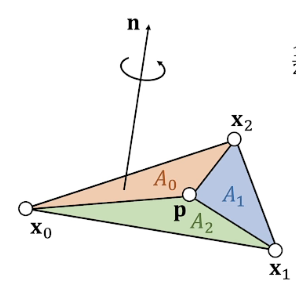

三维坐标

右手系: OpenGL, Research...

左手系: Unity, DirectX...

$$p = \begin{bmatrix} x_0\\x_1\\x_2\\...\\x_i \end{bmatrix} \in R^{3*i}$$ not a geometric vector, but a stacked vector.没有几何意义

##### 线性表示：向量表示位置/速度/力/线段/射线/直线

$$p(t)=p+tv$$ 表示位置

$$p(t)=p+t(q-p)\\p(t)=(1-t)p+tq $$表示插值，t表示权重(interpolant)

##### vector.norm()矢量大小

$$
||p||_2=(p_x^2+p_y^2+p_z^2)^{1/2}……2-norm \\
||p||_a=(p_x^a+p_y^a+p_z^a)^{1/a}……a-norm \\
||p||_1=(p_x+p_y+p_z)……1-norm\\
||p||_\infty = max(|p_x|,|p_y|,|p_z|)……Infinity-norm
$$

1-norm->曼哈顿距离

$$p \dotproduct q=p_xq_x+p_yq_y+p_zq_z = p^Tq$$ 点乘 满足交换律 分配律

$$p\dotproduct p=||p||^2$$ a way to write norm

由点乘计算投影距离
$$
s=(p-c)^Tn
$$
n为平面法向量，则$$s>0$$ ，点在平面上方（平面法向量方向）;$$s=0$$，点在平面上；$$s<0$$，点在平面下
$$
||p(t)-c||^2=r^2\\
(p-c+tv)\dotproduct (p-c+tv)=r^2\\
(v\dotproduct v)t^2 + 2(p-c)\dotproduct vt+(p-c)\dotproduct (p-c)-r^2=0
$$

$$r=p\cross q = \begin{bmatrix}p_yq_z-p_zq_y\\p_zq_x-p_xq_z\\p_xq_y-p_yq_x\end{bmatrix}$$

$$p\cross q = \bold0$$   ->   parallel

$$
\bold x_{10}=\bold x_1-\bold x_0 , \bold x_{20}=\bold x_2-\bold x_0\\
\bold n = (\bold x_{10} \cross \bold x_{20})/||\bold x_{10} \cross \bold x_{20}||\\
Area = ||\bold x_{10} \cross \bold x_{20}||/2,面积
$$
Triangle inside/outside 101提过了 不写
$$
\frac{1}{2}(\bold x_0-\bold p)\cross (\bold x_1-\bold p) \dotproduct \bold n = \left \{ \begin{aligned} \frac{1}{2}||(\bold x_0-\bold p)\cross (\bold x_1-\bold p)||,inside  \\  
-\frac{1}{2}||(\bold x_0-\bold p)\cross (\bold x_1-\bold p)||,outside \end{aligned}  \right.
$$

Signed areas:
$$
A_2=\frac{1}{2}(\bold x_0-\bold p)\cross (\bold x_1-\bold p)\dotproduct \bold n\\
A_1=\frac{1}{2}(\bold x_1-\bold p)\cross (\bold x_2-\bold p)\dotproduct \bold n\\
A_0=\frac{1}{2}(\bold x_2-\bold p)\cross (\bold x_0-\bold p)\dotproduct \bold n\\
A_0+A_1+A_2=A\\
b_0=A_0/A,b_1=A_1/A,b_2=A_2/A\\
\bold p = b_0 \bold x_1 + b_1 \bold x_0 + b_2 \bold x_2
$$
图画错了 公式按着画错的图来（

$$V=\frac{1}{3}hA=\frac{1}{6}\bold x_{30}\dotproduct \bold x_{10}\cross \bold x_{20}$$ is signed,取决于选择的底面的法向量与高度顶点关系
$$
V=\frac{1}{3}hA=\frac{1}{6}\bold x_{30}\dotproduct \bold x_{10}\cross \bold x_{20}\\
=\frac{1}{6}\begin{bmatrix}x_1&  x_2& x_3 & x_0 \\
1 & 1& 1& 1\end{bmatrix}\\
$$
同理可得 $$\bold p = b_0 \bold x_0 +b_1 \bold x_1+b_2 \bold x_2 +b_3 \bold x_3$$

确认相交：

1 确认相交位置:$$(p(t)-x_0)\dotproduct x_{10}\cross x_{20}=0\\t=\frac{(p-x_0)\dotproduct x_{10}\cross x_{20}}{v\dotproduct x_{10} \cross x_{20}}$$

2 确认是否在三角形内部

##### 正交矩阵

$$A=[a_0 \ a_1\ a_2]$$ such that $$a_i^Ta_j=\left \{ \begin{aligned}1,i=j\\0,i\neq j\end{aligned}\right.$$

$$A^T=A^{-1}$$

旋转矩阵：局部坐标系在世界状态中描述的，即正交矩阵

##### 奇异值分解

$$A=UDV^T$$，D是对角矩阵，U和V是正交矩阵

任意线性变换可用三个矩阵描述旋转$$V^T$$->缩放$$D$$->旋转$$U$$

##### 特征值分解（仅考虑对称矩阵）

$$A=UDU^{-1}$$，D是对角矩阵，U是正交矩阵

对称且正定 Symmetric Positive Definiteness(S.P.D)

正定$$v^TAv>0,v\ne0$$

半正定$$v^TAv\geq0,v\ne0$$

 

因此 对于正定矩阵$$A=UDU^T\ and\ d_0,d_1,..>0$$

对于正定矩阵，如果矩阵对角占优（每行对角大于其余值），则矩阵正定，但正定不一定对角占优

证明：if A is s.p.d., then $$B = \begin{bmatrix} A & -A \\-A & A\end{bmatrix}$$ is symmetric semi-definite（半正定）
$$
[x^T \ y^T]B\begin{bmatrix}x\\y\end{bmatrix}=[x^T \ y^T]\begin{bmatrix}A & -A\\-A &A\end{bmatrix}\begin{bmatrix}x\\y\end{bmatrix}\\
=x^TA(x-y)-y^TA(x-y)=(x-y)^TA(x-y)\ge 0 ，QED
$$

#### 求解线性方程

$$
\bold A \bold x = \bold b
$$

对于计算机而言 不求解矩阵的逆 因为原A矩阵可能是稀疏矩阵 而逆矩阵不一定是稀疏矩阵 会增大空间开销

求解方法：直接法(direct)、迭代法(iterative)

直接法一般基于LU分解（一般来说LU分解最佳内存）L下三角矩阵U上三角矩阵
$$
A=LU=\begin{bmatrix}l_{00}\\l_{10}&l_{11}\\.&...&...\end{bmatrix}
\begin{bmatrix}...&...&...\\&u_{n-1,n-1}\\&&u_{n,n}\end{bmatrix}
$$

$$
Ly=b\\
\begin{bmatrix}l_{00}\\l_{10}&l_{11}\\.&...&...\end{bmatrix}
\begin{bmatrix}y_0\\y_1\\...\end{bmatrix}=\begin{bmatrix}b_0\\b_1\\...\end{bmatrix}\\
y_0=b_0/l_{00}\\
y_1=(b_1-l_{10}y_0)/l_{11}\\
...
$$

$$
Ux=y\\\begin{bmatrix}...&...&...\\&u_{n-1,n-1}\\&&u_{n,n}\end{bmatrix}
\begin{bmatrix}...\\x_{n-1}\\x_n\end{bmatrix}=\begin{bmatrix}...\\y_{n-1}\\y_n\end{bmatrix}\\
...
$$

$$Ly=b,Ux=y$$   ->  $$LUx=b$$

直接法特点：

- 如果A稀疏，LU可能不太稀疏，取决于顺序(permutation)
- 两步：LU分解、LU求解

迭代法
$$
x^{k+1}=x^{k}+\alpha M^{-1}(b-Ax^{k})
$$
prove:
$$
b-Ax^{[k+1]}=b-Ax^{[k]}-\alpha AM^{-1}(b-Ax^{[k]})\\
=(I-\alpha AM^{-1})(b-Ax^{[k]})=(I-\alpha AM^{-1})^{k+1}(b-Ax^{[0]})
$$
因此 谱半径<1

$$b-Ax^{[k+1]}->0, if\ \rho(I-\alpha AM^{-1})<1 $$

如何取M：

$$M=diag(A)$$ Jacobi Method（要求对角占优）

$$M=lower(A)$$ Gauss-Seidei Method（要求正定）

迭代法易于实现，但有收敛性问题，都要求谱半径

#### 欢乐的微积分补课时间

$$
f(x)\in R,then \ df=\frac{\partial f}{\partial x}dx+\frac{\partial f}{\partial y}dy+\frac{\partial f}{\partial z}dz=
\begin{bmatrix}\frac{\partial f}{\partial x}&\frac{\partial f}{\partial y}&\frac{\partial f}{\partial z}\end{bmatrix}
\begin{bmatrix}dx\\dy\\dz\end{bmatrix}\\
\nabla f(x)=\begin{bmatrix}\frac{\partial f}{\partial x}\\\frac{\partial f}{\partial y} \\\frac{\partial f}{\partial z}\end{bmatrix}
$$

偏微分算子/梯度

if $$f(x)=\begin{bmatrix}f(x)\\g(x)\\h(x)\end{bmatrix}\in R^3$$ , then 
$$
Jacobian:J(x)=\frac{\partial f}{\partial x}=
\begin{bmatrix}\frac{\partial f}{\partial x} & \frac{\partial f}{\partial y} & \frac{\partial f}{\partial z}\\
\frac{\partial g}{\partial x}&\frac{\partial g}{\partial y}&\frac{\partial g}{\partial z}\\
\frac{\partial h}{\partial x}&\frac{\partial h}{\partial y}&\frac{\partial h}{\partial z}\end{bmatrix}
$$

散度
$$
Divergence：\nabla \dotproduct f =\frac{\partial f}{\partial x}+\frac{\partial g}{\partial y}+\frac{\partial h}{\partial z}
$$

$$
Curl:\nabla \cross f = \begin{bmatrix}\frac{\partial h}{\partial y}-\frac{\partial g}{\partial z} \\
\frac{\partial f}{\partial z}-\frac{\partial h}{\partial x}\\
\frac{\partial g}{\partial x}-\frac{\partial f}{\partial y}\end{bmatrix}
$$

二阶导
$$
Hessian:傻逼符号怎么这么多不想写了开摆截图
$$

喜闻乐见泰勒展开

quiz：对norm求导
$$
\frac{\partial ||\bold x||}{\partial \bold x} = \frac{\partial (\bold x^T\bold x)^{1/2}}{\partial \bold x}=
\frac{1}{2}(\bold x^T\bold x)^{-1/2}\frac{\partial (\bold x^T\bold x)}{\partial \bold x}\\
\frac{\partial (\bold x^T\bold x)}{\partial \bold x}=
\frac{\partial(x^2+y^2+z^2)}{\partial \bold x}=
\begin{bmatrix}2x&2y&2z\end{bmatrix}=2\bold x^T\\
\frac{\partial ||\bold x||}{\partial \bold x}=
\frac{\bold x^T}{||\bold x||}
$$
example:弹簧计算，利用上述计算结果

对于两个点，扩展维度$$R^6$$

