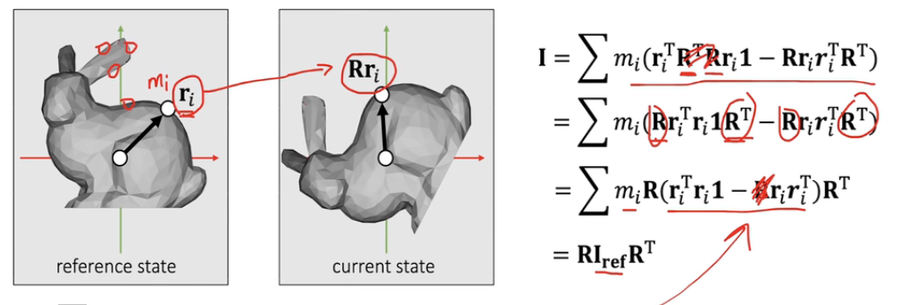
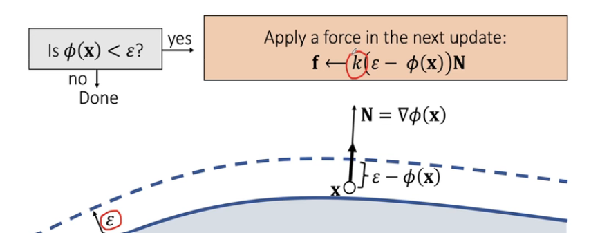
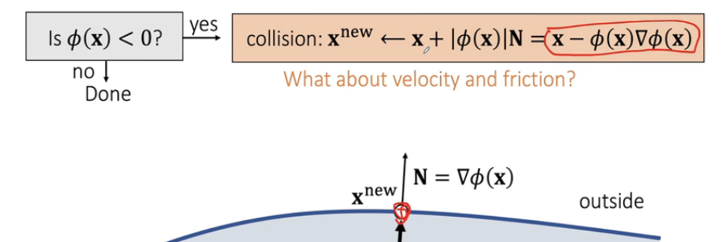
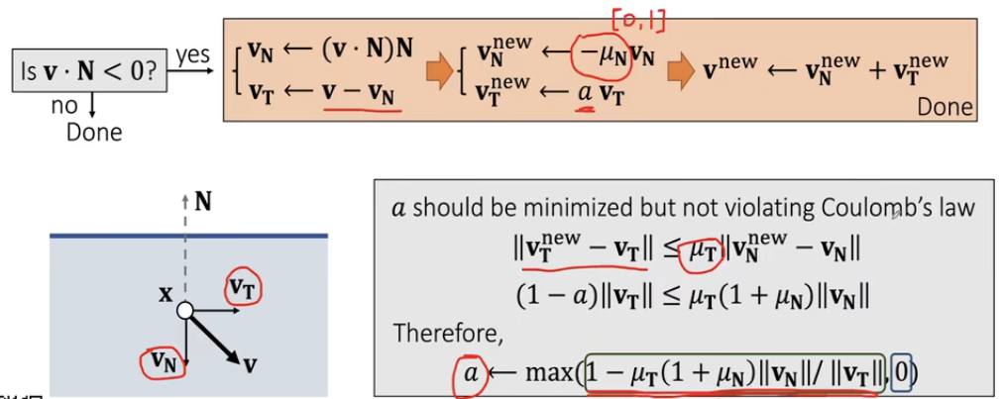
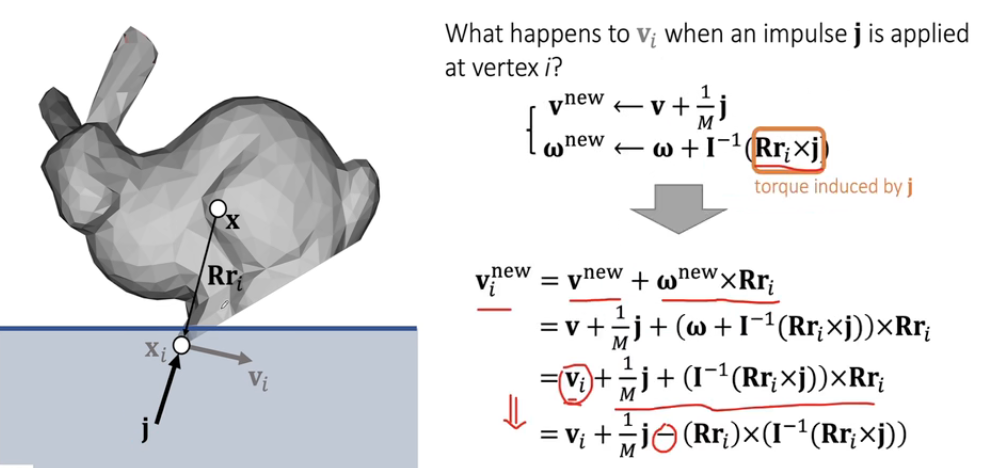
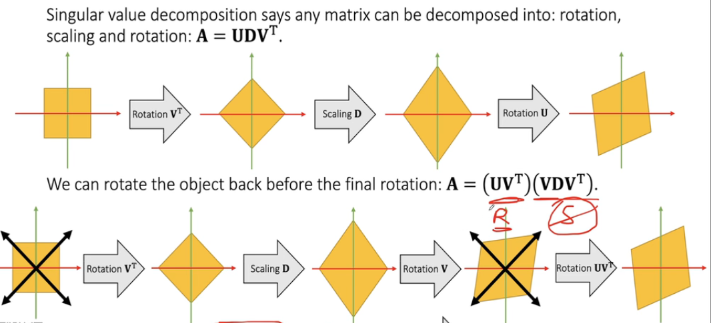

### 刚体喵

刚体不做形变，因此考虑两种状态移动：平移和旋转

state variable contains the position $$\bold x$$ and the velocity $$\bold v$$
$$
\bold v(t^{[1]})=v(t^{[0]})+M^{-1}\int_{t^{[0]}}^{t^{[1]}}f(\bold x(t),\bold v(t),t)dt\\
x(t^{[1]})=x(t^{[0]})+\int_{t^{[0]}}^{t^{[1]}}\bold v(t)dt
$$
- 隐式欧拉-一阶准确-二阶误差
- 显式欧拉-一阶准确-二阶误差
- 中点$$t^{[0.5]}$$-二阶准确-三阶误差（二阶误差计算抵消）
- 半隐式/ - 速度计算显式 - 位置计算隐式

空气阻力drag force：$$\bold f^{[0]}_{drag} = -\theta \bold v^{[0]}$$    ->  简化  $$\bold v^{[0]}=\alpha \bold v^{[0]}$$  直接做速度衰减

mass $$\bold M$$ and $$\Delta t$$ are depend on user

#### 旋转

旋转矩阵具有冗余性 不是所有矩阵都是旋转矩阵 不直观 计算角速度不容易

欧拉角万向节死锁问题，特定情况下将会减少一自由度

quaternion表示方法和计算方法，其中$$s$$表示$$w$$，$$\bold v$$ 表示$$[x,y,z]$$

quaternion图解表示，注意norm()=1

角速度图解表示

力矩和转动惯量

平移和旋转的具体计算,注意quaternion计算后需等于1

$$\bold R$$表示陀螺由于之前的状态改变导致的倾斜状态（Quaternion）

$$\bold I_{ref} = \Sigma m_i(\bold r_i^T\bold r_iE-\bold r_i\bold r_i^T)$$

关于状态变换后的转动惯量变化关系：

利用性质：旋转矩阵是正定矩阵，正定矩阵的逆矩阵和转置矩阵相同

因此 对于变化后的转动惯量计算只需在原先基础上计算旋转矩阵结果

#### Particle Collision

- Penalty methods
- Impulse methods

Signed Distance Function SDF

碰撞检测：判断内侧外侧，根据几何体不同的面的组合和点到不同的面的距离来判断在内侧/外侧

##### Quadratic Penalty Method

检测是否有碰撞：有碰撞则施加力使得物体退出（类似弹簧施加线性的力，quadratic表示二阶能量）
$$
\bold f = -k\phi(\bold x)\bold N
$$
可以对该情况做出提前处理，在表面前的缓冲空间就开始施加力

- k过小：还是会穿到内部
- k过大：overshooting 直接起飞

##### Log-Barrier Penalty Method (对于能量而言的log)

$$
\bold f = \rho \frac{1}{\phi(\bold x)}\bold N
$$

对于该情况，不能让穿透发生

##### Impulse Method

检测到碰撞后，速度和位置立即更新

库仑定律：切方向速度改变小于等于法方向速度改变*摩擦系数(自定义) (这啥定律没听说过)

#### RigidBody Collision Detection and Response

检测部分：遍历顶点

响应部分：

对于刚体整体，做速度和角速度的修改相对容易，位置更新非线性，较复杂

思路：根据impulse方法计算$s_i$顶点的速度变换，之后根据结论算出物体整体受到的冲量，再根据冲量计算整个物体的运动情况

##### Shape Matching

先让每个点自己运动模拟，之后将每个点的结果重新组合成一个刚体

$\bold c$是质心，$\bold R$为旋转矩阵 --> 简化将$\bold R$视为一般矩阵$\bold A$ --> 对c求导，由于$\Sigma r_i$是所有质心到点所有长度的集合，因此$\Sigma r_i=0$，得到最后结果。

所以其实就是对于变化后的顶点求个平均值质心

然后对A求导，矩阵求导已经忘完了所以直接看结论吧

$\bold A = \bold R \bold  S$的原理推导

shape matching过程

