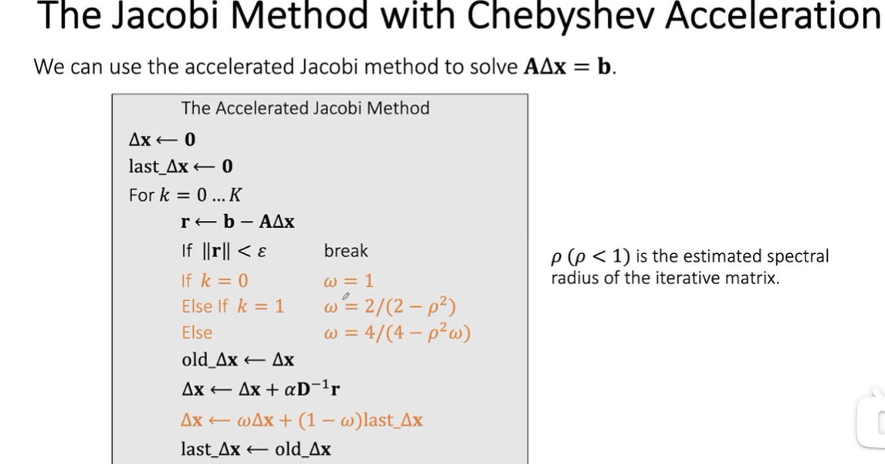
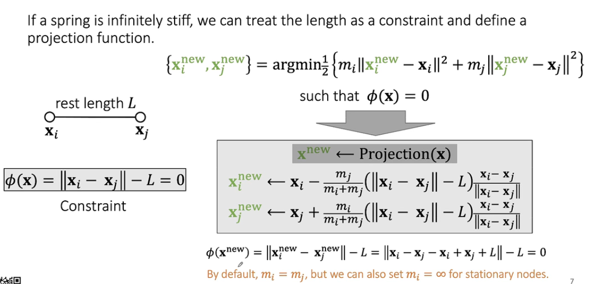

## Cloth

#### Physics-based Cloth

##### Ideal Spring

$E(x) = \frac{1}{2}k(x-L)^2\\f(x)=-\frac{dE}{dx}=-k(x-L)$

##### Multiple Springs

$E=\Sigma^n_{e=0}E_e=\Sigma^n_{e=0}(\frac{1}{2}k(||\bold x_i-\bold  x_e||-L_e)^2)$

懒得写了 力的叠加而已

##### Structured Spring Networks


##### Triangle Mesh


存边操作：所有三角形边都存一遍，排序后剔除


计算各个弹簧的力


问题：显式积分不稳定，例如overshooting

##### 隐式积分：


思想：由$f^{[1]}$来求下一状态$x^{[1]}$，由于弹簧系统$f^{1}$与位置线性相关，因此变为求解关于$x^{[1]}$方程


求$F(\bold x)$最小值,即梯度=0(一阶导)时情况


牛顿法:由泰勒展开得到的一二阶结果,求导=0得到$\Delta x$和结果的关系,由得到的$\Delta x$多次迭代至足够小值得到极小值点


Hessian:求二阶导操作,两个矩阵正定,但中间参数有可能为负,因此Hessian可能不正定

因此对于系统而言,拉伸的时候一般是稳定的,而压缩的时候会出现不稳定情况


粗暴解决方法:如果第二项为负就不要 乐



##### Dihedral Angle

二面角模型:产生弯曲的力与角度有关  


##### Quadratic Bending


好处:一阶导和二阶导都很好算
$$
\bold f(\bold x) = -\nabla E(\bold x) = -\bold Q \begin{bmatrix}x_0\\x_1\\x_2\\x_3\end{bmatrix}\\
\bold H(\bold x) = \frac{\partial^2E(\bold x)}{\partial^2\bold x} = \bold Q
$$
问题:伸展过大时不准确, 非平面时不适合计算

##### The Locking Issue

弹簧系统锁死,自由度丢失现

### Position Based Dynamics-PBD



要求满足约束并且移动距离尽量少

Gauss-Seidel  多弹簧系统:反复迭代


```
For k = 0...K
	For every edge e = {i,j} 
```

$$
\bold x_i = \bold x_i -\frac{1}{2}(||\bold x_i-\bold x_j||-L_e)\frac{\bold x_i - \bold x_j}{||\bold x_i - \bold x_j||}\\
\bold x_j = \bold x_j +\frac{1}{2}(||\bold x_i-\bold x_j||-L_e)\frac{\bold x_i - \bold x_j}{||\bold x_i - \bold x_j||}
$$


- 会收敛但不能所有边都同时满足
- 顺序会影响收敛速度

多弹簧: Jacobi Approach

```
For k = 0...K
	For every vertex i
		x^{new}_i = 0
		n_i = 0
	For every edge e = {i,j}
		x^{new}_i += x_i - 1/2 * ((x_i-x_j).magnitude-L_e) * (x_i-x_j).normalized
		x^{new}_j += x_j + 1/2 * ((x_i-x_j).magnitude-L_e) * (x_i-x_j).normalized
		n_i++;n_j++;
	For every vertex i
		x_i = (x^{new}_i + alpha * x_i)/(n_i + alpha)
```

###### PBD过程:

- 对各个顶点直接做模拟运动
- 进行约束,投影求出$x^{new}$, $v^{new}$

优点:容易实现,在低分辨率效率高

缺点:不太物理,高分辨率时收敛速度慢 解决方法:网格套网格层层模拟


Spring Strain Limit: 放宽约束条件,限制拉伸


#### Projective Dynamics

use projection to define a quadratic energy


得到常数矩阵，简化计算量

模拟的效果取决于Hessian矩阵的近似结果是否相近，收敛取决于Hessian矩阵是否正定

tips：优化性能主要取决于内存优化，减少变量等等，这就是PBD的优势，只需要对粒子的位置进行访存

#### Constrained Dynamics

多刚体彼此约束


$\lambda$ 引入第二个变量


$C=\frac{1}{k} * I$ 因此可以处理刚度极大情况

- Position -based  dynamics and strain limiting
  - The key is to build a projection function for every constraint
  - 2 approaches for integration: Jacobi and Gauss-Seidel
  - Fast in low resolutions
  - Not physically correct
- Projective Dynamics
  - use projection functions to build into energies 用投影计算能量
  - projections are first updated, then treated as constants in implicit formulation
  - Hessian matrix becomes constant
  - CPU friendly
- Constrained Dynamics
  - Focused on stiff constraints. Introduce dual variables. 
