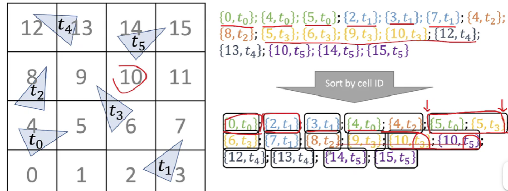
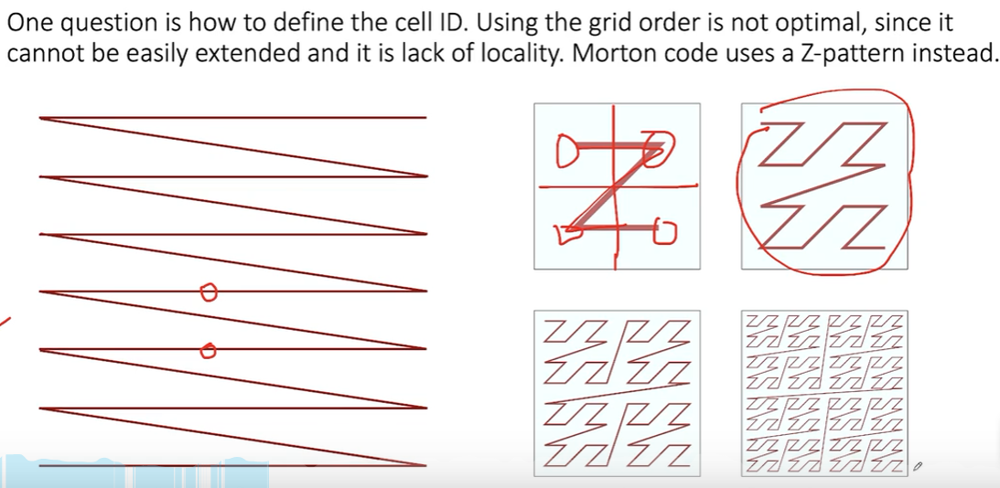
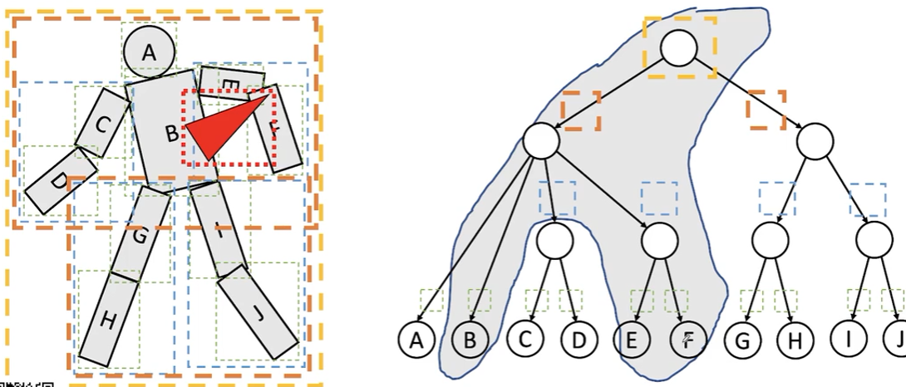
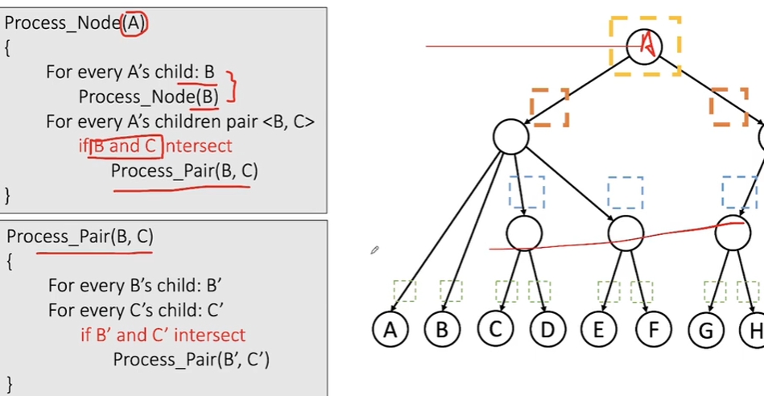
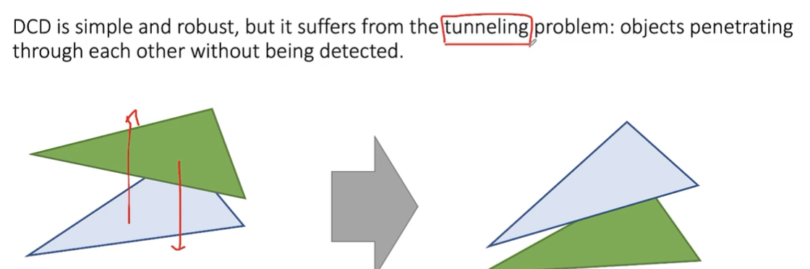
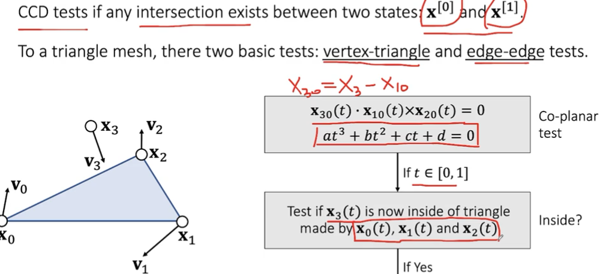
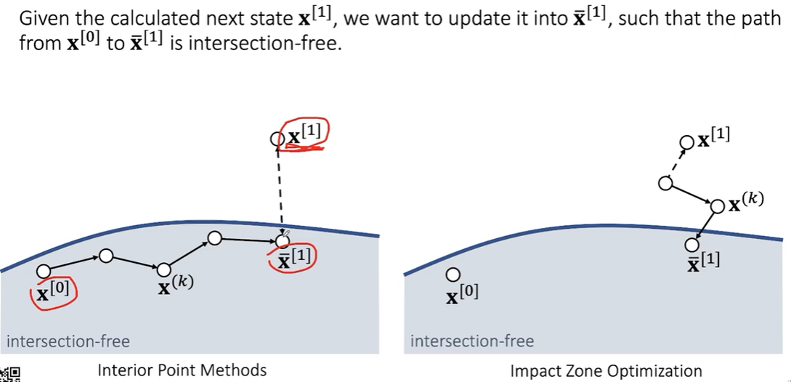
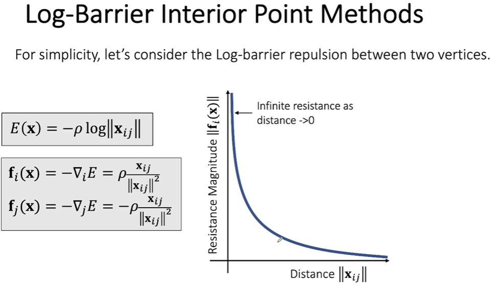

### 碰撞

概念简单 但算法复杂度高

- Collision Detection
- Interior Point Methods
- Impact Zone Optimization
- Untangling Cloth

##### Collision Detection

- Broad-Phase Collision Culling 首先排除距离过远情况的碰撞
  - Spatial Partitioning
  
    
  
    Morton Code:为了解决行列（三维）的内存访问顺序问题，希望对于相邻格子内存访问位置接近
  
  - 老朋友BVH
  
    
  
    
  
    自碰撞检测：首先递归检查子节点，再检查子节点之间是否相交
  
  - SH：好写 对GPU友善 要算的多
  
  - BVH：麻烦 GPU不友好 更新简单

- Narrow-Phase Collision Culling对剩下进行检测

  - Discrete Collision Detection DCD离散碰撞检测

    对于边和三角形做相交检测

    经典问题：速度太快穿过去

  - Continuous Collision Detection CCD持续碰撞检测

    

    边和边相交，同样构造四点同面的一元三次方程

    TIPS:对于求根公式，浮点数精度问题会导致误差大，因此推荐使用二分法去解一元三次方程
    
    游戏GPU 以单精度 single float-point为主

##### Interior Point Method & Impact Zone Optimization

interior：慢，小步长，但能保证结果正确

impact：快，可用大步长，但可能不成功

##### Rigid Impact Zones

摆烂 锁死整个区域 不发生相对位移 

##### Untangling Cloth

想办法去除掉相交

简单操作：检测距离，如果在物体内部就推出去

对于两块布

一：检测两块布相交区域的面积大小，面积小的区域互斥

二：检测两块布相交区域的曲线长短，往曲线短的方向减小相交
