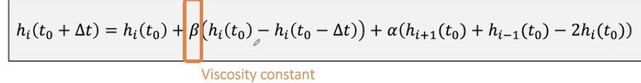

### 流体模拟

##### Two types of Simulation Approaches

- Lagrangian Approach

  将物理量定义在粒子上

- Eulerian Approach

  将物理量定义在格子上


$h(x)$高度函数，表示水面高度，$u(x)$速度函数，表示通过该截面的水的速度


速度变化实际上由左右压强差产生


去掉速度场，保留高度场

几个一维拉普拉斯算子


将拉普拉斯算子带回原始式
$$
h_i(t_0+\Delta t)=2h_i(t_0)-h_i(t_0-\Delta t)+\frac{\Delta t^2 h_i}{\Delta x^2 \rho}(P_{i+1}+P_{i-1}-2P)
$$
问题：总体积可能会变化 取决于$\frac{\Delta t^2 h_i}{\Delta x^2 \rho}(P_{i+1}+P_{i-1}-2P)$是否为0

去掉体积变化量


压强计算$P=\rho gh$


加入粘滞效果



对于高度的变化加入damping使得粘滞效果

##### 边界条件

1、模拟边界外是平整的水面（例如海面


2、模拟边界外没有任何水流对流（模拟墙


实现：

```
For every cell i
	h_i^{new} = h_i +\beta * (h_i - h_i^{old})
	if(h_{i-1} exists) h_i^{new} = h_i^{new} + \beta(h_{i-1}-h_i)
	if(h_{i+1} exists) h_i^{new} = h_i^{new} + \beta(h_{i+1}-h_i)
For every cell i
	h_i^{old} = h_i
	h_i = h_i^{new}
```

##### Two-Way Coupling

two-way：双向——水流对物体造成影响，物体也对水流造成影响

关键问题：将水从空间中排开

###### Virtual Height

虚拟高度：将被排开水的位置添加虚拟高度，使得从高处排到低处，实现将水排出的效果


$\lambda$作用：显式积分会导致一些情况下水花过大造成不稳定，用于减小水花高度


浮力对刚体的影响

以上为shadow-wave 模拟 简化很多比较简单


#### 基于Euler的流体处理

Incompressible, Viscous Navier Stokes' equations 不可压缩的，粘滞的纳韦斯托克方程

网格：便于求导


###### Boundary Conditions


边界条件中至少要有一个是Dirichlet条件，否则会导致无穷多的解

迭代解法


将速度定义在格子的边上：


$$
    \nabla \dotproduct \bold u_{i,j} = \frac{\part u_{i,j}}{\part x}+\frac{\part v_{i,j}}{\part y} \approx \frac{u_{i+1,j}-u_{i,j}}{h}+\frac{v_{i,j+1}-v_{i,j}}{h}
$$
Bilinear Interpolation: 线性插值

 

对速度场逐步更新

###### Semi-Lagrangian Method 对速度变化的计算


用插值计算出$u(x)$，再倒推回去

$\Delta \bold u$计算

由于不可压条件，得到压强方程组

$4p_{i,j}-p_{i-1,j}-p_{i+1,j}-p_{i,j-1}-p_{i,j+1}=h(-u_{i+1,j}-v_{i,j+1}+u_{i,j}+v_{i,j})$


对于水面的操作

还需要网格的导出操作，将网格导出为三角网格

#### Smoothed Particle Hydrodynamics SPH

用插值估算密度

$\rho_i^{smooth} = \Sigma_j V_j\rho_jW_{ij}= \Sigma_j m_jW_{ij}$

因此得到对于任意物理量的插值


因此，对于物理量的求梯度和拉普拉斯算子等操作，把$V_j$和$A_j$都视为常量，只对$W_{ij}$做计算


流体模拟考虑：

- 重力

- 压强

  

- 粘滞:向一个方向运动的趋势

  

算法

```
For every particle i
	compute neighbor set
	using neighbor set
		force = 0
		force += external force
		force += pressure force
		force += viscosity force
	update v += at
	update x += vt
```

找邻居：画格子Spatial Partition

##### Fluid Display...