## 013141516 Ray Tracing

#### Whitted-Style Ray Tracing

Rasterization couldn't handle global effects well

such as: (soft) shadows, glossy reflection (especially the light bounces more than once)

~10K CPU core hours to render one frame in production

##### Basic Ray-Tracing Algorithm

- light travels in straight lines
- dont collide with each other if they cross
- travel from the light sources to the eye (reversibility)

Ray equation:
$$
r(t)=o+td, 0\leq t<+\infty
$$
Sphere:   $$p:(p-c)^2-R^2$$  

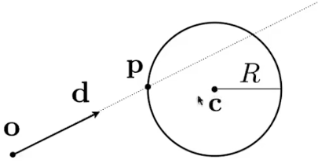

The intersection p must satisfy both ray equation and sphere equation
$$
(\bold o+t\bold d-\bold c)^2-R^2=0
$$
General implicit surface: $$\bold p:f(\bold p)=0$$

Substitute ray equation: $$f(\bold o +t \bold d)=0$$

Triangle is in a plane:

- Ray-plane intersection

  plane is defined by normal vector and a point on plane

  $$\bold p:(\bold p-\bold p')\cdot \bold N$$  ->  $$ax+by+cz+d=0$$

  $$(\bold o+t\bold d-p')\cdot \bold N=0$$ -> $$t=\frac{(\bold p'-\bold o)\cdot \bold N}{\bold d \cdot \bold N}, 0\leq t<+\infty$$

- Test if hit point is inside the triangle ........

Moller Trumbore Algorithm 一步到位

$$o+td=(1-b_1-b_2)P_0+b_1P_1+b_2P_2$$  三角形内的点可表述为重心坐标形式

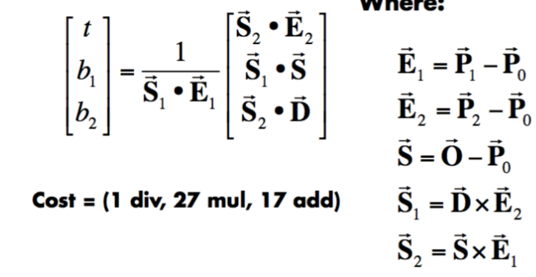

###### Bounding Volumes 包围盒\包围体积

box is the intersection of 3 pairs of slabs

we often use an Axis-Aligned Bounding Box(AABB) 轴对齐包围盒

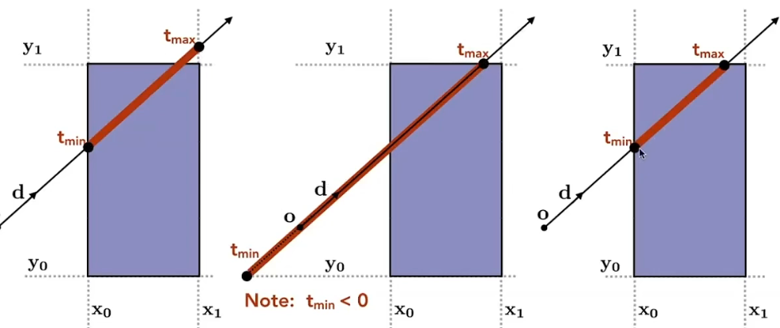

compute t_min/t_max intervals - intersection - max(min,min,min)~min(max,max,max)

$$t_{enter}\t_{exit} ,t_{exit}>=0$$

why use box: simplify

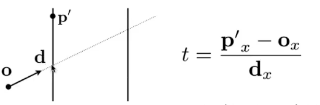

##### Acceleration

###### Uniform Spatial Partitions(Grids) 均匀划分单元格

- Find Bounding box

- Create grid

- Store each object in overlapping cells

  ```
  For each grid cell
  	Test intersection with all object
  	stored at that cell
  ```

  Heuristic: cells = C*number of objects, C is about 27 in 3D

"teapot in a stadium(体育场里的茶壶)" problem: objects dont spaced regularly in the space

###### Spatial Partitions

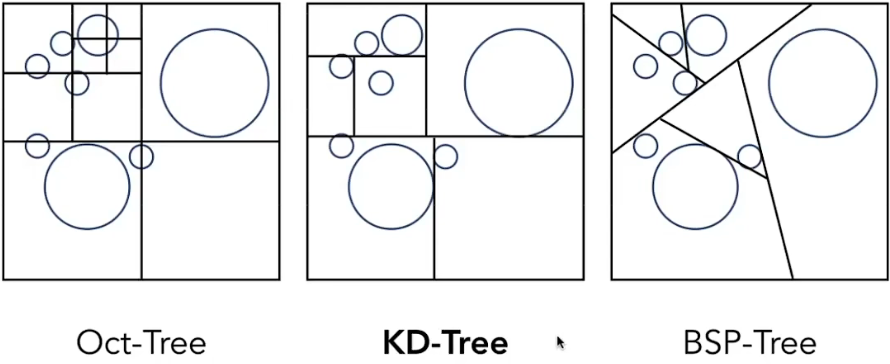

KD tree internal nodes store

- split axis: x-, y-, or z-axis
- split position: coordinate of split plane along axis
- children: pointers to child nodes
- No objects stored in internal nodes
- list of objects are stored in leaf nodes

Object Partitions and Bounding Volume Hierarchy (BVH)

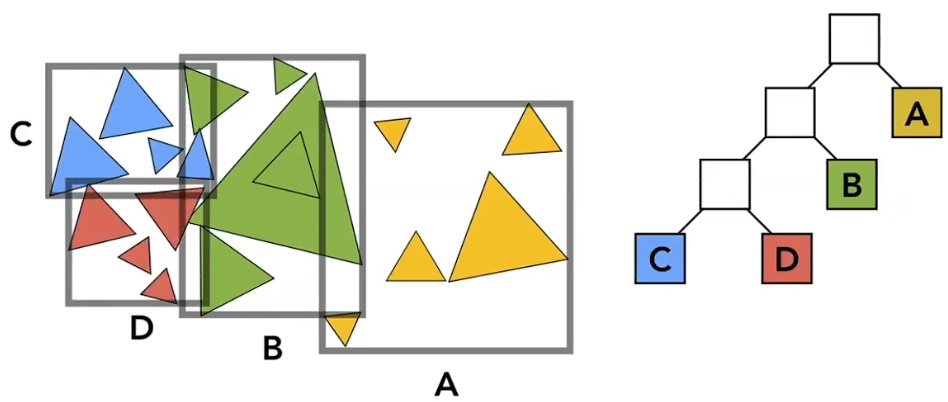

- finding bounding box
- recursively split set of objects in two subsets
- recompute the bounding box of the subsets
- stop when necessary
- store objects in leaf nodes

how to subdivide a node?

- choose a dimension to split
- 1: choose the longest axis in node
- 2: split node by half number of objects 
- stop when node contains few objects

```
Intersect(Ray ray, BVH node){
	if(intersection(ray, node.bbox)==0)return
	if(node->child==null){
		auto object = null;
		for(auto i:node.objects){
			if(intersection(ray, i)==1)
				object=closer(object,i)?object:i;
		}
		return object;
	}
	auto hit1 = intersect(ray, node.child1);
	auto hit2 = intersect(ray, node.child2);
	return closer(hit1,hit2)?hit1:hit2;
}
```

#### Basic radiometry

perform lighting calculations in a physically correct manner

Radiant Energy:    $$Q[j=Joule]$$

Radiant flux(power): $$\Phi \equiv   \frac{dQ}{dt}[W=Watt][lm=lumen]$$

Radiant Intensity: the power per unit solid angle 立体角
$$
I(w)\equiv \frac{d\Phi}{dw}[\frac{W}{sr}][\frac{lm}{sr}=cd=candela]
$$
solid angle: $$\Omega = \frac{A}{r^2}$$ 

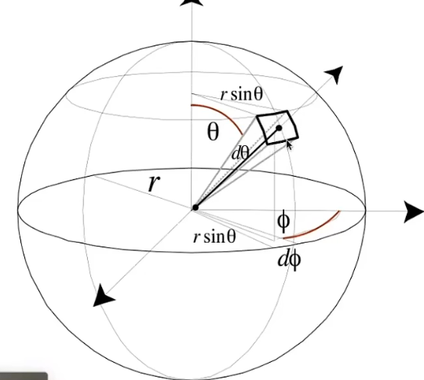

$$dA = (rd\theta)(rsin\theta d\phi)=r^2sin\theta d\theta d\phi$$

$$dw = \frac{dA}{r^2}=sin\theta d\theta d\phi$$

for light point source $$I = \frac{\Phi}{4\pi}$$

Irradiance: the power per unit area incident on a surface point $$E(x)\equiv \frac{d\Phi(x)}{dA}[\frac{W}{m^2}][\frac{lm}{m^2}=lux]$$

Radiance: per unit solid angle, per projected unit area

$$L(p, w)\equiv \frac{d^2\Phi(p,w)}{dwdAcos\theta}[\frac{W}{sr\cdot m^2}][\frac{cd}{m^2}=\frac{lm}{sr\cdot m^2}=nit]$$

incident radiance:  $$L(p, w)=\frac {dE(p)}{dw cos\theta}$$

exiting radiance:  $$L(p,w)=\frac{dI(p,w)}{dAcos\theta}$$

irradiance  vs radiance

$$dE(p,w)=L_i(p,w)cos\theta dw$$    $$E(p)=\int_{H^2}L_i(p,w)cos\theta dw$$

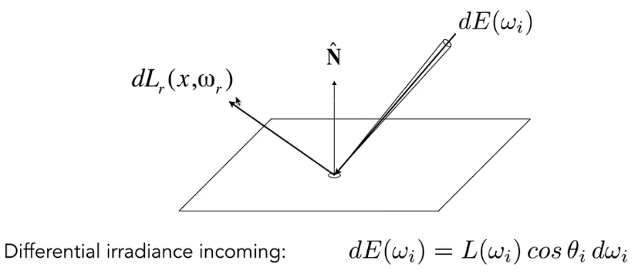

BRDF

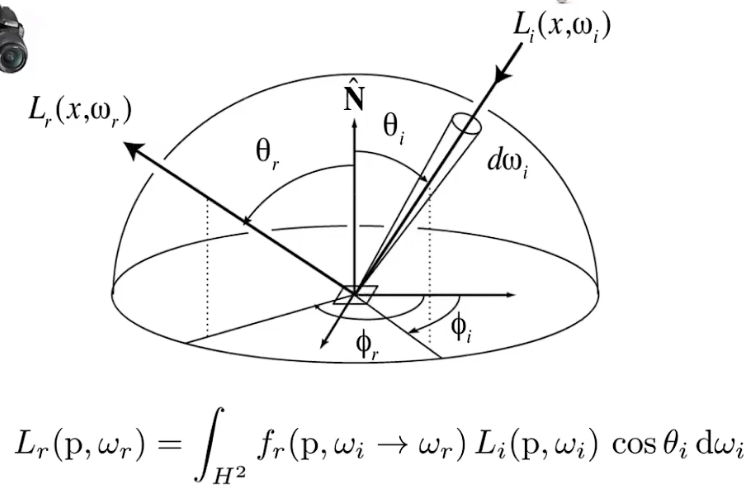

Rendering Equation 渲染方程
$$
L_o(p,w_0)=L_e(p,w_0)+\int_{\Omega^+}L_i(p,w_i)f_r(p,w_i,w_o)(n\cdot w_i)dw_i
$$
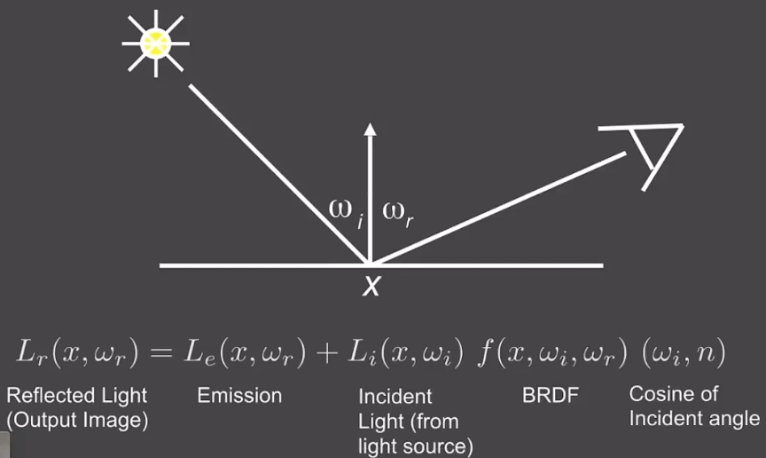

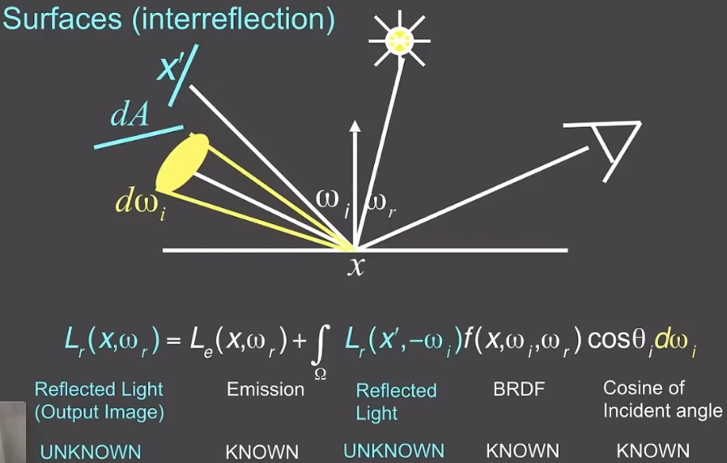

简写渲染方程

$$l(u)=e(u)+\int l(v)K(u,v)dv$$

$$L=E+KL$$

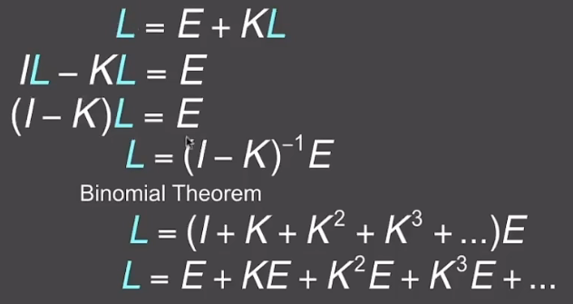

#### Monte Carlo Integration蒙特卡洛积分

$$\int_a^bf(x)dx$$          random variable    $$X_i\sim p(x)=\frac{1}{b-a}$$ 

$$F_N=\frac{1}{N}\sum_{i=1}^N \frac{f(X_i)}{p(X_i)}=\frac{b-a}{N}\sum_{i=1}^N f(X_i)$$

#### Path Tracing

use Monte Carlo integration to handle Rendering Equation

$$L_o(p,w_o)=\int_{\Omega^+}L_i(p,w_i)f_r(p,w_i,w_o)(n \cdot w_i)dw_i$$

$$\int_a^b f(x)dx \approx \frac{1}{N}\Sigma^N_{k=1}\frac{f(X_k)}{p(X_k)}$$

$$f(x)=L_i(p,w_i)f_r(p,w_i,w_o)(n \cdot w_i)$$         $$p(w_i)=1/2\pi$$

so there is $$L_o(p,w_o)=\int_{\Omega^+}L_i(p,w_i)f_r(p,w_i,w_o)(n \cdot w_i)dw_i\\ \approx \frac{1}{N}\Sigma^N_{i=1}\frac{L_i(p,w_i)f_r(p,w_i,w_o)(n \cdot w_i)}{p(w_i)}$$

```
shade(p, wo){
	Randomly choose 1 directions wi~pdf
	Lo=0.0
	/*
	for(auto wi : n){
		trace ray(p, wi)
		if(ray r hit the light source){
			Lo+=(1/N)*Li*fr*cos/pdf(wi)
		}
		else if(ray r hit an object at q){
			Lo+=(1/N)*shade(q,-wi)*fr*cos/pdf(wi)
		}
	}
	return Lo */
	trace ray(p, wi)//解决指数爆炸
	if(ray r hit the light source){
		Lo+=(1/N)*Li*fr*cos/pdf(wi)
	}
	else if(ray r hit an object at q){
		Lo+=(1/N)*shade(q,-wi)*fr*cos/pdf(wi)
	}
}
```

傻逼休眠吞文wrnm

改进光追算法：根据光源进行采样 即对避免噪点问题

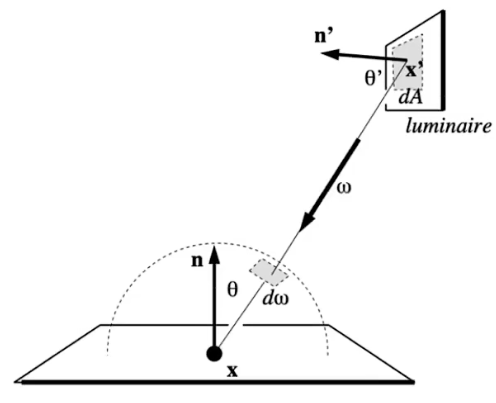

用这个伪代码将就一下path tracing

```
shade(p, wo)
	sampleLight(inter , pdf_light)
	Get x, ws, NN, emit from inter
	Shoot a ray from p to x
	If the ray is not blocked in the middle
		L_dir = emit * eval(wo, ws, N) * dot(ws, N) * dot(ws,NN) / |x-p|^2 / pdf_light
	L_indir = 0.0
	Test Russian Roulette with probability RussianRoulette
	wi = sample(wo, N)
	Trace a ray r(p, wi)
	If ray r hit a non -emitting object at q
		L_indir = shade(q, wi) * eval(wo, wi, N) * dot(wi, N)/ pdf(wo, wi, N) / RussianRoulette

	Return L_dir + L_indir

```

