## 0789 Shading

塞了好多图片= =

#### 1 (illumination, shading and graphics pipeline)

##### Shading

The darkening of coloring of an illustration or diagram with parallel lines or a block of color.

In this course: The process of applying a material to an object.

###### Blinn-Phong Reflectance Model

Perceptual Observations: Specular highlights(高光), Diffuse reflection(漫反射), Ambient lighting(环境光照)

- Diffuse Reflection
  - Lambert's cosine law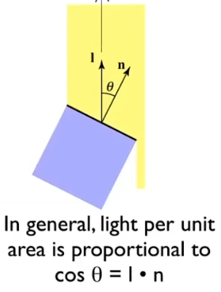
  - Intense 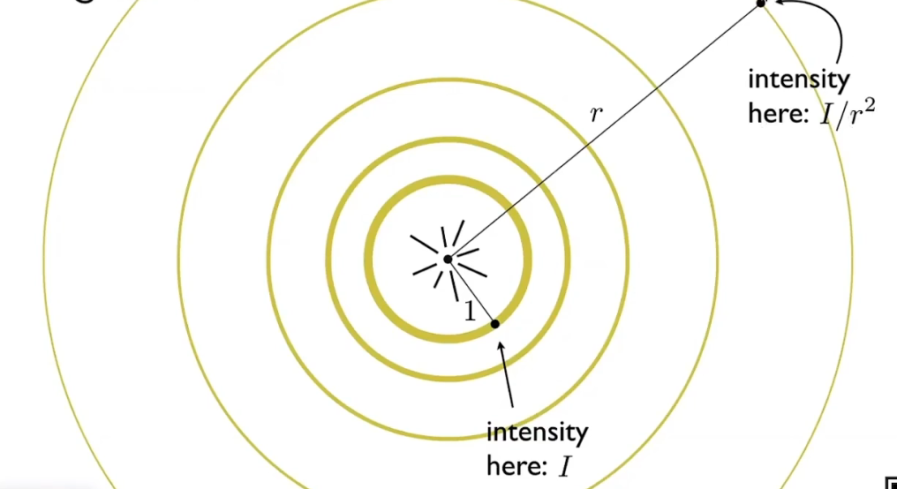

So for the pointolite(点光源) and diffuse reflection there is
$$
L_{d}=k_{d}\underbrace{(I/r^2)}_{intensity}\overbrace{max(0,\textbf{n}\cdot\textbf{l})}^{angle}
$$

#### 2 (Shading Pipeline and Texture Mapping)

##### Specular Term

bright near mirror reflection direction -> V close to mirror direction -> half vector near normal
$$
\textbf{h}=bisector(\textbf{v,l})=(\textbf{v+l})/||\textbf{v+l}||\\
L_{s}=k_{s}(I/r^2)max(0,\textbf{n}\cdot \textbf{h})^p
$$
the function of p: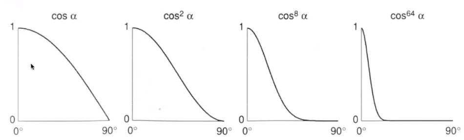

##### Ambient Term

$$
L_{a}=k_{a}I_{a}
$$

#### Blinn-Phong Reflection Model

$$
L=L_{a}+L_{d}+L_{s}\\
=k_{a}I_{a}+k_{d}{(I/r^2)}{max(0,\textbf{n}\cdot\textbf{l})}+k_{s}(I/r^2)max(0,\textbf{n}\cdot \textbf{h})^p
$$

#### Shading Frequencies

- Shade each triangle(flat shading)

- Shade each vertex(gouraud shading)

  simple scheme: average surrounding face normals
  $$
  N_{v}=(\Sigma _{i}N_{i})/||\Sigma _{i}N_{i}||
  $$
  
- Shade each pixel(Phong shading)

  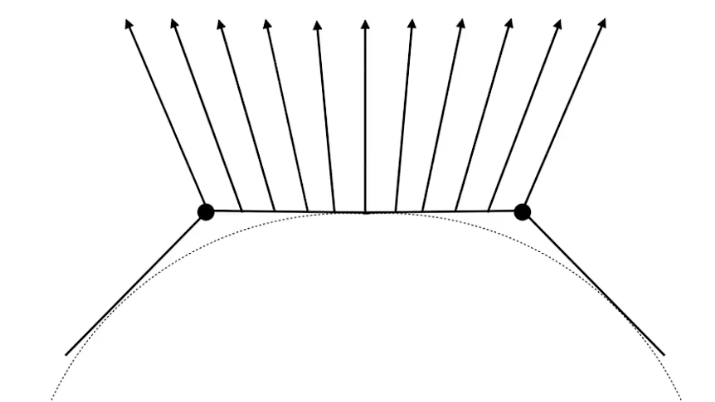

#### Graphics Pipeline

 …………………………………………no details

#### Textures 

coordinates u(0,1) v(0,1)

### Shading 3 

##### Barycentric coordinates 重心坐标

$$
point（x,y）=\alpha A+\beta B+\gamma C\\
\alpha +\beta +\gamma =1
$$

Inside the triangle if all 3 coordinates are non-negative: $$\alpha \geq 0 ,\beta \geq 0, \gamma \geq 0$$
$$
\alpha = \frac{S_{A}}{S_{A}+S_{B}+S_{C}}\\
\beta = \frac{S_{B}}{S_{A}+S_{B}+S_{C}}\\
\gamma = \frac{S_{C}}{S_{A}+S_{B}+S_{C}}
$$
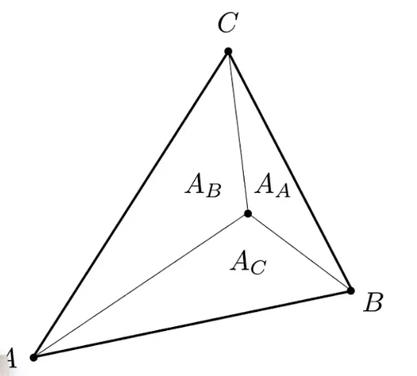

barycentric coordinate of the centroid: $$(\alpha,\beta,\gamma)=(\frac{1}{3},\frac{1}{3},\frac{1}{3})$$

Linearly interpolate values at vertices: $$V=\alpha V_{A}+\beta V_{B}+\gamma V_{C}$$

for each resterized screen sample(x,y):

(u,v) = evaluate texture coordinate at (x,y)

texcolor = texture.sample(u,v);

set sample's color to texcolor;

###### Bilinesr interpolation

$$lerp(x,v_{0},v_{1})=v_{0}+x(v_{1}-v_{0})$$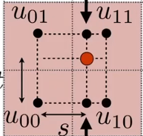

###### Antialiasing

- supersampling
- Mipmap: Allowing (fast, approx., square) range queries 快速近似方形范围查询

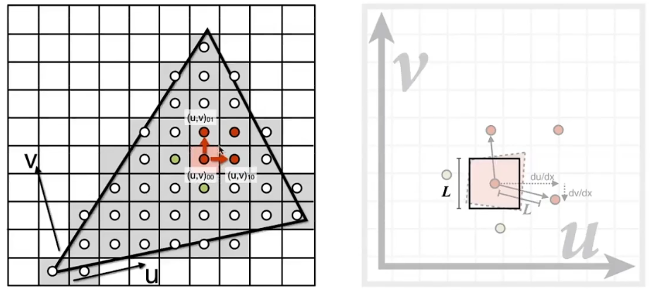

$$D=log_{2}L$$  ,$$L=max(\sqrt{(\frac{du}{dx})^2+(\frac{dv}{dx})^2},\sqrt{(\frac{du}{dy})^2+(\frac{dv}{dy})^2})$$

###### Trilinear interpolation三线性插值

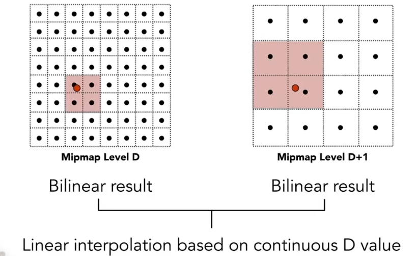

###### Anisotropic Filtering各向异性过滤

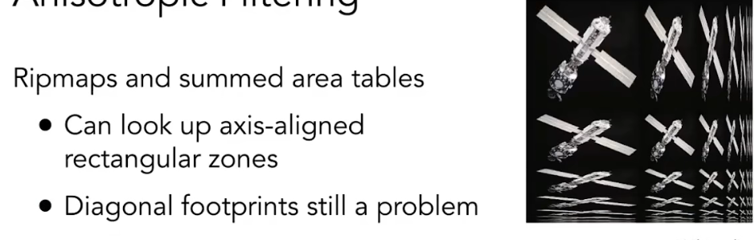

##### Applications of textures

###### Environment Map

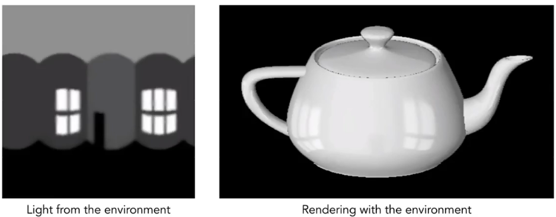

###### Spherical Environment Map

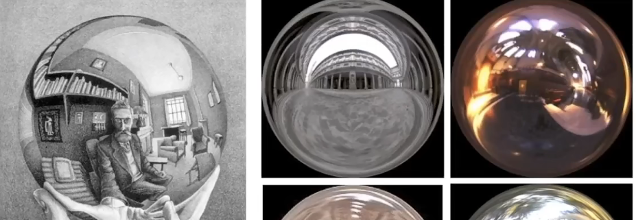

record the environment in the ball

problem: uneven, so the top and the bottom part are not good

###### fix: Cube Map

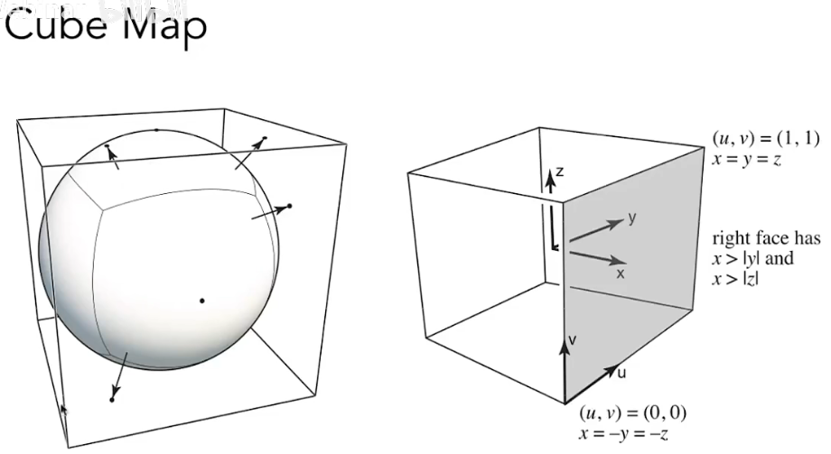

###### Textures affect shading

textures can stores the height/normal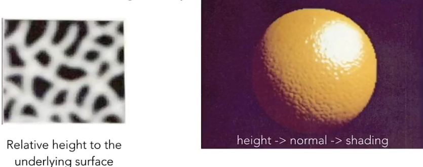

###### Bump Mapping

adding surface detail without adding more triangles

- $$dp/du = c1*[h(u+1)-h(u)]$$
- $$dp/dv=c2*[h(v+1)-h(v)]$$
- $$n=(-dp/du,-dp/dv,1)$$

3D Procedural Noise + Solid Modeling

Provide Precomputed Shading