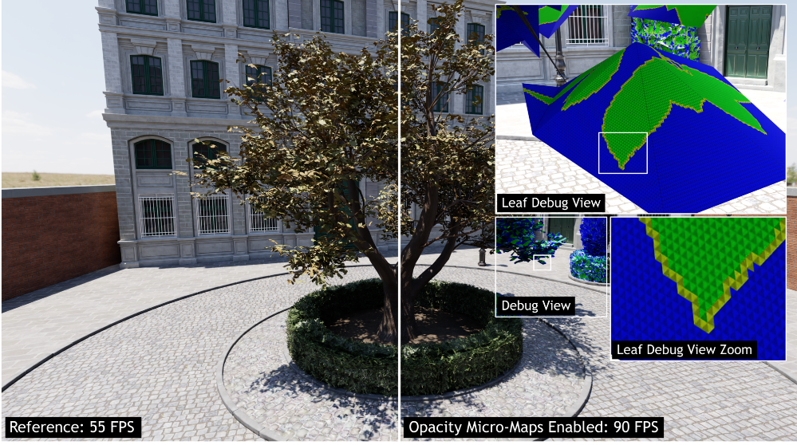

课程中查询到的光追相关的知识

主要是 NVIDIA 的RT Core 3 对于光追的优化

- [**Opacity Micro-Map(OMM)**](#OMM)
- [**Displaced Micro-Mesh (DMM)**](#DMM)
- [**Shader Execution Reordering (SER)**](#SER)

图灵架构的RT Core

#### **Opacity Micro-Map(OMM)**

Opacity Micro-Map（OMM）是一种用于加速光线追踪的技术。这项技术通过有效地编码微三角形和微网格的不透明状态，可以高效地进行光线追踪，以渲染极其详细的场景元素，如植被和叶子。

对于OMM引擎，对于使用OMM技术的物体会根据参数生成不同角度的微网格(Micro-Map)以存储不同的透明度情况，当光线追踪时出现和物体相交的情况即可根据光线的角度和微网格的透明度内容进行判断光线是否于物体相交，从而对于树木、枝叶一类的多个微小物体优化阴影计算。

对于以下的样例，生成了一个对于树木的OMM，在debug页面中显示了计算得出的该OMM的结果，对于光线追踪直接使用该OMM进行透明度判断，能够在得到精细物理效果的同时节省性能。

对于植被、叶子这类精密场景元素，OMM能够起到很好的优化效果：

l **大量重复**：在一个场景中，草等植被通常会有大量的重复出现。这些草本质上是相同的物体，只是位置和方向不同。因此，我们可以只对一棵草进行预计算OMM，然后将结果应用到所有的草上，这大大减少了需要预计算的物体数量。

l **半透明和重叠**：草等植被通常是半透明的，并且在视觉上会有大量的重叠。这使得在光线追踪中处理它们特别复杂和耗时。通过使用OMM，我们可以预先计算出透明度信息，从而在实际渲染时避免了复杂的透明度测试和混合。

l **几何复杂性低**：虽然草在视觉上看起来很复杂，但在几何上，它们通常很简单，通常只是一些平面的三角形。这使得预计算透明度信息相对容易。

在传统的光线追踪中，高详细度的不透明信息通常通过alpha纹理来构建，但这通常需要在着色器中进行昂贵的alpha评估以生成所需的结果。而OMM是一种解决方案，它可以完全消除对着色器调用的需求（通过近似原始几何图形），或者大大减少所需的着色器调用次数，而不会损失质量。因此，OMM通常会加速那些在光线追踪工作负载中有传统alpha测试或alpha混合的应用。

在RT Core中，OMM起到了重要的作用。新款的RT Core配备了全新的Opacity Micromap (OMM)引擎。OMM引擎可以大幅提升对alpha测试纹理进行光线追踪的速度，此类纹理通常应用于树叶、颗粒和围栏。这使得可以更高效地进行光追渲染，大大提高了丰富性和逼真度。

光线追踪的alpha测试和alpha混合：

- alpha测试：在光线追踪中，我们通常会对场景中的物体进行光线-物体相交测试，以确定光线是否与物体相交，以及相交点的位置。对于具有Alpha通道的纹理，我们可以在相交测试中使用Alpha测试。具体来说，当光线与物体相交时，我们可以查看相交点处纹理的Alpha值。如果Alpha值低于某个阈值，那么我们可以认为光线并没有真正与物体相交（即，光线穿过了纹理的透明部分），因此可以忽略这个相交点，让光线继续前进，直到找到下一个相交点。
- alpha混合：在光线追踪中，我们通常会对场景中的物体进行光线-物体相交测试，以确定光线是否与物体相交，以及相交点的位置。对于具有Alpha通道的纹理，我们可以在相交测试中使用Alpha混合。具体来说，当光线与物体相交时，我们可以查看相交点处纹理的Alpha值。如果Alpha值低于1，那么我们可以认为光线并没有完全与物体相交（即，光线穿过了纹理的半透明部分），因此可以将这个相交点的颜色与后面物体的颜色进行混合，以实现半透明效果。

#### **Displaced Micro-Mesh (DMM)**

借助 Displaced Micro-Mesh，您可以构建高度精细、复杂的几何图形，这些几何图形排列紧凑，能够高效渲染。素材以采用了微型三角形的结构化图形基元为基础，支持全保真效果，您不必进行格式转化或数据展开，就能直接进行光栅化处理或实时光线追踪。目前，对于高度精细的有机表面、人物或对象，尚未设计专门的标准图形基元。这是唯一一项从头开始构建的实时光线追踪技术，几何图形的数量增加了 50 倍。

与Opacity Micro-Map一样，Displaced Micro-Mesh是优化BVH结构和加速遍历以实现更快光线跟踪功能的另一种方式。前者有助于处理高度详细和/或透明的纹理，后者有助于在不丢失细节的情况下提高复杂几何体和高多边形网格的性能。

Ada上的第三代RT Core需要一个更简单的输入来输出复杂的镶嵌几何体，这得益于Displaced Micro-Mesh。Displaced Micro-Mesh是一种新的几何图元（如三角形），利用空间相干性来压缩高保真纹理。每个都由一个基本三角形和一个位移贴图定义。使用一个由micro-meshes组成的紧密的base-mesh来表示详细的物体，将位移幅度(displacement magnitude)压缩到map贴图中，每个base triangle对应一个map贴图。RT Core中的微网格引擎使用此定义从相当普通的基础网格生成高度详细的镶嵌网格，如下所示：

Displaced Micro-Meshes通过更改高精度模型的顶点数等内容来简化结构(图中的Base Triangle)，从而简化BVH的建立过程来减少开销。Displaced Micro-Meshes使用较少的bit来表示三角形，而且不同模型用来表示每个三角形的bit数不一样。 制作态发生了改变，开发人员需要使用不同的素材格式，或需要使用工具将原来的格式转换成DMM格式。

通过向RT Core提供更粗糙、更简单的网格，遍历和交叉测试的复杂性显著降低，同时最终生成高保真度的光线跟踪网格。

#### **Shader Execution Reordering (SER)**

发散的RT着色器是限制光线追踪工作负载性能的主要因素之一，这在镜面照明、路径追踪和其他多次反射交叉点中非常常见。发散通常出现在给定warp的线程开始处理不同的着色器或内存资源时，降低了原本向量工作负载的并行性。这通常意味着光线追踪作用在不同网格、材质或BVH结构上。

对于具有着色器和/或资源的不同结构。在现有设计下，warp的线程可能会投射与场景中不同BVH结构相交的光线，导致发散和不必要的开销。使用着色器执行重排序（SER），这些线程被重新排序，使得给定warp的光线被引导到相同的BVH结构/对象，从而提高利用率和执行时间。

SER在二次光线追踪或路径追踪中更有帮助，这些通常用于镜面和间接照明。由于这些光线在屏幕上随机射出，它们往往更加发散。着色器执行重排序在光线追踪管线中添加了一个新阶段，其中这些发散的线程被重新排序并根据它们请求的着色器和资源进行分组。