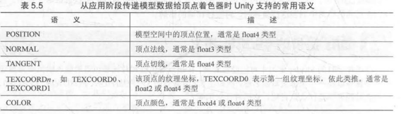
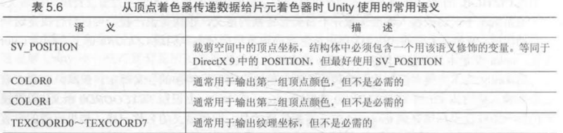
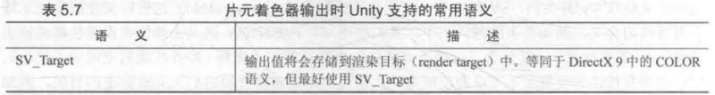
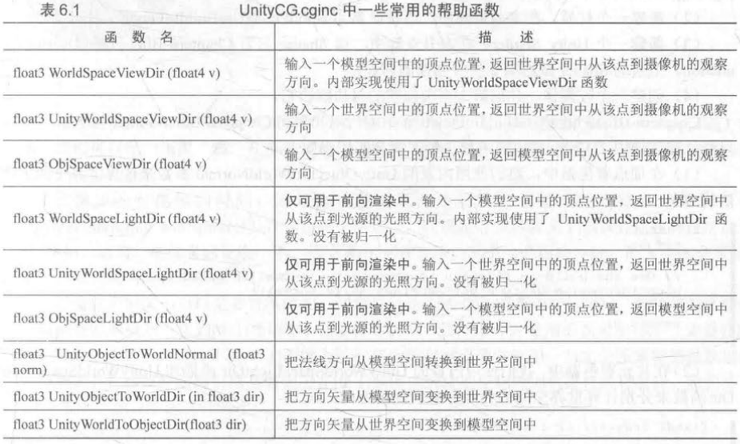

### 基础学习

#### 简单顶点/片元着色器

基本结构

```c
Shader "MyShaderName"{
	Properties{
        //属性
    }
    SubShader{
        Pass{
            //设置渲染状态和标签
            //开始CG代码片段
            CGPROGRAM
            // 编译指令
            #pragma vertex vert
            #pragma fragment frag
            // CG代码
            
            ENDCG
            // 其他设置
        }
        // 其他需要的Pass
    }
    Fallback "VertexLit"
}
```

第一个愚蠢的白色Shader

```c
// Upgrade NOTE: replaced 'mul(UNITY_MATRIX_MVP,*)' with 'UnityObjectToClipPos(*)'
// unity更新了MVP矩阵改成了个函数的意思
Shader "MyShader"
{
    SubShader{
        Pass{
            CGPROGRAM
            #pragma vertex vert
            #pragma fragment frag
            float4 vert(float4 v:POSITION):SV_POSITION{
                return UnityObjectToClipPos(v);
            }
            fixed4 frag():SV_Target{
                return fixed4(1.0,1.0,1.0,1.0);
            }
            ENDCG
        }
    }
}
```

##### 模型数据

要得到模型上每个顶点的纹理坐标和法线方向

```c
// 结构体定义顶点着色器输入
struct a2v{
    // POSITION 用模型空间的顶点坐标填充vertex
    float4 vertex:POSITION;
    // NORMAL 用模型空间的法线填充normal
    float3 normal: NORMAL;
    // 第一套纹理坐标
    float4 texcoord:TEXCOORD0;
}

float4 vert(a2v v):SV_POSITION{
	return UnityObjectToClipPos(v.vertex);
}
```

##### 顶点着色器和片元着色器通信

```c
// 顶点着色器输出
struct v2f{
    //SV_POSITION： pos包含顶点在裁剪空间中位置信息
    float4 pos: SV_POSITION;
    fixed3 color: COLOR0;
}

v2f vert(a2v v){
    v2f o;
    o.pos = UnityObjectToClipPos(v.vertex);
    o.color = v.normal * 0.5 + fixed3(0.5,0.5,0.5);
    return o;
}

fixed4 frag(v2f i):SV_Target{
    return fixed4(i.color, 1.0);
}
```

顶点着色器的输出结构中， 必须包含一个变量，它的语义是 SV_POSITION。否则， 渲染器将无法得到裁剪空间中的顶点坐标， 也就无法把顶点渲染到屏幕上。

 COLORO 语义中的数据则可以由用户自行定义， 但一般都是存储颜色， 例如逐顶点的漫反射颜色或逐顶点的高光反射颜色

##### 使用属性

在材质面板显示一个颜色拾取器， 从而可以直接控制模型在屏幕上显示的颜色

```c
Properties{
    // 声明Color类型属性
    _Color("Color Tine", Color) = (1.0, 1.0, 1.0, 1.0)
}
SubShader{
    Pass{
        ...
        fixed4 _Color; // 和属性名称和类型都匹配的变量
        ...
        fixed4 frag(v2f i):SV_Target{
            fixed3 c = i.color;
            c *= _Color.rgb;
            return fixed4(c, 1.0);
        }
        ...
    }
}
```

我们首先添加了Properties语义块中，并在其中声明了一个属性_Color, 它 的类型是Color, 初始值是(1.0, 1.0, 1.0, 1.0), 对应白色。 为了在CG代码中可以访问它， 我们还需 要在CG代码片段中提前定义一个新的变量， 这个变量的名称和类型必须与Properties语义块中 的属性定义相匹配。

有时，读者可能会发现在 CG 变量前会有 uniform 关键字，例如：`uniform fixed4 _Color;`, uniform 关键词是 CG 中修饰变量和参数的修饰词，它仅仅用于提供关于该变量的初始值是如何指定和存储的相关信息，在UnityShader中 uniform关键词可以省略

#### Unity内置文件和变量

##### 包含文件

文件后缀是.cginc 可以使用#include把文件包含进来

```c
CGPROGRAM
...
#include "UnityCG.cginc"
...
ENDCG
```

包含文件可帮助提高代码复用率

#### Unity提供CG/HLSL语义

##### 语义semantics

语义是一个赋给Shader输入和输出的字符串，这个字符串表达了这个参数的含义，让Shader知道读入数据和输出数据在哪里

例如：Unity会识别`TEXCOORDO` 语义，以把模型的第1组纹理坐标填充到`texcoord`中。 需要注意的是， 即便语义的名称相同， 如果出现的位置不同，含义也不同。`TEXCOORDO`既可以用于描述顶点着色器的输入结构体`a2v` 也可描述输出结构体`v2f`。但在输入结构体`a2f`中， `TEXCOORDO`即把模型的第1组纹理坐标存储在该变证中， 而在输出结构体`v2f`中， `TEXCOORDO`修饰的含义就可由用户决定

从dx10以后出现**系统数值语义system-value semantics**， 这些语义以SV开头代表含义为系统数值。例如使用SV_POSITION语义修饰顶点着色器的输出pos，表示pos包含变换后的顶点坐标

##### Unity支持的语义

Unity使用的常用语义，没有使用SV开头但Unity赋予特殊含义







##### 复杂的变量类型

上面提到的语义绝大部分用于描述标量或矢量类型的变蜇，例如 `fixed2` `float` `float4` `fixed4`

使用语义来修饰不同类型变量的例子：

```c
struct v2f {
	float4 pos: SV_POSITION;
    fixed3 color0:COLOR0;
    fixed4 color1: COLOR1;
    half value0:TEXCOORD0;
    float2 value1:TEXCOORD1;
}
```

一个语义可 以使用的寄存器只能处理4个浮点值(float)。 因此， 如果我们想要定义矩阵类型， 如`float4X4`等变量就需要使用更多的空间。 一种方法是拆分成多个变量， 例如对于 `float4X4`的矩阵类型，我们可以拆分成4个`float4`类型的变量

#### Debug

##### 假彩色图像

**假彩色图像false-color image**指的是用假彩色技术生成的一种图像，与假彩色图像对应的是照片这种**真彩色图像true-color image**

把需要调试的变量映射到[0,1]之间 作为颜色输出到屏幕上 再通过屏幕显示的像素颜色判断这个值是否正确

如果需要调试的数据是一维数据，可以选择一个单独的颜色分享进行输出，把其他分量置0

示例代码：

```c
Pass{
    ...
    #include "UnityCG.cginc"
    ...
    v2f vert(appdata_full v){
        v2f o;
        o.pos = UnityObjectToClipPos(v.vertex);
        // 可视化法线方向
        o.color = fixed4(v.normal * 0.5 + fixed3(0.5, 0.5, 0.5), 1.0);
    }
    ...
}
```

大概就是这么个意思，把要调试的东西作为颜色输出出去

Visual Studio有个调试神器说是

**Graphics Debugger**

##### 帧调试器Frame Debugger

Window -> Frame Debugger 打开帧调试器创库

可以查看渲染该帧时的各种渲染事件event

#### 渲染平台差异

##### 渲染纹理坐标差异

`OpenGL`中(0,0)对应屏幕左下角，`DX`对应左上角

对于DX需要处理多张纹理并开启抗锯齿的情况时有影响（不知道有没有修复

##### Shader语法差异

Windows平台下编译某些Shader可能有报错：

`incorrect number of arguments to numeric-type constructor (compiling for d3dll) `

`output parameter ' o ' not completely ini alized {compi ng for d3dll) `

第一个报错可能是因为DX9/11对Shader的语义更加严格造成的，例如Shader中可能存在下面代码

`float4 v = float4(0.0);`在OpenGL上代码合法 但在DX11要写成`float4 v = float4(0.0, 0.0, 0.0, 0.0);`

第二个操作可能是因为在顶点函数中没有对out参数的所有成员变量初始化

```c
void vert(inout appdata_full v, out Input o){
	UNITY_INITIALIZE_OUTPUT(Input, o);
}
```

DX9/11不支持在顶点着色器中使用tex2D函数，可能需要考虑tex2Dlod函数替代

#### Shader代码建议

3种精度数值类型

| 类型  | 精度          |
| ----- | ------------- |
| float | 最高精度 32位 |
| half  | 中等精度 16位 |
| fixed | 最低精度 11位 |

- 大多数现代桌面GPU会把所有计算按最高的浮点精度计算 因此三种类型实际等价
- 移动平台GPU的确会有不同的精度范围 运算速度也会有差异
- fixed精度实际只在较旧的移动平台使用 大多数现代GPU把fixed和half当成同精度

基本建议是尽可能使用精度较低 可以优化Shader性能

可以使用fixed类型存储颜色和单位矢量，更大范围选择half，再差选择float

##### 规范语法

发布到DX平台需要对Shader使用更严格的语法，例如使用和变量类型相匹配的参数数目来对变量进行初始化

##### 避免不必要计算

可能出现错误`temporary register limit of 8 exceeded`，原因是在Shader中进行过多计算使得需要的临时寄存器数目或指令数目超过了当前可支持的数目。不同的Shader Target、 不同的着色器阶段， 我们可使用的临时寄存器和指令数目都是不同的

所有类似 OpenGL 的平台（包括移动平台）被当成是支持到 Shader Model 3.0

Shader Model 是由微软提出的规范，通俗地理解就是它们决定了 Shader 中各个特性 (feature) 的能力 (capability) 。这些特性和能力体现在 Shader 能使用的运算指令数目、寄存器 个数等各个方面 Shader Model 等级越高， Shader 的能力就越大

##### 慎用分支和循环

尽量把计算向流水线上端移动，例如把片元着色器的计算放到顶点着色，或在CPU预计算，再把结果给Shader

不得不用分支的话：

- 分支判断使用的条件变量最好是常数 在Shader运行过程不会变化
- 分支包含的操作指令尽可能少
- 分支的嵌套层数尽可能少

##### 不要除以0

```
fixed4 frag(v2f i):SV_Target{
	return fixed4(0.0/0.0, 0.0/0.0, 0.0/0.0, 1.0);
}
```

代码结果无法预测，可能会是白色（无限大截取1），也可能是黑色或者直接崩溃

对于除数可能是0的情况，强制截取到非0范围

### 基础光照

#### 标准光照模型

进入摄像机的光线分为4部分：

- 自发光emissive， 这部分用于描述给定一个方向时，一个表面本身会向该方向发射多少辐射量。如果没有全局光照这些自发光的表面不会真的照亮周围物体，而是本身更亮
- 高光反射specular 光源照到模型表面在完全镜面反射方向散射多少辐射量
- 漫反射diffuse 描述光线从光源到模型表面会向每个方向散射多少辐射量
- 环境光ambient 其他所有的间接光照

##### 环境光

直接用一个变量：$c_{ambient} = g_{ambient}$

##### 自发光

直接使用该材质自发光颜色：$c_{emissive} = m_{emissive}$

##### 漫反射

兰伯特定律
$$
c_{diffuse} = (c_{light}*m_{diffuse})(max(0,n\dotproduct I))
$$
n是表面法线，I是指向光源的单位矢量，$m_{diffuse}$是材质的漫反射颜色，$c_{light}$是光源颜色

要防止法线和光源方向点乘结果为负。

##### 高光

反射角方向：$r=2(n\dotproduct I)n-I$
$$
c_{specular} = (c_{light}\dotproduct m_{specular})(max(0,v \dotproduct r))^{m_{glass}}
$$
$m_{glass}$是材质的反光度，用于控制高亮区域的“亮点”有多宽。

Blinn提出简单修改方法得到类似的效果：避免计算反射方向，引入新矢量$h$，即对$v$（反射面到摄像机）和 $I$ （反射面到光源）的中值
$$
h = \frac{v+I}{|v+I|}\\
c_{specular} = (c_{light}\dotproduct m_{specular})(max(0,n\dotproduct h))^{m_{glass}}
$$

##### 逐像素还是逐顶点

逐像素光照以每个像素为基础得到法线（顶点法线插值或法线纹理采样）。

在片元间对顶点法线插值被称为**Phong着色**/**Phong插值**

逐顶点光照称为**高洛德着色(Gouraud shading)**在每个顶点计算光照然后在图元线性插值。

顶点数目小于像素数目 计算量小于逐像素。

但逐顶点光照依赖于线性插值，当光照模型中有非线性计算逐顶点光照将出现问题。并且由于顶点插值将会出现棱角

> Blinn-Phong光照模型各项同性，各个角度反射都一样，但金属等可能各向异性

#### 环境光和自发光

环境光控制：Window->Lighting->Ambient Source/Ambient Color/Ambient Intensity

通过Unity内置变量 `UNITY_LIGHTMODEL_AMBIENT`得到环境光的颜色和强度

大部分物体无自发光特性所以不算，计算自发光则在片元着色器计算时把材质的自发光颜色加上去

#### UnityShader实现漫反射光照模型

##### 逐顶点光照

- 去掉天空盒子Window -> Rendering -> Lighting -> Envirenment 
- 创建个胶囊体用新材质新shader

Shader：

声明Color类型属性Diffuse用于得到漫反射颜色

```c
Properties{
    _Diffuse("Diffuse", Color) = (1, 1, 1, 1)
}
```

顶点和片元着色器代码需要写在Pass语义块而不是SubShader 需要指明光照模式

```c
SubShader{
    Pass{
        Tags{"LightMode" = "ForwardBase"}
    }
}// 暂时不说这个LightMode干什么说是
```

CDPROGRAM/ENDCG包围代码片并定义着色器名字

```c
CGPROGRAM
#pragma vertex vert
#pragma fragment frag

ENDCG
```

需要使用Unity内置变量_LightColor0 包含内置文件

```c
#include "Lighting.cginc"
```

定义和_Diffuse属性类型相匹配的变量

```
fixed4 _Diffuse;
```

顶点着色器代码：

```c
v2f vert(a2v v){
    v2f o;
    o.pos = UnityObjectToClipPos(v.vertex);
    fixed3 ambient = UNITY_LIGHTMODEL_AMBIENT.xyz;

    fixed3 worldNormal = normalize(mul(v.normal, (float3x3)_World2Object));
    fixed3 worldLight = normalize(_WorldSpaceLightPos0.xyz);
    fixed3 diffuse = _LightColor0.rgb * _Diffuse.rgb * saturate(dot(worldNormal, worldLight));

    o.color = ambient + diffuse;
    return o;
}
```

Unity 的内置变批 UNITY_LIGHTMODEL_AMBIENT 得到了环境光部分。

内置变量`_LightColor0`来访问该Pass处理的光源颜色和强度信息（得到正确的值需要定义合适的LightMode），光源由`_WorldSpaceLightPos0`得到（此处对光源方向的计算不通用，此处认为只有一个光源且平行光，多光源或点光源则不适用）

给顶点着色器的法线是模型空间的，需要转为世界空间。需要顶点变换矩阵（模型到世界）的逆转置矩阵，因此逆矩阵即为世界到模型变换矩阵 `_World2Object`; 法线是一个三维矢量，因此对于转置矩阵 * 三维矢量 = 三维矢量 * 原矩阵，因此将`_World2Object`放在矩阵乘法右边的位置。

对于归一化操作使用`saturate` 将参数截取到[0,1]

> // Upgrade NOTE: replaced '_World2Object' with 'unity_WorldToObject'

片元着色直接输出颜色

```c
fixed4 frag(v2f i):SV_Target{
	return fixed4(i.color, 1.0);
}
```

最后直接加一句（应该没用）`Fallback "Diffuse"`

> 坑：该教程写法是内置渲染管线用的CG，只能在默认工程用，URP工程中用的HLSL。

##### 逐像素光照

```c
struct v2f{
    float4 pos : SV_POSITION;
    fixed3 worldNormal : TEXCOORD0;
};

v2f vert(a2v v){
    v2f o;
    o.pos = UnityObjectToClipPos(v.vertex);
    o.worldNormal = normalize(mul(v.normal, (float3x3)unity_WorldToObject));
    return o;
}

fixed4 frag(v2f i): SV_Target{
    fixed3 ambient = UNITY_LIGHTMODEL_AMBIENT.xyz;
    
    fixed3 worldNormal = i.worldNormal;
    fixed3 worldLight = normalize(_WorldSpaceLightPos0.xyz);
    fixed3 diffuse = _LightColor0.rgb * _Diffuse.rgb * saturate(dot(worldNormal, worldLight));
    
    return fixed4(ambient + diffuse,1.0);
}
```

比较fragment和vertex能看出fragment的过渡更细腻

问题：光照无法到达的位置Diffuse是全黑的，模型的背光面看起来是没有明暗变化的。引入半兰伯特模型

##### 半兰伯特模型Half Lambert

原本漫反射光照模型被称为兰伯特模型。v社在此基础上简单修改被称为半兰伯特模型
$$
c_{diffuse} = (c_{light}\dotproduct m_{diffuse})(0.5(n\dotproduct I)+0.5)
$$
半兰伯特模型把点积的结果由[-1, 1]变成[0, 1]，所以本来是负的黑的地方就能有光照差别

没有任何物理依据，只是出于视觉效果的修改

```c
fixed3 diffuse = _LightColor0.rgb * _Diffuse.rgb * dot(worldNormal, worldLight)*0.5+0.5;
```

#### 高光反射光照模型

$$
c_{specular} = (c_{light}\dotproduct m_{specular})max(0,v\dotproduct r)^{m_{glass}}
$$

##### 逐顶点

存新的属性

```c
 Properties{
     _Diffuse ("Diffuse",Color) = (1,1,1,1)
         _Specular ("Specular", Color) = (1,1,1,1)
         _Gloss ("Gloss", Range(8.0,256)) = 20 // 控制高光区域大小
 }
...
    Pass{
    		fixed4 _Diffuse;
            fixed4 _Specular;
            float _Gloss;
    
    		fixed3 reflectDir = normalize(reflect(-worldLightDir, worldNormal));
            fixed3 viewDir = normalize(_WorldSpaceCameraPos.xyz - mul(unity_ObjectToWorld, v.vertex).xyz);
            fixed3 specular = _LightColor0*_Specular*pow(saturate(dot(reflectDir,viewDir)),_Gloss);
	}
```

使用逐顶点绘制高光会导致高光部分明显不平滑，因为高光反射部分计算是非线性，而顶点计算光照再插值是线性的，破坏了非线性关系导致出现视觉问题。

##### 逐片元计算

```c
struct v2f{
    float4 pos : SV_POSITION;
    fixed3 worldNormal : TEXCOORD0;
    float3 worldPos: TEXCOORD1;
};

v2f vert(a2v v){
    v2f o;
    o.pos = UnityObjectToClipPos(v.vertex);
    o.worldNormal = normalize(mul(v.normal, (float3x3)unity_WorldToObject));
    o.worldPos = mul(unity_ObjectToWorld, v.vertex).xyz;

    return o;
}

fixed4 frag(v2f i): SV_Target{
    fixed3 ambient = UNITY_LIGHTMODEL_AMBIENT.xyz;

    fixed3 worldLightDir = normalize(_WorldSpaceLightPos0.xyz);
    fixed3 diffuse = _LightColor0*_Diffuse*saturate(dot(i.worldNormal,worldLightDir));

    fixed3 reflectDir = normalize(reflect(-worldLightDir, i.worldNormal));
    fixed3 viewDir = normalize(_WorldSpaceCameraPos.xyz - i.worldPos);
    fixed3 specular = _LightColor0*_Specular*pow(saturate(dot(reflectDir,viewDir)),_Gloss);

    return fixed4(ambient + diffuse + specular, 1.0);
}
```

##### Blinn-Phong光照模型

```c
fixed3 halfDir = normalize(worldLightDir + viewDir);
fixed3 specular = _LightColor0*_Specular*pow(saturate(dot(i.worldNormal,halfDir)),_Gloss);
```

Blinn-Phon 光照模型的高光反射部分看起来更大更亮一些。在实际渲染中绝大多数情况都会选择 Blinn-Phong 光照模型。这两种光照模型都是经验模型 

#### Unity内置函数



```c
// 优化
fixed3 worldLightDir = normalize(_WorldSpaceLightPos0.xyz);
worldLightDir = normalize(UnityWorldSpaceLightDir(i.worldPos));

fixed3 viewDir = normalize(_WorldSpaceCameraPos.xyz - i.worldPos);
viewDir = UnityWorldSpaceViewDir(i.worldPos);
```

#### 基础纹理

本章讲述纹理采样的原理因此往往不能直接应用到实际项目（缺少阴影，光照衰减）

##### 单张纹理

```c
// Properties
_MainTex ("MainTex", 2D) = "white"{}
// Pass
sampler2D _MainTex;
float4 _MainTex_ST;
```

 Unity 中，我们需要使用纹理名_ST 的方式来声明某个纹理的屈性。其中， ST 是缩放 (scale 和平移 (translation 的缩写。 MainTex_ST 可以让我们得到该纹理的缩放和平移 （偏移）值 _MainTex_ST.xy 存储的是缩放值，而 MainTex_ST.zw 存储的是偏移值。

```c
struct a2v{
    float4 vertex : POSITION;
    float3 normal : NORMAL;
    float4 texcoord : TEXCOORD0;
};

struct v2f{
    float4 pos : SV_POSITION;
    fixed3 worldNormal : TEXCOORD0;
    float3 worldPos: TEXCOORD1;
    float2 uv : TEXCOORD2;
};
```

们使用纹理的属性值`_MainTex_ST` 来对顶点纹理坐标进行变换，得到最 终的纹理坐标。计算过程是，首先使用缩放属性`_MainTex_ST.xy` 对顶点纹理坐标进行缩放，然后 再使用偏移属性 `MainTex ST.zw` 对结果进行偏移。 Unity 宏 TRANSFORM_TEX 帮我们计算上述过程。 

```c
fixed3 ambient = UNITY_LIGHTMODEL_AMBIENT.xyz;
fixed3 diffuse = _LightColor0*albedo*saturate(dot(i.worldNormal,worldLightDir));
```

使用 CG 的tex2D 函数对纹理进行采样。它的第一个参数是需要被采样的纹理，第2个参数是一个 `float2` 类型的纹理坐标， 它将返回计算得到的纹素值。我们使用采样结果和颜色属性`_Color` 的乘积来作为材质的反射率 albedo, 把它和环境光照相乘得到环境光部分

###### 纹理属性

Texture类型纹理：

Alpha from Grayscale复选框，透明通道的值将会由每个像素的灰度值生成

Wrap Mode决定将纹理坐标超出范围后如何平铺：Repeat(重复)和Clamp(截取)

Filter Mode 拉伸的滤波模式 Point Bilinear Trilinear （最近 附近4个插值 三级插值）

mipmapping技术:纹理类型选择Advanced后勾选Generate Mip Maps

还能选择是否使用线性空间用于伽马校正

##### 凹凸映射bump mapping

两种方法：

- 高度纹理height map来模拟表面位移displacement，之后得到一个修改后的法线值
- 使用法线纹理直接存储表面法线 

###### 高度纹理

用一张高度图实现凹凸映射，存储强度值intensity，由图中灰度值表现模型表面高度

###### 法线纹理

存储表面方向，法线方向分量范围[-1.1]像素分量范围[0,1]需要做一个映射
$$
pixel = \frac{normal+1}{2}
$$
因此采样之后需要计算 $normal = pixel * 2 - 1$

#### 透明效果

##### Unity Shader的渲染顺序

Unity提供 **渲染队列**（**render queue**）来确定模型归于哪个渲染队列，在Unity内部使用一系列整数索引来表示每个渲染队列，索引号越小表示越早被渲染。

| 名称        | 队列索引号 | 描述                                                         |
| ----------- | ---------- | ------------------------------------------------------------ |
| Background  | 1000       | 最早渲染，一般绘制背景                                       |
| Geometry    | 2000       | 默认渲染，不透明物体使用这个队列                             |
| AlphaTest   | 2450       | 需要透明度测试的物体使用这个队列                             |
| Transparent | 3000       | 上述两个队列渲染后再按**从后往前**的顺序进行渲染 使用透明度混合的物体 |
| Overlay     | 4000       | 实现一些叠加效果，最后渲染的物体应该使用这个队列             |

```
SubShader {
	Tags {"Queue" = "AlphaTest"}
	Pass {
		ZWrite Off
		...
	}
}
```

`ZWrite Off`关闭深度写入，如果写在SubShader中所有Pass都会关闭深度写入

##### 透明度测试 Alpha Test

设置阈值

```
Properties{
	_Color ("Main Tint", Color) = (1, 1, 1, 1)
	_MainTex ("Main Tex", 2D) = "white" {}
	_Cutoff ("Alpha Cutoff", Range(0, 1)) = 0.5
}
```

`_Cutoff` 参数用于决定我们调用 clip 进行透明度测试时使用的判断条件

```
SubShader{
	Tags{"Queue"="AlphaTest" "IgnoreProjector"="True" "RenderType"="TransparentCutout"}
	Pass{
		Tags{"LightMode"="Forwar"}
	}
}
```

`IgnoreProjector`：关闭投影器，应该是表面光照一样的东西，需要深度写入

```
Shader "Unity Shaders Book/Chapter 8/Alpha Test" {
	Properties {
		_Color ("Color Tint", Color) = (1, 1, 1, 1)
		_MainTex ("Main Tex", 2D) = "white" {}
		_Cutoff ("Alpha Cutoff", Range(0, 1)) = 0.5
	}
	SubShader {
		Tags {"Queue"="AlphaTest" "IgnoreProjector"="True" "RenderType"="TransparentCutout"}
		
		Pass {
			Tags { "LightMode"="ForwardBase" }
			
			CGPROGRAM
			
			#pragma vertex vert
			#pragma fragment frag
			
			#include "Lighting.cginc"
			
			fixed4 _Color;
			sampler2D _MainTex;
			float4 _MainTex_ST;
			fixed _Cutoff;
			
			struct a2v {
				float4 vertex : POSITION;
				float3 normal : NORMAL;
				float4 texcoord : TEXCOORD0;
			};
			
			struct v2f {
				float4 pos : SV_POSITION;
				float3 worldNormal : TEXCOORD0;
				float3 worldPos : TEXCOORD1;
				float2 uv : TEXCOORD2;
			};
			
			v2f vert(a2v v) {
				v2f o;
				o.pos = mul(UNITY_MATRIX_MVP, v.vertex);
				
				o.worldNormal = UnityObjectToWorldNormal(v.normal);
				
				o.worldPos = mul(_Object2World, v.vertex).xyz;
				
				o.uv = TRANSFORM_TEX(v.texcoord, _MainTex);
				
				return o;
			}
			
			fixed4 frag(v2f i) : SV_Target {
				fixed3 worldNormal = normalize(i.worldNormal);
				fixed3 worldLightDir = normalize(UnityWorldSpaceLightDir(i.worldPos));
				
				fixed4 texColor = tex2D(_MainTex, i.uv);
				
				// Alpha test 片元着色器中进行alpha测试 小于目标透明度直接裁剪
				clip (texColor.a - _Cutoff);
				// Equal to 
//				if ((texColor.a - _Cutoff) < 0.0) {
//					discard;
//				}
				
				fixed3 albedo = texColor.rgb * _Color.rgb;
				
				fixed3 ambient = UNITY_LIGHTMODEL_AMBIENT.xyz * albedo;
				
				fixed3 diffuse = _LightColor0.rgb * albedo * max(0, dot(worldNormal, worldLightDir));
				
				return fixed4(ambient + diffuse, 1.0);
			}
			
			ENDCG
		}
	} 
	FallBack "Transparent/Cutout/VertexLit" // 替代shader
}
```

##### 透明度混合Blend

| 语义                      | 描述                                                         |
| ------------------------- | ------------------------------------------------------------ |
| Blend Off                 | 关闭混合                                                     |
| Blend SrcFactor DstFactor | 开启混合 设置混合因子 源颜色 * SrcFactor + 目标颜色 * DstFactor |
|                           |                                                              |
| BlendOp                   | 其他操作（非相加                                             |

一般混合的颜色是： `Color = SrcAlpha * SrcColor + (1 - SrcAlpha) * DstColor`

```
Shader "Unity Shaders Book/Chapter 8/Alpha Blend" {
	Properties {
		_Color ("Color Tint", Color) = (1, 1, 1, 1)
		_MainTex ("Main Tex", 2D) = "white" {}
		// 控制整体的透明度
		_AlphaScale ("Alpha Scale", Range(0, 1)) = 1
	}
	SubShader {
		// Transparent 渲染组
		Tags {"Queue"="Transparent" "IgnoreProjector"="True" "RenderType"="Transparent"}
		
		Pass {
			Tags { "LightMode"="ForwardBase" }
			// 源颜色混合因子SrcAlpha 目标混合因子OneMinusSrcAlpha
			ZWrite Off
			Blend SrcAlpha OneMinusSrcAlpha
			
			CGPROGRAM
			
			#pragma vertex vert
			#pragma fragment frag
			
			#include "Lighting.cginc"
			
			fixed4 _Color;
			sampler2D _MainTex;
			float4 _MainTex_ST;
			fixed _AlphaScale;
			
			struct a2v {
				float4 vertex : POSITION;
				float3 normal : NORMAL;
				float4 texcoord : TEXCOORD0;
			};
			
			struct v2f {
				float4 pos : SV_POSITION;
				float3 worldNormal : TEXCOORD0;
				float3 worldPos : TEXCOORD1;
				float2 uv : TEXCOORD2;
			};
			
			v2f vert(a2v v) {
				v2f o;
				o.pos = mul(UNITY_MATRIX_MVP, v.vertex);
				
				o.worldNormal = UnityObjectToWorldNormal(v.normal);
				
				o.worldPos = mul(_Object2World, v.vertex).xyz;
				
				o.uv = TRANSFORM_TEX(v.texcoord, _MainTex);
				
				return o;
			}
			
			fixed4 frag(v2f i) : SV_Target {
				fixed3 worldNormal = normalize(i.worldNormal);
				fixed3 worldLightDir = normalize(UnityWorldSpaceLightDir(i.worldPos));
				
				fixed4 texColor = tex2D(_MainTex, i.uv);
				
				fixed3 albedo = texColor.rgb * _Color.rgb;
				
				fixed3 ambient = UNITY_LIGHTMODEL_AMBIENT.xyz * albedo;
				
				fixed3 diffuse = _LightColor0.rgb * albedo * max(0, dot(worldNormal, worldLightDir));
				// 设置透明通道
				return fixed4(ambient + diffuse, texColor.a * _AlphaScale);
			}
			
			ENDCG
		}
	} 
	FallBack "Transparent/VertexLit"
}
```

##### 开启深度写入的blend

添加一个新的pass把深度写入缓冲后剔除阻挡片元

```
Shader "Unity Shaders Book/Chapter 8/Alpha Blending With ZWrite" {
	Properties {
		_Color ("Color Tint", Color) = (1, 1, 1, 1)
		_MainTex ("Main Tex", 2D) = "white" {}
		_AlphaScale ("Alpha Scale", Range(0, 1)) = 1
	}
	SubShader {
		Tags {"Queue"="Transparent" "IgnoreProjector"="True" "RenderType"="Transparent"}
		
		// Extra pass that renders to depth buffer only
		Pass {
			ZWrite On
			ColorMask 0 // ColorMask = 0 不写入任何颜色通道
		}
		
		Pass {
			Tags { "LightMode"="ForwardBase" }
			
			ZWrite Off
			Blend SrcAlpha OneMinusSrcAlpha
			
			CGPROGRAM
			
			#pragma vertex vert
			#pragma fragment frag
			
			#include "Lighting.cginc"
			
			fixed4 _Color;
			sampler2D _MainTex;
			float4 _MainTex_ST;
			fixed _AlphaScale;
			
			struct a2v {
				float4 vertex : POSITION;
				float3 normal : NORMAL;
				float4 texcoord : TEXCOORD0;
			};
			
			struct v2f {
				float4 pos : SV_POSITION;
				float3 worldNormal : TEXCOORD0;
				float3 worldPos : TEXCOORD1;
				float2 uv : TEXCOORD2;
			};
			
			v2f vert(a2v v) {
				v2f o;
				o.pos = mul(UNITY_MATRIX_MVP, v.vertex);
				
				o.worldNormal = UnityObjectToWorldNormal(v.normal);
				
				o.worldPos = mul(_Object2World, v.vertex).xyz;
				
				o.uv = TRANSFORM_TEX(v.texcoord, _MainTex);
				
				return o;
			}
			
			fixed4 frag(v2f i) : SV_Target {
				fixed3 worldNormal = normalize(i.worldNormal);
				fixed3 worldLightDir = normalize(UnityWorldSpaceLightDir(i.worldPos));
				
				fixed4 texColor = tex2D(_MainTex, i.uv);
				
				fixed3 albedo = texColor.rgb * _Color.rgb;
				
				fixed3 ambient = UNITY_LIGHTMODEL_AMBIENT.xyz * albedo;
				
				fixed3 diffuse = _LightColor0.rgb * albedo * max(0, dot(worldNormal, worldLightDir));
				
				return fixed4(ambient + diffuse, texColor.a * _AlphaScale);
			}
			
			ENDCG
		}
	} 
	FallBack "Transparent/VertexLit"
}
```

在Unity中，深度缓冲是全局的，所有的shader pass都会共享同一个深度缓冲。所以在第二个pass中，你不需要做任何特殊的操作就可以使用第一个pass的深度信息。具体来说，当第二个pass在渲染像素时，会自动检查这个像素的深度值与深度缓冲中的值进行比较，如果这个像素的深度值大于深度缓冲中的值（也就是说这个像素在其他像素的后面），那么这个像素就会被丢弃，不会进行渲染

##### 混合模式

对于 `Blend SrcFactor DstFactor，SrcFactorA DstFactorA `四个参数分别为 源`rgb` 目标`rgb` 源`alpha` 目标`alpha`的计算因子

###### 混合因子参数

| 参数             | 描述 |
| ---------------- | ---- |
| One              |      |
| Zero             |      |
| SrcColor         |      |
| SrcAlpha         |      |
| DstColor         |      |
| DstAlpha         |      |
| OneMinusSrcColor |      |
| OneMinusSrcAlpha |      |
| OneMinusDstColor |      |
| OneMinusDstAlpha |      |

###### 混合操作

| 操作   |             |
| ------ | ----------- |
| Add    |             |
| Sub    |             |
| RevSub | 源颜色-目标 |
| Min    | 目标-源     |
| Max    |             |

###### 混合类型

```
Blend SrcAlpha OneMinusSrcAlpha //透明度混合
Blend OneMinusDstColor One // 柔和相加
／／正片叠底(Multiply), 即相乘
Blend DstColor Zero 
／／两倍相乘(2x Multiply) 
Blend DstColor SrcColor 
／／变暗(Darken)
BlendOp Min 
Blend One One 
／／变亮(Ligh七en)
BlendOp Max 
Blend One One 
／／滤色(Screen)
Blend OneMinusDstColor One 
Blend One OneMinusSrcColor 
／／线性减淡(Linear Dodge) 
Blend One One 
```

##### 双面渲染

默认情况下渲染引擎剔除了物体背面（相对于摄像机的方向）的渲染图元，而只渲染了物体的 面。如果我们想要得到双面渲染的效果，可以使用 CulJ 指令来控制需要剔除哪个面的渲染图元

```
Cull Back|Front|Off
```

设置为Off则关闭剔除功能

把双面渲染的工作分成两个 Pass——第一个 Pass 渲染背面 第二个 Pass 只渲染正面，由于 Unity 会顺序执行 SubShader 中的各个 Pass, 因此我们可以保证背面总是在正 面被渲染之前渲染 从而可以保证正确的深度渲染关系。

```
Shader "Unity Shaders Book/Chapter 8/Alpha Blend With Both Side" {
	Properties {
		_Color ("Color Tint", Color) = (1, 1, 1, 1)
		_MainTex ("Main Tex", 2D) = "white" {}
		_AlphaScale ("Alpha Scale", Range(0, 1)) = 1
	}
	SubShader {
		Tags {"Queue"="Transparent" "IgnoreProjector"="True" "RenderType"="Transparent"}
		
		Pass {
			Tags { "LightMode"="ForwardBase" }
			
			// First pass renders only back faces 
			Cull Front
			
			ZWrite Off
			Blend SrcAlpha OneMinusSrcAlpha
			
			CGPROGRAM
			
			#pragma vertex vert
			#pragma fragment frag
			
			#include "Lighting.cginc"
			
			fixed4 _Color;
			sampler2D _MainTex;
			float4 _MainTex_ST;
			fixed _AlphaScale;
			
			struct a2v {
				float4 vertex : POSITION;
				float3 normal : NORMAL;
				float4 texcoord : TEXCOORD0;
			};
			
			struct v2f {
				float4 pos : SV_POSITION;
				float3 worldNormal : TEXCOORD0;
				float3 worldPos : TEXCOORD1;
				float2 uv : TEXCOORD2;
			};
			
			v2f vert(a2v v) {
				v2f o;
				o.pos = mul(UNITY_MATRIX_MVP, v.vertex);
				
				o.worldNormal = UnityObjectToWorldNormal(v.normal);
				
				o.worldPos = mul(_Object2World, v.vertex).xyz;
				
				o.uv = TRANSFORM_TEX(v.texcoord, _MainTex);
				
				return o;
			}
			
			fixed4 frag(v2f i) : SV_Target {
				fixed3 worldNormal = normalize(i.worldNormal);
				fixed3 worldLightDir = normalize(UnityWorldSpaceLightDir(i.worldPos));
				
				fixed4 texColor = tex2D(_MainTex, i.uv);
				
				fixed3 albedo = texColor.rgb * _Color.rgb;
				
				fixed3 ambient = UNITY_LIGHTMODEL_AMBIENT.xyz * albedo;
				
				fixed3 diffuse = _LightColor0.rgb * albedo * max(0, dot(worldNormal, worldLightDir));
				
				return fixed4(ambient + diffuse, texColor.a * _AlphaScale);
			}
			
			ENDCG
		}
		
		Pass {
			Tags { "LightMode"="ForwardBase" }
			
			// Second pass renders only front faces 
			Cull Back
			
			ZWrite Off
			Blend SrcAlpha OneMinusSrcAlpha
			
			CGPROGRAM
			
			#pragma vertex vert
			#pragma fragment frag
			
			#include "Lighting.cginc"
			
			fixed4 _Color;
			sampler2D _MainTex;
			float4 _MainTex_ST;
			fixed _AlphaScale;
			
			struct a2v {
				float4 vertex : POSITION;
				float3 normal : NORMAL;
				float4 texcoord : TEXCOORD0;
			};
			
			struct v2f {
				float4 pos : SV_POSITION;
				float3 worldNormal : TEXCOORD0;
				float3 worldPos : TEXCOORD1;
				float2 uv : TEXCOORD2;
			};
			
			v2f vert(a2v v) {
				v2f o;
				o.pos = mul(UNITY_MATRIX_MVP, v.vertex);
				
				o.worldNormal = UnityObjectToWorldNormal(v.normal);
				
				o.worldPos = mul(_Object2World, v.vertex).xyz;
				
				o.uv = TRANSFORM_TEX(v.texcoord, _MainTex);
				
				return o;
			}
			
			fixed4 frag(v2f i) : SV_Target {
				fixed3 worldNormal = normalize(i.worldNormal);
				fixed3 worldLightDir = normalize(UnityWorldSpaceLightDir(i.worldPos));
				
				fixed4 texColor = tex2D(_MainTex, i.uv);
				
				fixed3 albedo = texColor.rgb * _Color.rgb;
				
				fixed3 ambient = UNITY_LIGHTMODEL_AMBIENT.xyz * albedo;
				
				fixed3 diffuse = _LightColor0.rgb * albedo * max(0, dot(worldNormal, worldLightDir));
				
				return fixed4(ambient + diffuse, texColor.a * _AlphaScale);
			}
			
			ENDCG
		}
	} 
	FallBack "Transparent/VertexLit"
}
```

