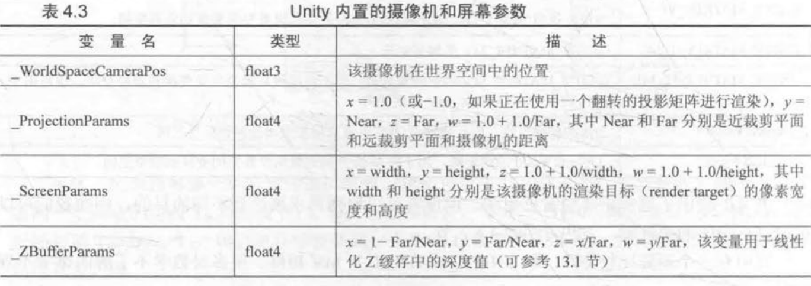
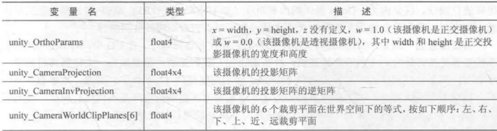

##### 名字

```
Shader "Custom/MyShader"{}
```

在材质面板的位置： Shader -> Custom -> MyShader

##### 属性Property

```
Properties{
	Name{"display name", PropertyType} = DefaultValue
	_Color ("Color", Color) = (1,1,1,1)
}
```

。如果我们需要在 Shader 中访问它们，就需要使用每个属性的名字 (Name) 。在 Unity 中，这些属性的名字通常由 个下划线开始。 显示的名称 (display name) 则是出现在材质面板上的名字。我们需要为每个 属性指定它的类型 (PropertyType) 常

##### SubShader语义块

```
SubShader{
	// 可选的
	[Tags]
	// 可选的
	[RenderSetup]
	Pass{
	}
}
```

SubShader中定义了 一系列Pass以及可选的状态([RenderSetup])和标签([Tags])设置。 每个 Pass定义了一次完整的渲染流程， 但如果Pass的数目过多， 往往会造成渲染性能的下降。 因此， 我 们应尽量使用最小数目的Pass。状态和标签同样可以在Pass声明。 不同的是，SubShader中的一些标 签设置是特定的。 也就是说， 这些标签设置和Pass中使用的标签是不一样的。 而对于状态设置来说， 其使用的语法是相同的。 但是， 如果我们在SubShader进行了这些设置， 那么将会用于所有的Pass

###### SubShader的标签

SubShader的标签(Tags)是一个键值对(Key/Value Pair), 它的键和值都是字符串类型。 

标签结构如下

`Tags {"TagNamel" = "Value1" "TagName2" = "Value2"}`

`Tags { "RenderType"="Opaque" }`

###### Pass语义块

```
Pass{
	[Name]
	[Tags]
	[RenderSetup]
	// Other code
}
```

在Pass中定义该Pass名称：

`Name "MyPassName"`

通过`UsePass`命令直接使用其他`UnityShader`的`Pass`

`UsePass "MyShader/MYPASSNAME"`

由于 Unity 内部会把所有 Pass 的名称转换成大写字母的表示 在使用 `UsePass` 命令时必须使用大写形式的名字。

我们可以对 Pass 设置渲染状态。 SubShader 的状态设置同样适用于 Pass 。除了上面提到的状态设置外，在 Pass 中我们还可以使用固定管线的着色器命令 

Pass 同样可以设置标签 但它的标签不同于 SubShader 的标签。这些标签也是用千告诉渲染引擎我们希望怎样来渲染该物休。

Unity Shader 支持一些特殊的 Pass, 以便进行代码复用或实现更复杂的效果。 

- UsePass: 我们之前提到的一样，可以使用该命令来复用其他 Unity Shader 中的 Pass: 
- GrabPass: Pass 负责抓取屏称并将结果存储在一张纹理中，以用于后续的 Pass 处理

###### Fallback

它用于告诉 Unity, "如果上面所有的 SubShader 在这块显卡上都不能运行，那么就使用这个最低级的 Shader 

```
Fallback "name"
或者
Fallback Off
```

也可以关闭 Fallback 功能：“如果一块显卡跑不了上面所有的 SubShader, 那就不要管它了！

事实上 Fallback 还会影响阴影的投射。在渲染阴影纹理时 Unity 会在每个 Unity Shader 寻找 阴影投射的 Pass 。通常情况下，我们不需要自己专门实现一个 Pass, 这是因为 Fallback 使用的内置 Shader 中包含了这样 个通用的 Pass 。因此，为每个 Unity Shader 正确设置 Fallback 是非常重要的

##### UnityShader形式

```
Shader "MyShader"{
	Properties{
		// 属性
	}
	SubShader{
		// 表面着色器 或
		// 顶点/片元着色器
		// 固定函数着色器
	}
}
```

表面着色器是 Unity 对顶点／片元着色器的更高一层的抽象。 存在的意义是Unity 为我们处理了很多光照细节

```c
Shader "Custom/Simple Surface Shader" {
	SubShader {
		Tags { "RenderType " = "Opaque" }
		CGPROGRAM
		#pragma surface surf Lambert 
		struct Input {
			float4 color : COLOR; 
		}; 
		void surf (Input IN, inout SurfaceOutput o){
			o.Albedo = l; 
		} 
		ENDCG
    }
    Fallback "Diffuse"
}
```

`CGPROGRAM`和`ENDCG` 之间的代码是使用 `CG/HLSL` 编写的，也就是说，我们需要把 CG/HLSL 语言嵌套在 `ShaderLab` 语言中。值得注意的是，这里的 CG/HLSL Unity 经封装后提 供的，它的语法和标准的 CG/HLSL 语法儿乎一样，但还是有细微的不同，例如有些原生的函数 和用法 Unity 并没有提供支持

##### 顶点/片元着色器

```c
Shader "Custom/Simple VertexFragment Shader"{
	SubShader{
        Pass{
            CGPROGRAM
            #pragma vertex vert
            #pragma fragmentt frag
            
            float4 vert(float4 v: POSITION){
                return mul(UNITY_MATRIX_MVP, v);
            }
            
            fixed4 frag(): SV_TARGET{
                return fixed4(1.0,0.0,0.0,1.0);
            }
            ENDCG
        }
    }
}
```

顶点／片元着色器的代码也需要定义在 `CGPROGRAM ENDCG` 之间， 但不同的是 顶点／片元着色器是写在 Pass 语义块

##### 固定函数着色器（基本废弃）

对于不支持可编程管线着色器的设备使用固定函数着色器

```c
Shader "Tutorial/Basic" { 
	Properties { 
		_Color ( "Main Color", Color) = (1,0.5,0.5,1) 
	} 
	SubShader { 
		Pass { 
			Material { 
				Diffuse [_Color] 
			} 
			Lighting On
        }
    }
}
```

##### 着色器选择

- 处理光源适用表面着色器，但要小心移动平台性能表现
- 光源需求少适用顶点片元着色器
- 如果有很多自定义渲染效果 适用顶点/片元着色器


##### 法线变换：

问题：用同一个变换矩阵无法保证法线的垂直性

即使用原变换矩阵的逆转置矩阵来变换法线$G = (M^{-1}_{A->B})^T$

如果变换只包括旋转变换，那 么这个变换矩阵就是正交矩阵。而如果变换只 含旋转和统一缩放，而不包含非统一缩放，我们 利用统一缩放系数k 来得到变换矩阵 $M_{A->B}$ 的逆转置矩阵 $(M^T_{A->B})^{-1}=\frac{1}{k}M_{A->B}$ 这样就可以避免计 算逆矩阵的过程。如果变换中包含了非统一变换，那么我们就必须要求解逆矩阵来得到变换法线 的矩阵。






通常在变换顶点时，我们都是使用右乘的方式来按列 矩阵进行乘法。这是因为， Unity 提供的内悝矩阵（如 UNITY_MATRIX_MV）都是按列存储 的。但有时也会使用左乘的方式，这是因为可以省去对矩阵转置的操作。

Unity 在脚本中提供了一种矩阵类型—-Matrix4x4 脚本中的这个矩阵类型则是采用列优先的方式。这与 Unity Shader 中的规定不一样

##### 屏幕坐标

在顶点／片元着色器中，有两种方式来获得片元的屏幕坐标。

种是在片元着色器的输入中声明 `VPOS WPOS` 语义

```
fixed4 frag(float4 sp: VPOS): SV_Target{
	return fixed(sp.xy/_ScreenParams.xy,0.0,1.0);
}
```

float4类型变量前两个是xy，如果屏幕分辨率为 400 X 300, 那么x的范围就是 [0.5 400.5] 。注意，这里 的像素坐标并不是整数值，这是因为 OpenGL DirectX 10 以后的版本认为像素中心对应的是浮点值 中的 .5 。

在 Unity 中， VPOS/WPOS 的z分量范围是[0,1], 在摄像机的近裁剪 平面处， 值为0, 在远裁剪平面处，值为1 。对于w分量，我们需要考虑摄像机的投影类型。如果使用的是透视投影，那么 分量的范围是 $[\frac{1}{Near},  \frac{1}{Far}]$ 对应Camera 组件中设置的近裁剪平面和远裁剪平面距离摄像机的 远近；如果使用的是正交投影，那么 分量的值恒为1

另一种方式是通过 Unity 提供的 `ComputeScreenPos` 函数。这个函数在 UnityCG.cginc 里被定 义

```c
struct vertOut{
	float4 pos: SV_POSITON;
    float4 scrPos: TEXCOORD0;
};
vertOut vert(appdata_base v){
    vertOut o;
    o.pos = mul(UNITY_MATRIX_MVP, V,vertex);
    // 把ComputeScreenPos的结果保存在scrPos
    o.scrPos = ComputeScreemPos(o.pos);
    return o;
}
fixed4 frag(verOut i): SV_TARGET{
    // 用scrPos.xy除scrPos.w得到视口空间坐标
    float2 wcoord = (i/scrPos.xy/i.scrPos.w);
    return fixed4(wcoord,0.0,1.0);
   
}
```

