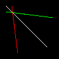
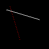
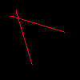
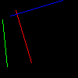

# Bresenham’s Line Drawing Algorithm

##### 第一次尝试

设置step为0.01,即100像素

```c++
void line(int x0, int y0, int x1, int y1, TGAImage &image, TGAColor color){ 
    for (float t=0.; t<1.; t+=.01) { 
        int x = x0 + (x1-x0)*t; 
        int y = y0 + (y1-y0)*t; 
        image.set(x, y, color); 
    } 
}
```

```c++
line(10, 10, 80, 80, image, white);
line(20, 10, 30, 90, image, red);
line(10, 20, 90, 30, image, green);
```



##### 第二次尝试

尝试改变步长为0.1，线段变成一堆点

```c++
void line(int x0, int y0, int x1, int y1, TGAImage &image, TGAColor color){ 
    for (float t=0.; t<1.; t+=.1) { 
        int x = x0 + (x1-x0)*t; 
        int y = y0 + (y1-y0)*t; 
        image.set(x, y, color); 
    } 
}
```

要处理的问题在于步长的选取，考虑根据整数x的变化率来进行像素着色，该方法问题在于当该直线斜率过大时线条会明显变为单点（图中红色线段情况），以及受限于x_0<x_1不能进行反向绘制（第三条线段情况）

```c++
void line(int x0, int y0, int x1, int y1, TGAImage &image, TGAColor color){ 
    for (int x=x0; x<=x1; x++) { 
        float t = (x-x0)/(float)(x1-x0); 
        int y = y0*(1.-t) + y1*t; 
        image.set(x, y, color); 
    } 
}
```

```c++
line(13, 20, 80, 40, image, white);
line(20, 13, 40, 80, image, red);
line(80, 40, 13, 20, image, red);
```



##### 第三次尝试

为修复第二次尝试 考虑线条在哪个方向取样更多 并且修复没有取绝对值引起的问题

```c++
void line(int x0, int y0, int x1, int y1, TGAImage& image, TGAColor color) {
    int t0, t1, t2, t3;
    bool xsample;
    if (std::abs(x0 - x1) < std::abs(y0 - y1)) {
        xsample = false;
        t0 = y0; t1 = y1;
        t2 = x0; t3 = x1;
    }
    else {
        xsample = true;
        t0 = x0; t1 = x1;
        t2 = y0; t3 = y1;
    }
    if (t0 > t1) {
        std::swap(t0, t1);
        std::swap(t2, t3);
    }
    for (int x = t0; x <= t1; x++) {
        float t = (x - t0) / (float)(t1 - t0);
        int y = t2 * (1. - t) + t3 * t;
        if(xsample) image.set(x, y, color);
        else image.set(y, x, color);
    }
}
```

修复问题后对于第二次尝试的相同参数效果如下



##### 第四次尝试（代码优化）

由于每次循环的除法很费时间，但由于斜率固定实际上每次的变化率是一样的，即可以在循环外计算出每次的变化率再在每次循环中加上该变化量

```c++
void line(int x0, int y0, int x1, int y1, TGAImage& image, TGAColor color) {
    int t0, t1, t2, t3;
    bool xsample;
    if (std::abs(x0 - x1) < std::abs(y0 - y1)) {
        xsample = false;
        t0 = y0; t1 = y1;
        t2 = x0; t3 = x1;
    }
    else {
        xsample = true;
        t0 = x0; t1 = x1;
        t2 = y0; t3 = y1;
    }
    if (t0 > t1) {
        std::swap(t0, t1);
        std::swap(t2, t3);
    }
    int dx = t1 - t0;
    int dy = t3 - t2;
    float derror = std::abs(dy / float(dx));
    float error = 0;
    int y = t2;
    for (int x = t0; x <= t1; x++) {
        if(xsample) image.set(x, y, color);
        else image.set(y, x, color);
        error += derror;
        if (error > .5) {
            y += (y1 > y0 ? 1 : -1);
            error -= 1.;
        }
    }
}
```

##### 第五次尝试-抛弃愚蠢的浮点数

```c++
void line(int x0, int y0, int x1, int y1, TGAImage& image, TGAColor color) {
    int t0, t1, t2, t3;
    bool xsample;
    if (std::abs(x0 - x1) < std::abs(y0 - y1)) {
        xsample = false;
        t0 = y0; t1 = y1;
        t2 = x0; t3 = x1;
    }
    else {
        xsample = true;
        t0 = x0; t1 = x1;
        t2 = y0; t3 = y1;
    }
    if (t0 > t1) {
        std::swap(t0, t1);
        std::swap(t2, t3);
    }
    int dx = t1 - t0;
    int dy = t3 - t2;
    float derror2 = std::abs(dy)*2
    float error2 = 0;
    int y = t2;
    for (int x = t0; x <= t1; x++) {
        if(xsample) image.set(x, y, color);
        else image.set(y, x, color);
        error2 += derror2;
        if (error2 > dx) {
            y += (y1 > y0 ? 1 : -1);
            error2 -= dx*2;
        }
    }
}
```

综上，即为[Bresenham 直线算法](https://zhuanlan.zhihu.com/p/106155534)



