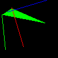

### 三角形绘制

三个顶点根据y轴排序

根据最低的y轴点，往上遍历，找出沿着这个最低的点往上的两条边，逐步绘制各个同y轴的点，再将两个同高度的点作为线段连起来，即将该三角形从底到高绘制。（该绘制过程根据中间高度的三角形顶点分为两部分

直接上代码 这个思路很丑不太想写

```cpp
void triangle(Vec2i t0, Vec2i t1, Vec2i t2, TGAImage &image, TGAColor color) { 
    if (t0.y==t1.y && t0.y==t2.y) return; // I dont care about degenerate triangles 
    // sort the vertices, t0, t1, t2 lower−to−upper (bubblesort yay!) 
    if (t0.y>t1.y) std::swap(t0, t1); 
    if (t0.y>t2.y) std::swap(t0, t2); 
    if (t1.y>t2.y) std::swap(t1, t2); 
    int total_height = t2.y-t0.y; 
    for (int i=0; i<total_height; i++) { 
        bool second_half = i>t1.y-t0.y || t1.y==t0.y; 
        int segment_height = second_half ? t2.y-t1.y : t1.y-t0.y; 
        float alpha = (float)i/total_height; 
        float beta  = (float)(i-(second_half ? t1.y-t0.y : 0))/segment_height; // be careful: with above conditions no division by zero here 
        Vec2i A =               t0 + (t2-t0)*alpha; 
        Vec2i B = second_half ? t1 + (t2-t1)*beta : t0 + (t1-t0)*beta; 
        if (A.x>B.x) std::swap(A, B); 
        for (int j=A.x; j<=B.x; j++) { 
            image.set(j, t0.y+i, color); // attention, due to int casts t0.y+i != A.y 
        } 
    } 
}
```

------------

another way：

包围盒 -> 是否在三角形内部

```c++
bool isInsideTriangle(int x0, int y0, int x1, int y1, int x2, int y2, int x, int y) {
    float alpha = (float)((y1 - y2) * (x - x2) + (x2 - x1) * (y - y2)) /
        ((y1 - y2) * (x0 - x2) + (x2 - x1) * (y0 - y2));
    float beta = (float)((y2 - y0) * (x - x2) + (x0 - x2) * (y - y2)) /
        ((y1 - y2) * (x0 - x2) + (x2 - x1) * (y0 - y2));
    float gamma = 1.0f - alpha - beta;

    return alpha > 0 && beta > 0 && gamma > 0;
}

void Triangle(int x0, int y0, int x1, int y1, int x2, int y2, TGAImage& image, TGAColor color) {
    int maxx = std::max(x0, std::max(x1, x2)), maxy = std::max(y0, std::max(y1, y2));
    int minx = std::min(x0, std::min(x1, x2)), miny = std::min(y0, std::min(y1, y2));
    int tx, ty;
    for (tx = minx; tx <= maxx; tx++) {
        for (ty = miny; ty <= maxy; ty++) {
            if (isInsideTriangle(x0, y0, x1, y1, x2, y2, tx, ty)) {
                image.set(tx, ty, color);
            }
        }
    }
}
```

