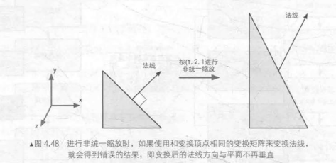

# 八股-图形学篇

对搜到和自己被问的八股的图形学部分的一些总结

#### 判断点是否在三角形内/射线与三角形相交（t0：图形学基础）

（腾讯、网易）

- **叉乘法**：首先，按照顺时针找到三角形的三个向量AB，BC和CA。然后，对于点P，如果向量AB与AP、向量BC与BP、向量CA与CP的叉乘结果都大于0，那么点P在三角形内部。如果有一个叉乘结果为0，那么点P在三角形边上。如果有一个值小于零，那么点P在三角形外部。

- **面积法**：通过计算三角形的面积以及点与三个顶点构成的子三角形的面积，可以判断点是否在三角形内部。具体来说，如果点P在三角形ABC内部，那么三角形ABC的面积等于三个子三角形PAB、PBC、PCA的面积之和。

  引申：**重心坐标 - MT算法**

  MT算法全称Möller-Trumbore算法，是一种用于判断射线与三角形是否相交的算法。

  Möller-Trumbore算法的核心思想是一步到位的计算出射线是否与三角形相交，主要利用到的知识点是三角形的重心坐标。这个算法的基本思想是，对于一个三角形ABC和一个射线r(t)，如果射线与三角形相交，那么存在一个t使得点P = r(t)在三角形ABC内部。**这个点P可以表示为P = (1 - u - v)A + uB + vC，其中A、B、C是三角形的三个顶点，u、v是满足0 <= u, v <= 1且u + v <= 1的参数**。

  这个算法的优点是计算速度快，不需要预先计算包含三角形的平面方程，而且可以直接得出交点和重心坐标。

#### MVP矩阵（t0：图形学基础）

（腾讯、网易）

MVP矩阵由模型（Model）、观察（View）、投影（Projection）三个矩阵组成

- **模型矩阵（M）**：模型矩阵用来将物体顶点在模型空间下的坐标转换为在世界空间下的坐标。模型矩阵包括**平移矩阵、旋转矩阵、缩放矩阵**。这个变换过程可以理解为将物体从其自身的坐标系（模型空间）移动到一个共享的坐标系（世界空间）。

  相关知识：平移操作非线性，因此平移矩阵的维数多一维（齐次坐标），变换由4*4矩阵计算来完成，由第四个维度来进行平移操作，旋转和放缩则是考虑在对应的x轴、y轴、z轴进行旋转 $\theta$角 和 放缩乘 $k$ 倍的操作

- **观察矩阵（V）**：观察矩阵用来将物体顶点在世界空间下的坐标转换为视图空间下的坐标。观察矩阵包括**旋转矩阵，平移矩阵**。这个变换过程可以理解为将整个世界从世界空间移动到摄像机的视角，也就是视图空间。

  把世界空间移动到摄像机视角（视图空间），也就是摄像机在世界空间的位置和方向的**逆矩阵**

- **投影矩阵（P）**：投影矩阵用来将物体顶点在视图空间的坐标转换为裁剪空间的坐标。投影矩阵包括正交投影矩阵和透视投影矩阵。这个变换过程可以理解为将三维的视图空间压缩到二维的裁剪空间，以便最后在屏幕上进行渲染。

  **透视投影**符合我们人眼的视觉也就是近大远小，平行线远处相交(如看向远处的火车铁轨)

  **正交投影**不改变大小，没有近大远小，且平行线永远平行。

  一般考虑先进行透视投影变换再进行正交变换：先由fov等参数确定视锥体，将视锥体挤压为长方体（透视变换），再将该长方体经过缩放和位移变换到三个轴的坐标都在[-1,1]范围内的标准立方体（正交投影）。

  这三个矩阵的组合（MVP矩阵）就可以将物体从模型空间一步步变换到裁剪空间，然后再通过视口变换将其映射到屏幕坐标，最终在屏幕上进行渲染。

#### 渲染流水线（t1.5：偏基础）

（疯狂游戏）

渲染流水线分为**应用阶段 (Application Stage)、 几何阶段(Geometry Stage)、 光栅化阶段(Rasterizer Stage)**

- **应用阶段**：准备好场景数据、设置好渲染状态，包括摄像机的位置、 视锥体、 场景中包含了哪些模型、 使用了哪些光源等等；为了提高渲染性能， 我们往往需要做一个粗粒度剔除(culling)工作， 以把那些不可见的物体剔除出去， 这样就不需要再移交给几何阶段进行处理；需要设置好每个模型的渲染状态。 这些渲染状态包括但不限于它使用的材质（漫反射颜色、 高光反射颜色）、 使用的纹理、 使用的Shader等。 这一阶段最重要的输出是渲染所需的几何信息， 即渲染图元(rendering primitives)。 通俗来讲， 渲染图元可以是点、 线、 三角面等。 这些渲染图元将会被传递给几何阶段
- **几何阶段**：处理从上一阶段接收到的待绘制物体的几何数据（可以理解为Draw Call指向的图元列表），与每个渲染图元打交道，进行逐顶点，逐多边形的操作。把**顶点坐标变换到屏幕空间**中 ，再交给光栅器进行处理。通过对输入的渲染图元进行多步处理后，这一阶段将会输 出屏幕空间的二维顶点坐标、每个顶点对应的深度值、着色等相关信息，并传递给下一个阶段。
- **光栅化**：决定每个渲染图元中 的哪些像素应该被绘制在屏幕 上。它需要对上一个阶段得到的逐顶点数据 （例如纹理坐标 、顶点颜色等）进行插值，然后再进行逐像素处理。

#### LOD和Mipmap（t1.5）

##### mipmap

Mipmap是一种在三维计算机图形的贴图渲染中常用的技术。为了加快渲染速度和减少图像锯齿，贴图被处理成由一系列被预先计算和优化过的图片组成的文件。Mipmap中每一个层级的小图都是主图的一个特定比例的缩小细节的复制品。虽然在某些必要的视角，主图仍然会被使用，来渲染完整的细节。但是当贴图被缩小或者只需要从远距离观看时，mipmap就会转换到适当的层级。

| 过滤方式                  | 描述                                                         |
| ------------------------- | ------------------------------------------------------------ |
| GL_NEAREST_MIPMAP_NEAREST | 使用最邻近的多级渐远纹理来匹配像素大小，并使用邻近插值进行纹理采样 |
| GL_NEAREST_MIPMAP_LINEAR  | 使用最邻近的多级渐远纹理级别，并使用线性插值进行采样         |
| GL_LINEAR_MIPMAP_NEAREST  | 在两个最匹配像素大小的多级渐远纹理之间进行线性插值，使用邻近插值进行采样 |
| GL_LINEAR_MIPMAP_LINEAR   | 在两个邻近的mipmap之间使用线性插值，并使用线性插值进行采样（三线性插值） |

占用空间情况：1 + 1/4 + 1/16 + ... +  需要额外1/3空间

**ripmap**:各异向性mipmap 通常考虑从三维的三个方向构造mipmap 额外大小 3 * (1+1/4+...+) 需要额外三倍空间；之后的方法考虑从原有的mipmap中再采样。

##### LOD（Levels of Detail 多细节层次）

LOD技术指根据物体模型的节点在显示环境中所处的位置和重要度，决定物体渲染的资源分配，降低非重要物体的面数和细节度，从而获得高效率的渲染运算。

#### 法线贴图和切线空间（t1）

- **法线贴图**：模拟凹凸处光照效果的技术，是[凸凹贴图](https://zh.wikipedia.org/wiki/凸凹贴图)的一种实现，凹凸贴图存储的是高度，法线贴图存储的是法线指向Nx、Ny、Nz，以普通[RGB](https://zh.wikipedia.org/wiki/RGB)图像的形式存储，其中的R、G、B分量分别对应[法线](https://zh.wikipedia.org/wiki/法线_(计算机图形学))的X、Y、Z坐标。最后在渲染的时候直接将该高度图的每个像素与光源的向量[点乘](https://zh.wikipedia.org/wiki/数量积)，即可得到表示每一点的明暗系数的图

- **法线变换**

  对于法线，进行变换之后可能不再与原平面垂直

  

  引入额外的**TBN矩阵**，用于法线变换来保持垂直

  确定T和B向量：首先，我们需要确定切线向量T和副切线向量B。这两个向量可以通过三角形的顶点坐标和对应的纹理坐标来计算。假设我们有一个三角形，其顶点坐标为P1，P2，P3，对应的纹理坐标为UV1，UV2，UV3。我们可以定义两个向量E1 = P2 - P1，E2 = P3 - P1，以及两个纹理坐标向量deltaUV1 = UV2 - UV1，deltaUV2 = UV3 - UV11。然后，我们可以写出以下两个等式：
  E1 = deltaUV1.x * T + deltaUV1.y * B
  E2 = deltaUV2.x * T + deltaUV2.y * B 这两个等式可以写成矩阵形式，然后通过求解线性方程组得到T和B。
  确定N向量：法线向量N通常是已知的，它是顶点的法线向量。如果T和B不垂直，那么我们需要对它们进行正交化处理，然后再归一化，以确保它们构成一个正交基。
  构造TBN矩阵：最后，我们可以将T，B，N作为矩阵的列向量，构造出TBN矩阵。

- **切线空间**：

  **切线平面概念**:组成一个模型的所有Mesh网格三角形或者四边形中的任意单个顶点为空间原点,顶点的法线为N轴,过顶点原点垂直于顶点法线N轴的平面为切线平面;

  **切线空间概念:**切线平面上过顶点原点,在切线平面上取该顶点所在的UV纹理轴相同方向的两轴分别作为TB轴,由TBN向量轴所张成的局部空间; 就叫做顶点切线空间

  **切线空间 (Tangent Space)** 与 **世界空间 (World Space)** 和 **观察空间 (View Space)** 一样，都是一个坐标空间，它是由顶点所构成的平面的 UV 坐标轴以及表面的法线所构成，一般用 **T (Tangent), B (Bitangent), N (Normal)** 三个字母表示，即**切线，副切线，法线**，

  所谓法线贴图的技术;本身所用的高度贴图就是利用高度贴图中的[颜色]数据来标记[顶点法线]坐标;

  在同一个坐标系内,一个立方体的6个面的法线(向量)本就不同;一个是+z,一个是-z;一个是+x,一个是-x,一个是+y一个是-y;6个面各不相同;而同一张高度贴图的颜色数据即顶点法线数据是写好的固定的,当然不可能适应不同的6个面的法线适配;

  此时若想要用同一个高度图来适配顶点数相同的立方体6个面,就需要用到切线空间和切线空间转换矩阵TBN矩阵;

  纹理压缩：一般法线方向不会是朝向表面内部，即法线贴图中的 z 值不会是负数，而我们使用的法线又是归一化的，所以完全可以根据 x 和 y 的值来推导出 z 的值，贴图中只需要存储 x 和 y 的值即可，可进行纹理压缩

  法线贴图中读取法线（切线空间），通过TBN矩阵转为模型空间，在转为世界空间处理光照

#### GPU Instancing （t1.5：性能优化）

Gpu Instance是一种用来提高渲染大量物体效率的技术，随着手游游戏品质需求的提升，我需要在场景里绘制越来越多的物体，这里面主要涉及两个方面的性能瓶颈，一是cpu对gpu提交数据的次数，二是gpu上的绘制（包括顶点处理和像素绘制），随着场景物体的提升，cpu和gpu的压力都会上升。目前在一些典型的3D游戏的制作中，我们的经验值是全屏不超过10万个顶点和200个draw call左右

- static batching： 即静态合批，静态合批的原理即化整为零，将多个场景物体预先合成一个大的物体进行绘制，unity5的实现就是整合成一个大的vbo，而不整合IBO，一次性提交vbo给gpu，然后并不是把整个vbo都绘制，而是每次需要绘制其中某个某些物体时改变IBO，选择大vbo上的某一段进行绘制。静态合批可以将多个小物体的绘制合并成一个大物体的绘制，减少对渲染状态的改变，它一次并行绘制多个物体，理论上是最快的绘制方法，不过最大的缺点是因为合成新的大vbo需要耗费额外的大量内存，同时不能渲染动态物体，因为合并vbo的时候已经确定顶点数据了，顶点数据不能更改（例如unity5对LOD合批的实现也是讲所有层次的lod都预先合并进去），另外一个vbo的大小是有限制的，如果物体数量过多，也会被拆成多个绘制。

- dynamic batching：动态合批，可以解决对顶点数据有变化的物体的合批，它动态的合并vbo进行提交，组建vbo的时间有消耗，为了减少这个消耗，unity对动态合批的vbo大小有限制，以致于很小顶点数的物体才有可能被动态合批。
- vertex constant instancing：Instancing 是不同于batching的另一种方案，它的原理是对于模型一致的物体，只提交原始的模型的vbo给gpu，然后将每个物体不同的属性单独抽出来组成buffer发给gpu，在显卡中根据这一份vbo和每个物体不同的属性来绘制多个物体，即一次提交，在gpu上绘制多个，对于大量同样模型的物体绘制是一个很好的方案。vertex constant的instancing是利用顶点常量属性来存储这些per instance attributes，但是也需要一个大的vbo存储所有未经顶点变换的相同的n个原顶点数据，在shader里面读取不同的vertex constant内容绘制不同的instance
- gpu instancing：如果绘制1000个物体，它将一个模型的vbo提交给一次给显卡，至于1000个物体不同的位置，状态，颜色等等将他们整合成一个per instance attribute的buffer给gpu，在显卡上区别绘制，它大大减少提交次数，它在不同平台的实现有差异，例如gles是将per instance attribute也当成一个vbo提交，然后gles3.0支持一种per instance步进读取的vbo特性，来实现不同的instance得到不同的顶点数据，这种技术对于绘制大量的相同模型的物体由于有硬件实现，所以效率最高，最为灵活，避免合批的内存浪费，并且原则上可以做gpu skinning来实现骨骼动画的instancing。

##### drawcall

在每次调用 Draw Call 之前， CPU 需要向 GPU 发送很多内容，包括数据、状态和命令等。在这一阶段， CPU 需要 完成很多工作，例如检查渲染状态等。而一旦 CPU 完成了这些准备工作， GPU 就可以开始本次 的渲染。 GPU 的渲染能力是很强的，渲染 200 还是 2000 三角网格通常没有什么区别，因此 渲染速度往往快于 CPU 提交命令的速度。如果 Draw Call 的数批太多， CPU 就会把时间花费在提交 Draw Call 上，造成 CPU 的过载

#### alpha测试和模板测试（t2）

- alpha测试：Alpha测试是基于像素的测试，通过比较像素的透明度值与阈值来决定是否绘制该像素。透明度值通常使用图像的Alpha通道表示，取值范围从0到1，其中0表示完全透明，1表示完全不透明。在进行Alpha测试时，如果像素的透明度值小于等于设定的阈值，则丢弃该像素，否则绘制该像素。
  需要注意的是，Alpha测试会引入额外的性能开销，因为需要在像素级别上进行额外的计算和判断。因此，在使用Alpha测试时，应根据实际需求和性能要求进行权衡，并适时进行优化和调整。
- 模板测试：渲染过程中，可以用这个值与预先设定好的参考值作（ReferenceValue）比较，根据结果来决定是否更新相应的像素点的颜色值。这个比较的过程就称为模板测试。
  模板测试在透明度测试之前后，深度测试之前。
  如果模板测试通过，相应的像素点更新，否则不更新。

#### 欧拉角、万向节死锁、四元数（t2.5）

- **欧拉角（Euler Angles）**是由三个角度组成的，通常被称为偏航角（yaw）、俯仰角（pitch）和滚动角（roll）。欧拉角的优点在于它们直观且易于理解，因为我们可以直接将这三个角度映射到我们在现实世界中的经验。然而，欧拉角也有一些缺点。最重要的一个问题是所谓的“万向节死锁”（Gimbal Lock），这是当外部和内部万向节对齐时，会丢失一个自由度，导致无法执行某些旋转。

- **四元数（Quaternions）**是由四个实数组成的数学对象，通常表示为 $q=w+xi+yj+zk$，其中 $w,x,y,z$ 是实数，$i,j,k$是四元数的基元素。四元数的主要优点是它们可以避免万向节死锁，并且对于连续的旋转动画，它们可以提供平滑且自然的插值。此外，四元数的运算通常比矩阵运算更快，因为它们只需要存储四个数值，并且旋转操作只需要一次乘法。然而，四元数的主要缺点是它们不如欧拉角那样直观，因此理解和使用它们可能需要一些数学知识。

- 四元数优缺点：

  优点：

  **紧凑性**：四元数是一种使用四个实数来表示旋转的方法，相比于欧拉角的三个实数和旋转矩阵的九个实数，四元数具有更简洁的表示方式。这使得它们在存储和传输方面更加高效。
  **计算效率**：四元数的运算比旋转矩阵运算更高效。旋转矩阵的乘法需要进行九次浮点数乘法和六次浮点数加法，而四元数的乘法只需要进行四次浮点数乘法和两次浮点数加法。使得四元数进行旋转计算更加迅速。
  **插值和融合**：四元数可以进行平滑的插值和融合操作。由于四元数可以表示任意旋转，因此我们可以使用插值算法在两个四元数之间进行平滑的过渡。这在动画和游戏开发中尤为有用，可以实现平滑的旋转效果。
  **无奇异性**：与旋转矩阵和欧拉角不同，四元数不存在奇异性。换句话说，每个四元数都对应一个唯一的旋转，不存在两个不同的四元数表示相同的旋转。这种独特性使得四元数在处理旋转时更为可靠，并能有效地解决万向锁问题。
  缺点：

  **难以理解**：相比于旋转矩阵和欧拉角，四元数的概念较为抽象和难以理解。它们涉及到复数的概念和复数运算，需要一定的数学基础才能掌握。
  **缺乏直观性**：四元数的表示方式不直观，很难通过直接观察四个实数来理解旋转的意义。这使得四元数在可视化和用户界面设计方面的应用相对困难。
  **存储需求**：虽然四元数比旋转矩阵和欧拉角具有更紧凑的表示方式，但它们仍然需要存储四个实数。在一些计算机图形学应用中，如大规模渲染或动画系统，这可能导致存储需求的增加。

#### 基于图块渲染TBR（t2：移动端）

Tile based rendering（基于图块渲染）是一种计算机图形学中的渲染技术。它通过在光学空间中将图像细分为**规则的网格**，并分别渲染每个网格或图块。这种设计的优点是，与立即模式渲染系统（一次绘制整个帧）相比，可以减少内存和带宽的使用。这使得基于图块的渲染系统在低功耗的手持设备中特别常见。
TBDR（Tile-Based Deferred Rendering）是一种特殊的基于图块渲染的技术。它是 PowerVR GPU 的独特特性，通过隐藏表面消除（HSR）和 TagBuffer 实现了零 Overdraw，从而提高了性能和效率。TBDR 的主要优点是 tile 仅占 Framebuffer 的一小部分。因此，可以将 tile 的颜色、深度和模板的整个工作集存储到与 GPU shader 核心紧密耦合的 On-chip 中3。因此，GPU 进行深度测试和混合透明片段所需的 Framebuffer 数据无就不必要从内存中重复多次进行读写了，从而提升性能，节省能耗。此外，部分深度/模板缓冲区，只需要在着色过程中存在，无需写回内存，TBDR 可以选择 Discard 掉这部分内容来进一步减少带宽使用3。TBDR 的实现也使得一些算法的实现变得方便，例如 MSAA 和 Defer-Rendering3。但是，TBDR 并没有解决 Overdraw 的问题，渲染每个 tile 时，将按提交顺序处理几何图形。会被遮挡的片元依旧将被处理，从而导致冗余的颜色计算和纹理数据提取。
**基于图块渲染（TBR）**的核心思想是：将需要渲染的画面分成一个个的区块（tile），每个区块的坐标通过中间缓冲器以列表形式保存在系统内存中。渲染时，直接渲染对象不再是当前的Frame Buffer和Depth Buffer (深度缓冲)，而是叫Tile Buffer的高速缓存。这样，将IMR中对Color/Depth Buffer进行的读写操作，改为对GPU中高速内存的读写操作，大大提升速度。因此，TBR在渲染过程中，由于Depth Test和Alpha Test等只需要跟片上缓存交互即可，避免了和显存之间的带宽消耗。