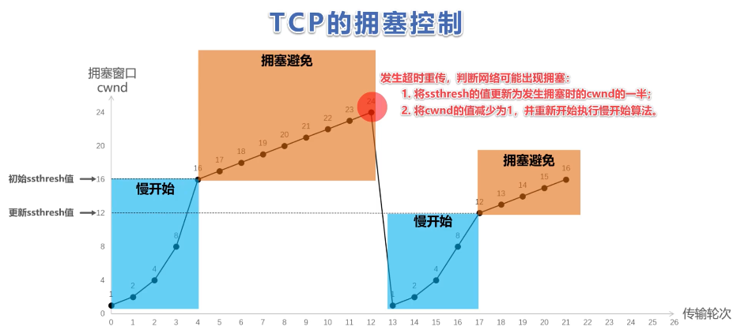
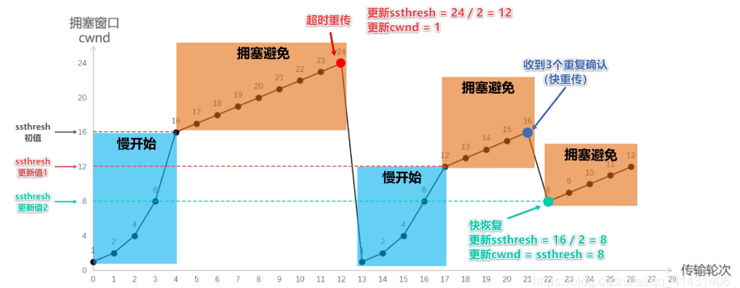

# 八股-计算机网络

对搜到和自己被问的八股的计算机网络部分的一些总结

#### TCP和UDP区别（t0：唯一真神）

[TCP和UDP常见面试题(全面)_tcp 和 udp面试题目-CSDN博客](https://blog.csdn.net/weixin_42155498/article/details/107914137)

- TCP是面向连接的，UDP是面向无连接的（面向连接即在互通前会先建立连接，如TCP的三次握手）
- UDP的程序结构较简单
- TCP是面向字节流的，UDP是面向报文的
- TCP保证数据正确性，UDP不保证正确性
- TCP保证数据顺序，UDP不保证
- **TCP应用于**对效率要求较低，但是对准确性要求较高的场景（由于需要对数据确认，重发，排序所以效率低）例子：文件传输，电子邮件，远程登录；**UDP应用**于对效率要求较高，实时性要求高，但是对准确性要求较低的场景。例子：QQ聊天，在线视频，语音电话，广播通信（广播多播）

##### TCP为什么是可靠连接

- 通过TCP连接传输的数据无差错，不丢失，不重复，并且按顺序到达
- TCP报文里的序号可以使TCP的数据按顺序到达
- 报文头里面的确认序号可以保证不丢包，有累计确认以及超时重传机制
- TCP拥有流量控制及拥塞控制的机制

关于握手次数、2MSL等问题直接看链接 懒得写了

##### TCP拥塞控制

慢开始、拥塞控制、快重传、快恢复

#### KCP(t1)

KCP是一个快速可靠协议，能以比 TCP浪费10%-20%的带宽的代价，换取平均延迟降低 30%-40%，且最大延迟降低三倍的传输效果。纯算法实现，并不负责底层协议（如UDP）的收发，需要使用者自己定义下层数据包的发送方式，以 callback的方式提供给 KCP。 连时钟都需要外部传递进来，内部不会有任何一次系统调用

不算网络传输协议，为UDP写的可靠传输算法，它是把TCP的主要可靠传输机制移植到了UDP身上

- 重传超时时间RTO由2变为1.5
- 选择重传，接收方在返回的 ACK 中包含 `rcv_nxt` (表示之前的全接)和 `sn `(不连续的)，发送方据此了解哪些包需要重传
- 快速重传，发送端发送了 `1,2,3,4,5` 几个包，然后收到远端的 ACK：`1,3,4,5`，当收到 ACK `3` 时，KCP 知道 `2` 被跳过 1 次，收到 ACK `4` 时，知道 `2` 被跳过了 2 次，**当次数大于等于设置的 resend 的值的时候，此时可以认为**2**号丢失**
- ACK+UNA，UNA表示此编号之前全部收到，ACK表示此编号包已收到
- 非退让：发送方缓存、接收方缓存，可以配置跳过丢包退让和慢启动

#### CDN(t2.5)

CDN（Content Delivery Network）的缩写，是一种利用分布式节点技术，在全球部署服务器，即时地将网站、应用视频、音频等静态或动态资源内容分发到用户所在的最近节点，提高用户访问这些内容的速度和稳定性，降低网络拥塞和延迟，同时也能减轻源站的压力。提高网络或应用的可用性和安全型。

CDN的基本原理是将源站的内容分发到离用户最近的节点上进行缓存，并通过智能路由、负载均衡等技术来保证用户能够快速、稳定地访问到所需资源。CDN将源站与用户之间的网络传输距离缩短，通过多节点并行传输，从而显著降低了网络传输的延迟和带宽消耗。

[CDN（Content Delivery Network）内容分发网络原理、组成、访问过程、动静态加速、作用详解_cdn如何实现分发静态页面-CSDN博客](https://blog.csdn.net/weixin_45863010/article/details/139453879)

##### CDN的访问过程

CDN的访问过程依赖于DNS的重定向技术，即将用户**定向至地理位置上距离其最近的边缘CDN节点服务器**上。用户首先向根DNS服务器发送域名解析请求，根DNS服务器向授权DNS服务器发送域名解析请求，请求中包含了根服务器的IP地址，当域名解析服务器/根DNS服务器接受到一个CNAME类的DNS记录，域名解析服务器会重定向到CDN节点网络层中的智能CDN域名服务器上，**CDN域名服务器将进行一系列的智能解析操作，根据本地DNS域名解析服务器的IP地址，分析各个网络线路的拥堵情况和负载情况，将最适合的CDN节点服务器IP地址返还给根DNS服务器**，用户接受到CDN节点的IP地址后，直接向CDN节点服务器发送请求获取网站内容。

##### CDN的加速原理

- 负载均衡：CDN通过将用户请求分发到不同的节点，避免单一节点过载，从而保证用户请求响应速度。
- 缓存机制：CDN将静态资源缓存在靠近用户的节点上，当用户请求这些资源时，可直接从缓存中获取，避免了从源站获取资源的耗时。
- 数据传输优化：CDN采用自动智能路由技术，选择最优的传输路径，避免网络拥塞，从而优化数据传输过程。
- 动态加速技术：CDN可以使用动态加速技术，对动态内容进行加速，例如应用程序、交互式内容和数据库查询等。
- 安全保障：CDN可以提供一些常用的安全防护机制，如DDoS攻击防护、源站防护等，保障网站的安全。

#### DNS 请求（t2）

- **客户端发起请求**：当你在浏览器中输入一个URL（如www.baidu.com）时，你的设备（客户端）会首先检查本地缓存是否有这个域名对应的IP地址。如果没有，它会向本地的DNS服务器发送一个解析请求
- **本地DNS服务器查询**：本地DNS服务器会在自己的记录中查找这个域名。如果找到了，就会返回对应的IP地址。如果没有找到，它会在本地的缓存中查找。如果仍然没有找到，本地DNS服务器就会向其他DNS服务器发送查询请求。
- **向根DNS服务器查询**：本地DNS服务器首先会向根DNS服务器发送查询请求。根DNS服务器保存了所有顶级域名服务器的IP地址信息
- **向顶级域名服务器查询**：根DNS服务器会返回顶级域名服务器的IP地址（例如，对于www.baidu.com，顶级域名服务器是.com的服务器）。然后，本地DNS服务器会向顶级域名服务器发送查询请求。
- **向权威DNS服务器查询**：顶级域名服务器会返回权威DNS服务器的IP地址（例如，对于www.baidu.com，权威DNS服务器是baidu.com的服务器）。然后，本地DNS服务器会向权威DNS服务器发送查询请求。
- **获取IP地址**：权威DNS服务器会返回请求的域名对应的IP地址。本地DNS服务器会将这个IP地址返回给客户端
- **缓存结果**：一旦本地DNS服务器获取到解析结果，它会在本地进行缓存。这样，下次客户端再请求相同的域名时，就不需要再进行一系列的查询，直接从缓存中获取结果即可145。
- **建立连接**：客户端获取到IP地址后，就可以通过IP地址与目标服务器建立连接，从而访问网站。

#### 粘包产生的原因

**粘包**指的是多个数据包被连续存储于连续的缓存中，在对数据包进行读取时由于无法确定发生方的发送边界，而采用某一估测值大小来进行数据读出。这导致若双方的数据包大小不一致时，就会使发送方发送的若干包数据在接收方接收时粘成一包，从接收缓冲区看，后一包数据的头紧接着前一包数据的尾。

- **发送方**引起的粘包是由TCP协议本身造成的。为了提高传输效率，发送方往往要收集到足够多的数据后才发送一包数据。若连续几次发送的数据都很少，通常TCP会根据优化算法把这些数据合成一包后一次发送出去，从而导致接收方收到粘包数据
- **接收方**引起的粘包是因为接收方用户进程没有及时接收缓冲区中的数据，从而导致多个包接收。接收方先把收到的数据放在系统接收缓冲区，用户进程从该缓冲区取数据。若下一包数据到达时前一包数据尚未被用户进程取走，则下一包数据放到系统接收缓冲区时就接到前一包数据之后，用户进程根据预先设定的缓冲区大小从系统接收缓冲区取数据，这样就一次取到了多包数据

为了**解决粘包问题**，可以采取以下方式：

- **添加包首部**：发送端给每个数据包添加包首部，首部中应该至少包含数据包的长度。接收端在接收到数据后，通过读取包首部的长度字段，就知道每一个数据包的实际长度了。
- **固定长度封装**：发送端将每个数据包封装为固定长度（不够的可以通过补0填充），这样接收端每次从接收缓冲区中读取固定长度的数据就自然而然地把每个数据包拆分开来。
- **设置边界**：在数据包之间设置边界，如添加特殊符号，这样接收端通过这个边界就可以将不同的数据包拆分开。

#### HTTP协议下GET和POST的区别（t3）

GET 请求可被缓存、保留在浏览器历史记录中、可被收藏为书签、不应在处理敏感数据时使用、有长度限制、只应当用于取回数据
get请求只能进行url编码（appliacation-x-www-form-urlencoded）,post请求支持多种（multipart/form-data等）。
通常GET 产生一个 TCP 数据包，浏览器会把 http header 和 data 一并发送出去，服务器响应 200；
POST 产生两个 TCP 数据包，浏览器先发送 header，服务器响应 100， 浏览器再继续发送 data，服务器响应 200
**哪个更快一点**：在相同网络环境下，GET请求比POST请求快。因为POST请求要发两次

#### HTTP协议

HTTP（超文本传输协议，HyperText Transfer Protocol） 是一种应用层传输协议，它定义了客户端与服务器之间请求和响应的格式。HTTP 协议是基于 TCP/IP 通信协议来传递数据（HTML 文件、图片文件、查询结果等）。

- **无连接**：每次连接只处理一个请求。服务器处理完客户的请求，并收到客户的应答后，即断开连接。采用这种方式可以节省传输时间。
- **无状态**：HTTP 协议本身不会对发送过的请求和相应的通信状态进行持久化处理。这样做的目的是为了保持 HTTP 协议的简单性，从而能够快速处理大量的事务, 提高效率
- 支持客户/服务器模式
- **简单快速**：客户向服务器请求服务时，只需传送请求方法和路径。由于 HTTP 协议简单，使得 HTTP 服务器的程序规模小，因而通信速度很快
- **灵活**：HTTP 允许传输任意类型的数据对象。正在传输的类型由 Content-Type 加以标记